The feel layer
==============

    Audience       Anyone adding an effect and wondering what it should
                   look like, or wondering why a wand of striking gets a
                   white flash and a wand of drain life gets a magenta
                   one.
    Prerequisites  None. `../reference/content-tables.md` if you want to
                   know which row produced the thing being described.
    This is        Understanding: what nihilurk spends its cosmetics on, and
                   what each one is trying to tell the player. The dry
                   facts — which row, which field — are the reference.

nihilurk is a terminal game with sixteen colours and one glyph per tile. Almost everything it can say to the player, it says in a line of text. The feel layer is the part that does not: a spark where a blow landed, a beam racing down a corridor, a map that lurches when something hits hard enough to deserve it.

None of it is gameplay. None of it is saved. Every bit of it can be switched off (`-nb`, `-nshake`) and the game underneath is identical. It exists because a roguelike turn is a wall of text, and a wall of text does not tell you *which of the eleven things that just happened was the one that nearly killed you*.

```mermaid
%%{init: {'theme':'base','themeVariables':{
  'primaryColor':'#20242b','primaryTextColor':'#d7dae0',
  'primaryBorderColor':'#5c6370','lineColor':'#8a8f98',
  'fontFamily':'ui-monospace, SFMono-Regular, Menlo, monospace',
  'fontSize':'13px'}}}%%
flowchart LR
  T(["a turn resolves"]):::hero --> Q["systems queue<br/>Particles + arm Shake"]:::magic
  Q --> P["play_particles<br/><i>blocks</i>"]:::magic
  P --> M["play_magic_map<br/><i>blocks</i>"]:::magic
  M --> R["render"]:::cold
  R --> S["play_shake<br/><i>never blocks</i>"]:::magic
  S --> N(["next key"]):::hero
  classDef hero fill:#3a3418,stroke:#d7ba4a,color:#e8dfa8
  classDef peril fill:#3a1f1f,stroke:#c05050,color:#f0c8c8
  classDef magic fill:#2f2038,stroke:#a86fc0,color:#e6cdf0
  classDef cold  fill:#17323a,stroke:#4aa3c0,color:#bfe4f0
```

The rules
---------

**Gameplay arms a flourish and forgets it.** A mechanic calls `fx.hit_spark(x, y)` or `shake::kick_shake(world, ShakeKind::Heavy)` and moves on. It never waits, never checks, and never learns whether anything was drawn — the effect resources are reached through `get_resource_mut`, so a headless test world with no renderer in it runs the same code path.

**Cosmetic randomness comes off `FxRng`, never `GameRng`.** A firework's colour drawn from the gameplay stream would mean every flourish quietly reshuffled the dice for everything after it, and `models/tests/determinism.rs` exists to catch exactly that.

**Anything that could leak information is gated on sight.** A shake for a blast in a room the player has never entered tells them there is a room there. `helpers::player_sees` is the shared check.

**A missile in flight holds the screen until it lands.** An arrow, a dagger, a thrown wand — a flight is the one animation in the game that is *cause* rather than aftermath, and an impact spark going off while the arrow is still two tiles out reads as two unrelated things instead of one. So `Particles::hurl` and `Particles::lob` advance the batch's hold by their own span, and every mote queued behind them — the spark, the blast, the corpse fling, the second arrow — opens once the missile has finished drawing. It is the effect layer's own bookkeeping, so the rule above still stands: gameplay arms its flourish and forgets it, and no caller passes a delay.

**The one thing that must never cost a keystroke is the shake.** Particles and the magic-map wipe block input, the way NetHack freezes for a bolt — they animate an aftermath the player asked for by swinging. A shake is armed *by the dungeon*, at exactly the moments a player is typing ahead. See `../reference/rendering.md`, "The screen shake".

What a scroll looks like
------------------------

Each one has a flourish of its own. The enchantments and monster confusion throw `Particles::spark_burst` off the reader's tile — orange for a plus biting into gear, magenta for a charm settling onto a pair of hands (and again on the victim when the next blow spends it); food detection uses the same burst in green. Scare monster, hold monster and sleep flash `Particles::condition_mark` over each creature they caught (`!`, `#`, `z`), staggered a beat apart so a roomful reads as a wave crossing the room rather than every tile blinking at once — and the lasting news is the renderer's status tint under the creature, which holds for as long as the condition does.

What a wand looks like
----------------------

A zapped bolt (`fire_bolt` → `Particles::beam`) is a line of suns (`☼`) — one glyph the whole way, not NetHack's directional `- | \ /`, which at one cell per tile read as scenery rather than as something travelling — crawling a cell every `90ms` so it is watchable at the default `AnimRate`. Each cell flickers white/its own colour twice rather than fading once, and lands with `Particles::impact_sparks` — a brighter flash on the hit tile plus a small ring of offset sparks around it, timed off `beam`'s returned flight time so they pop right as the bolt arrives. Flashier and denser than the beam alone, on every bolt-type wand (fire, cold, lightning, magic missile, striking, drain life).

Teleport away/to (`teleport_entity_away`, `teleport_target_here`) leaves a `Particles::poof` and a short `map::Smoke` puff (`helpers::VANISHING_SMOKE_TURNS`) where the creature stood — the same magenta signature the teleport trap and the scroll of teleportation now leave. Polymorph (`polymorph_entity`) puffs the same smoke in a small ring around the transformed creature's tile (`leave_smoke_ring`), staggered so it reads as smoke rolling outward.

Polymorph draws **once** from the bestiary and takes what it gets. When that happens to be the species it started from, the magic still worked — the log says the creature "twists and warps into a different-looking <name>!" and the dungeon moves on. Re-rolling until the species differs would be a loop whose exit depends on the table being long enough, which is a hang waiting for the day somebody shortens it.

Every particle animation's frame pacing (a zap's beam, a blast's ripple, a teleport's poof, the magic-mapping reveal wipe) scales with the `AnimRate` resource, set once at startup from `-anim-rate` — see `../reference/cli-and-env.md`.

### Thrown

**Thrown**, a wand only bursts on *impact* — hitting a creature or a wall, or flying its full `throw_reach` leash. Lobbed into open floor short of that, it just lands with its charges and its secret intact.

In flight it doesn't fly as its own catalog glyph the way every other thrown item does (`Particles::hurl`) — a wand tumbles as a mystic grenade instead (`Particles::lob`), a slower arc tinted with the `BlastPalette` its charges are about to burst in (`BlastPalette::accent_color`), so the colour of the coming blast is already legible while it's still in the air. The lob is deliberately the slow half of the beat; the burst it ends in is not.

On impact (`resolve_wand_throw`) it spends every remaining charge at once. The blast animation is coloured per wand (`blast_palette` → `particles::BlastPalette`) and always opens on that palette's bright first frame — a primary blast never reads as dark. On a light or utility wand's throw (never an attack wand's — it returns before the per-creature loop), every creature the blast actually caught also gets a small, darker `Particles::secondary_burst` a beat after the primary ripple passes its tile — purely cosmetic, confirming who the effect landed on, no gameplay of its own.

Fire and cold blasts (zapped or thrown — both run through the one `elemental_blast`) also billow a grey/white `Particles::smoke_burst` across the blast cells a beat after the flames. Fire's smoke additionally lingers on the map for `SMOKE_LINGER_TURNS` (4) real turns afterward, DCSS-style — the `map::Smoke` resource, ticked once a turn by `smoke_system`, ages every puff down and the renderer draws a grey `≈` over any smoky tile currently in view (never on a tile an actor stands on, like blood). Cold's puff is animation only; nothing persists.

Anyone `elemental_blast` kills outright is finished off right there (`combat::finish_indirect_kill`) rather than left for `reaper_system`'s next sweep, so their death burst knows the blast's centre and flings the corpse radially outward through where they stood — an edge casualty gets launched straight on away from the blast, not a random direction like an ordinary indirect kill. A casualty standing exactly on the blast's own centre has no "outward" to speak of, so it falls back to the usual random fling.

- *Attack* wands (fire, cold, lightning, magic missile, striking, drain life — `is_attack_wand`) throw the wide grenade: `GRENADE_RADIUS`, `GRENADE_DIE_PER_CHARGE` sides per remaining charge, armour-ignoring. Fire and cold carry their element (immunities apply); the rest are non-elemental.
- *Wand of light* throws the same wide grenade, but instead of an element it **dazzles** every creature caught (`dazzle`) — a monster flips to `MovementType::Confused`, the player gains the `Confused` condition. "dazzle" in the log.
- *Utility* wands (polymorph, haste, slow, teleport away/to, cancellation) throw a small `BLAST_RADIUS` blast that deals **no damage** — the effect is the whole payload, worked on every creature caught (`apply_thrown_wand_effect`), thrower included.
- Wand of nothing: bursts in magenta/cyan confetti particles, no blast.

Effects that can land on the **player** (via a thrown blast): polymorph logs "You feel like a new person"; haste/slow set the player's `Speed`; dazzle gives `Confused`; teleport away runs the scroll-of-teleportation relocation; teleport-to with no other target logs the "straight to yourself" joke; either teleport with nowhere to put a *monster* — no open tile left on the floor, or no room at the zapper's side — bursts it in a spray of gore instead of fizzling (`burst_in_transit`, which goes through `finish_indirect_kill` like any other death with nobody swinging); cancellation is `cancel_player` — zeroes every `PowerBonus`/`ArmorBonus` on weapons and armour, turns unread scrolls to `BlankPaper` and potions to `Water`, and lifts every `Curse` without destroying the item.

Doing it with style
-------------------

The one moment in a run that exists purely to be looked at. A ring of adornment is worth exactly one action — put it on and it doubles the run's score and disintegrates — and the climb out with the Element of Yoord calls the same code, because a run is not scored on what it killed, it is scored on how it left.

`do_it_with_style` is sixteen `Particles::firework` blasts over a `BlastPalette::Glam` burst on the player's own tile — the eight tiles around them, then Frost Nova's star points a few tiles further out, `90ms` apart so the chain runs *round* them rather than flashing at once, each in a colour drawn at random from magenta, cyan and yellow (`rings::GLAM_COLORS`). Twice the fireworks and twice the glam of the old eight-blast version, and the one animation in the game allowed to take its time. Plus a `ShakeKind::Heavy` kick, four lines of fanfare, and `score::double`.

It is queued like any other animation, so the engine plays it out before the victory panel rather than instead of it.

Why none of this is unit-tested
-------------------------------

Everything on this page is checked by playing the game, and nothing on it is checked by `cargo test`. That is a decision, not a backlog.

There used to be a lot of coverage here: which shake a blow earned, how a shake decayed and what outranked what, the corpse-fling and bone scatter, mote birth and culling, the map-cell clipping a shake pushes tiles through, the log line's colours and the pride stripes, and an end-to-end test that rendered a frame and asserted glyph rows. Just over seventeen hundred lines of it. All of it was deleted in one pass, because all of it shared the same two problems.

**It asserted the wrong thing.** A shake is punctuation: what matters is whether it reads as heavier than the one below it, and no assertion can tell you that. A test can tell you `ShakeKind::Heavy` lasts 260 ms, which is a number you can also read off `ShakeKind::shape` in less time than the test takes to compile. What it cannot tell you is the thing you actually want to know, which is whether the heavy one feels heavy.

**It broke for reasons that were never bugs.** Presentation tests are coupled to presentation, so moving a layer, renaming a badge or reordering the HUD fields turned them red without anything being wrong. The end-to-end render test was the worst of them: its fixture hand-mirrored twenty-two of `main`'s startup resources, with a comment admitting as much, so it drifted every time startup changed and told you nothing when it did.

The rule that came out of it: **assert game rules, not their presentation.** A test earns its place here if it pins something a player could be cheated by — damage arithmetic, what a seed generates, what survives a save, what a menu offers. If the worst case of it being wrong is "that looked a bit off", it belongs in a playtest.

One rule on this side of the line does clear that bar, and it is the exception worth knowing: `log_panel` holds the log's `--MORE--` prompt back until the effect layer is empty, because `play_particles` reads any keypress as "skip" and a prompt asking for Space mid-animation asks for exactly that key. A trick shot's blast is queued behind the missile's flight, so the key ate the explosion and left the flight looking fine — the player is cheated of the thing they lined the shot up for, and the frame it happens in looks perfectly correct, which is the one case playing the game does not catch. Two tests in `view.rs` pin it, on a fixture of two resources.

Two things in the effect layer keep their tests, and the exceptions are worth knowing because they are not about feel:

  * `particle-core`'s own tests, including `tests/parity.rs`. That crate is `no_std` and compiles for a microcontroller, and `f32::ceil` has two implementations — the hosted intrinsic and a hand-rolled branch. If those disagree, the bare-metal build is compiling arithmetic the game does not run and the whole portability proof is worthless. `nostd_check.sh` runs the parity test *first*, before it compiles anything. See `cross-platform-testing.md`.
  * `models/tests/determinism.rs`, which cares about the effect layer only to prove it stays out of the way — that cosmetic randomness comes off `FxRng` and never perturbs `GameRng`.

Neither is testing how anything looks.

See also
--------

  ../reference/content-tables.md  which row produces each of these
  ../reference/rendering.md       the layers, and the three playback loops
  ../reference/components.md      the shake table, and what arms each kind
  ../how-to/add-an-effect.md      adding a property, and giving it a look
