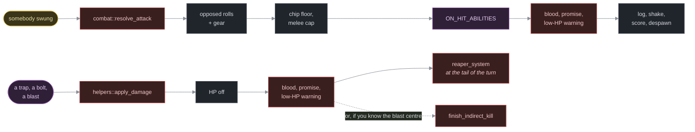

Working with the ECS
====================

    Audience       Engine developers. You are adding a mechanic, not a
                   row in a table — you need to reach an entity, change
                   it, and get the borrow checker to let you.
    Prerequisites  You write Rust. You know what a component and a
                   system are. You have read
                   `../reference/components.md` at least once.

Recipes: copy the shape, change the nouns. *Why* the code is arranged this way is `../explanation/ecs-in-nihilurk.md`.

Fifteen of nihilurk's sixteen schedule steps take `&mut World` and nothing else. That one fact decides everything below: you are not writing `Query<&mut Fighter>` and letting bevy sort out the aliasing, you are holding the whole world and borrowing bits of it by hand. The borrow checker is stricter here than it is in a `Query`-based codebase, and the five patterns in the first section are how every mechanic in the tree gets past it.

    Contents

    The five borrow patterns              start here
    Recipe: add a component
    Recipe: add a kind of entity
    Recipe: put something in the world
    Recipe: deal damage
    Recipe: apply a condition
    Recipe: read a stat gear contributes to
    Recipe: queue an intent from input
    Recipe: add a system to the turn
    Recipe: decorate without depending on the renderer
    Recipe: write a system that really is a Query
    Checking your change

The five borrow patterns
------------------------

### 1. Copy out, then mutate

`world.get::<C>(e)` hands back `Option<&C>`, and that `&` borrows the **whole world**. While you hold it you cannot log, roll a die, or touch another component. So take a copy and drop it on the same line:

    let Some(pos) = world.get::<Position>(victim).copied() else {
        return;
    };
    // `world` is free again from here.
    crate::shake::kick_shake(world, ShakeKind::Kill);

`.copied()` for a `Copy` component, `.cloned()` or `.map(|n| n.what.clone())` for a `String`, `.map(|f| f.hp)` when you only want one field. The `let ... else` is the house guard clause — see `../explanation/code-calisthenics.md`.

The same rule in its most common disguise: **name things before you log them.** This does not compile if you inline `item_label`, because the log is a resource and the name is a borrow of the world:

    let name = item_label(world, entity);                   // borrow ends here
    if let Some(mut mob) = world.get_mut::<Mob>(entity) {
        mob.movement_type = MovementType::Confused;
    }
    world.resource_mut::<GameLog>()
        .add(format!("The {name} {mob_verb}."));

(`conditions::stagger`.) A `Mut<C>` from `get_mut` behaves the same way — its borrow ends at its last *use*, not at the end of the block, so a write followed by a `resource_mut` is fine as long as nothing touches the `Mut` afterwards.

### 2. Collect, then iterate

`world.query::<…>()` needs `&mut World` **even to read**, and the `QueryState` it returns borrows the world for as long as you iterate it. Any loop body that mutates must therefore run after the iteration ends. Collect the entity ids first:

    let doomed: Vec<Entity> = {
        let mut q = world.query::<(Entity, &Fighter)>();
        q.iter(world)
            .filter(|(_, f)| f.hp <= 0)
            .map(|(e, _)| e)
            .collect()
    };

    for entity in doomed {
        finish_indirect_kill(world, entity, None);
    }

(`combat::reaper_system`.) Collect **ids**, not references — the whole point is to stop borrowing. And re-check anything you collected before you use it: by the time the loop reaches the third entity, the first two may have despawned it, teleported it or turned it into something else. `traps::detonate_trap` does exactly that:

    if world.get::<Position>(victim).is_none() {
        continue;   // an earlier victim's trapdoor took this one with it
    }

### 3. `mem::take` a queue before you drain it

A system that drains a queue resource cannot hold that resource while it resolves, because resolving touches everything. Swap the queue's contents out for an empty `Vec` in one move:

    pub fn combat_system(world: &mut World) {
        let attacks = std::mem::take(&mut world.resource_mut::<AttackQueue>().attacks);
        for attack in attacks {
            resolve_attack(world, attack.attacker, attack.target);
        }
    }

All four queues (`AttackQueue`, `UseQueue`, `ThrowQueue`, `SpellQueue`) are drained exactly like this. It also gives you the right semantics for free: an attack queued *while* the queue is draining lands next turn, not in the middle of this one.

### 4. `entity_mut` for a burst of writes

`world.entity_mut(e)` returns an `EntityWorldMut` that holds the world until you drop it. Inside it, `insert`/`remove`/`get`/`contains` are cheap and archetype-aware — so batch structural changes there rather than calling `world.entity_mut(e)` once per component:

    let mut e = world.entity_mut(item);
    if e.contains::<PowerDie>() && e.contains::<PowerBonus>() {
        e.insert(PowerBonus(0));
    }
    e.remove::<Curse>();

(`items::wands::cancel_player`.) What you **cannot** do inside that block is call anything taking `&mut World` — including `world.resource_mut()`. Gather the facts, close the block, then log.

### 5. `&World` can read but not query

A helper that only reads should take `&World`, so its callers can hold one alongside other borrows. The cost is that `world.query()` is off the table; you get `world.get::<C>(e)` and `world.iter_entities()` and nothing else.

    pub fn equipped(world: &World, wearer: Entity) -> impl Iterator<Item = EntityRef<'_>> {
        world
            .iter_entities()
            .filter(move |e| e.get::<Equipped>().is_some_and(|eq| eq.by == Some(wearer)))
    }

(`equipment::equipped`.) Prefer returning an iterator of `EntityRef` over a `Vec<Entity>`: the caller gets to read components straight off it with no second lookup and no allocation. Keep a `Vec`-returning twin (`equipped_items`) only for callers that go on to mutate.

Recipe: add a component
-----------------------

Before you write one, check you need one. Three things that look like new components are not:

  * **A property some system will ask about** — fire immunity, sees invisible, hits harder. That is an *effect*: a marker in `effects.rs` plus a row in the `EFFECTS` registry, so a table can name it with `Grant::of::<C>()` and a wand of cancellation can strip it. Follow `add-an-effect.md` instead.
  * **A number gear contributes** — a weapon's die, a ring's plus. That is a `Modifier` in `effects.rs`; `equipped_total` already folds it.
  * **Which one of a kind a thing is** — a fourteenth wand, a sixteenth potion. That is a variant on an existing type key and a row in `catalog.rs`. See `add-an-item.md`.

What is left is a genuinely new *fact about an entity*, and it goes in `models/src/components.rs` — nouns only, no behaviour:

    /// Two sentences: what carrying this means, and who owns it. Name the
    /// system that reads it, and — if it is transient — say so here,
    /// because that doc comment is the only record of why it is missing
    /// from the save.
    #[derive(Component)]
    pub struct Doomed {
        pub turns: u32,
    }

Then, in order:

  1. **Derive no more than it needs.** `Component` always. `Clone, Copy` when it is small and gets read out by value. `Serialize, Deserialize` *only* if the save stores the type itself rather than its fields — most do not.
  2. **Decide if it is saved**, and write the answer in the doc comment. If yes: a field on `saveload::EntitySave` with `#[serde(default)]`, plus the save line and the load line. If no, say *why* — rebuilt every frame (`Viewshed::visible_tiles`), reset on load (`Speed::energy`), or re-attached from a catalog row by name (`ThrownDamage`). A component that is silently neither is a bug waiting for somebody's save file.
  3. **Give it a row** in `../reference/components.md`, in the section it belongs to, with its "Saved?" column filled in.

Rules that are not negotiable:

  * **No `fn` that touches the `World`.** If the component needs a verb, the verb lives in the module that owns the domain — `conditions.rs` for an affliction, `equipment.rs` for gear. Methods *about the type* (`SpeedKind::faster`, `Name::article`) are fine.
  * **A saved enum is written by variant position.** Append variants; never reorder one, or a saved trapdoor comes back as something else.
  * **Small.** A component with eight fields is usually two components.

### Attaching and detaching one

    world.entity_mut(e).insert(Doomed { turns: 3 });
    world.entity_mut(e).remove::<Doomed>();

Both are structural — they move the entity between archetypes — so they invalidate any query you are in the middle of. That is what pattern 2 (collect, then iterate) is for. From a `Query` system, defer them through `Commands` instead:

    commands.entity(entity).insert(Hidden);

Recipe: add a kind of entity
----------------------------

"Kind" means a new *shape* — a thing that is neither a monster, an item, nor a trap. Adding a new monster or a new potion is a table row and nothing else; see `add-a-monster.md` and `add-an-item.md`.

A new kind is three pieces, and the third is what keeps it from spreading:

**1. A `Def` row type, with the table beside it.** Not in `components.rs` — next to the content it describes, so the type, the table and the one place it is built are all in one file:

    pub struct TrapDef {
        pub effect: TrapEffect,
        pub name: &'static str,
        pub glyph: char,
        /* … the dials its mechanic needs, on the row */
    }

    pub const TRAPS: &[TrapDef] = &[ /* one line per trap */ ];

**2. A `Bundle`, so the entity is described exactly once.** Every spawn site goes through it — level population, a scroll that conjures one, a save being reloaded — and none of them assembles the components by hand:

    #[derive(Bundle)]
    pub struct TrapBundle {
        pub name: Name,
        pub glyph: Renderable,
        pub position: Position,
        pub trap: Trap,
        pub hidden: Hidden,
    }

    impl TrapBundle {
        pub fn from_def(def: &TrapDef, reveal: TrapReveal, position: Position) -> Self { … }
    }

    let e = world.spawn(TrapBundle::from_def(def, reveal, pos)).id();

Components that only *some* of the kind carry stay off the bundle and go on afterwards, the way `spawn_monster` adds `Invisible` for the phantom:

    let e = world.spawn(MonsterBundle::from_def(def, pos)).id();
    grant_all(world, e, def.grants);
    if def.invisible {
        world.entity_mut(e).insert(Invisible);
    }

**3. A way to reach it by name.** Add the table to `spawn::spawn_named` and to `spawn::content_names`, and the new kind immediately answers to `NIHILURK_SPAWN`, to `-content`, to every test, and to `models/tests/content.rs`'s "every name spawns and keeps its name" check. If it is *loot* rather than furniture, implement `ItemDef` and give it a `DROPS` row instead — `add-an-item-category.md` is the full recipe.

Then the bookkeeping, in order:

  * **Saving.** Decide what the save stores and what it reads back off the row. Store the row's *name*, never its contents (see `restore_from_catalog`), and add the entity's own mutable state — a trap's `revealed` latch, a wand's charges.
  * **Despawning between floors.** `map::levels::transition_level` clears everything with a `Position` that is not the player and not in a backpack. If your kind should survive a staircase, it needs a reason and an exception; if it should not, you have nothing to do.
  * **Drawing.** A `Renderable` gets it on screen, but *when* it draws is a layer in `engine/src/view.rs`'s `render`, and the order matters — a later layer covers an earlier one. See `../reference/rendering.md`.
  * **Documenting.** A row in `../reference/content-tables.md` for the table and one in `../reference/components.md` for anything new it carries.

The test that tells you it landed: `cargo run -p engine -- -content` lists it, and `NIHILURK_SPAWN="<name>"` puts one in front of you.

Recipe: deal damage
-------------------

There are exactly two ways, and which one you want depends on whether somebody swung.

**Something hit something else** — use the opposed-roll resolver:

    crate::combat::resolve_attack(world, attacker, target);

It rolls both sides, folds in every equipped modifier, fires the `ON_HIT_ABILITIES` table, spills blood, logs the line, kicks the shake, pays the score and despawns the corpse. You do not do any of that yourself. Monsters reach it by pushing onto the `AttackQueue` (below); the player's own swing calls it inline from `move_player`.

**Something took damage with no swinger** — a trap, a bolt, a blast:

    crate::helpers::apply_damage(world, victim, amount);

That subtracts the HP, spills blood, breaks any promise the victim was holding and fires the low-HP warning. It deliberately does **not** kill: anything left on `hp <= 0` is finished by `reaper_system` at the tail of the turn. If you know where the damage came from and want the corpse flung away from it, finish the casualty yourself instead:

    if world.get::<Fighter>(victim).is_some_and(|f| f.hp <= 0) {
        crate::combat::finish_indirect_kill(world, victim, Some(center));
    }

(`items::wands::elemental_blast`.)

Three rules that are easy to get wrong:

  * **Armour.** `resolve_attack` rolls the defender's armour *die*. Everything else — traps, thrown weapons — subtracts only the armour *plus*, via `helpers::total_armor_plus`, and a `Projectile` subtracts nothing at all. A blast subtracts nothing either.
  * **Elements.** If the damage has a flavour, go through `items::wands`'s `damage_with_element`, which checks the target's immunity (`Element::immunity()`) and logs the shrug. Never match on a species.
  * **`took_damage`.** Melee applies its own HP change and so has to call `helpers::took_damage` by hand. If you ever add a third damage path, call it too — it is the one place "what happens because a creature was hurt" lives.

Recipe: apply a condition
-------------------------

Never insert a condition component directly. Call the verb in `crate::conditions`, which already knows the player takes an affliction differently from a monster:

    use crate::conditions::{blind, confuse, paralyse, hasten, snare, shift_entity_speed};

    // The player gets `Confused`; a monster gets `MovementType::Confused`.
    confuse(
        world,
        victim,
        "The flash leaves you reeling — you are dazzled!",  // the player reads this
        "is dazzled",                                       // "The rat ___."
    );

    // Pinned for a count of turns. Deliberately silent — the sentence
    // belongs to whatever pinned them.
    snare(world, victim, Grant::of::<Asleep>(), SLEEP_TURNS);

Every verb returns `bool`: whether it actually took hold. That answer is load-bearing — a potion thrown at a monster only identifies itself when something plainly happened (`items::throwing::shatter_potion`), so pass it up rather than discarding it.

**To add a new condition**, in order:

  1. A marker component in `components.rs`, doc-commented with what it costs the player and what it does to a monster instead.
  2. A verb in `conditions.rs` that does the player/monster split once.
  3. An arm in `conditions::cure_one_condition` (a rosé coin and a ring of regeneration both lift "the worst thing wrong with you", worst first) and in `conditions::afflicted`.
  4. An arm in `conditions::clear_player_conditions`, unless it is meant to survive a staircase — `Plated` and `Forged` are the only two that do, and the staircase *settles* them instead.
  5. A field in `saveload::EntitySave` with `#[serde(default)]`, plus the save and load lines. A condition a save forgets is a condition that silently lifts on reload.
  6. A badge in the HUD's condition list (`engine/src/view.rs`).

A condition that lives on a *monster* usually needs none of this: prefer a `MovementType` or a `Speed` shift, which the AI already reads.

Recipe: read a stat gear contributes to
---------------------------------------

Never walk the pack. One call folds the entity's own component together with every equipped source of the same modifier:

    use crate::effects::{equipped_total, PowerDie, PowerBonus, ArmorDie, ArmorBonus, ThrowBonus};

    let power = world.get::<Fighter>(e).map_or(1, |f| f.power)
        + equipped_total::<PowerDie>(world, e);

It does not know what kind of item supplied the number, and neither should you: that is the whole reason a ring of protection needs no code. Combat, the throw roll, the trap damage rule and the HUD all fold through it, which is why the HUD can never drift from the dice.

**Want more than one of them? Take the whole loadout in one pass.** Each `equipped_total` walks the wearer's gear again, so five fields is five walks over the same handful of items:

    let worn = crate::effects::loadout(world, entity);
    let power = world.get::<Fighter>(e).map_or(1, |f| f.power) + worn.power_die;
    let cap = worn.melee_cap;   // ceilings fold with `min`, not `+`

`combat::fold_matchup` takes one per side; the HUD takes one per frame. There is no cache underneath it — `Equipped` is still the only record of who wears what.

To ask whether an entity *has* a property, probe the marker, never the source:

    if world.get::<SeesInvisible>(e).is_some() { … }

A ring, a potion and being born that way all leave the same component.

Recipe: put something in the world
----------------------------------

Anything the content tables know, by name:

    let dragon = crate::spawn_named(world, "dragon", pos);      // Option<Entity>

That is the door a test, a debug command and `NIHILURK_SPAWN` all use. It builds the thing **exactly as its row describes it** — no enchantment roll, no battery charge, no ammunition bundle. For the dungeon's own randomised version, `spawn::roll_item(world, rng, depth, pos)`.

Assembling an entity by hand is for one case only: you are adding a new *kind* of thing. Then it is a `Bundle` next to its table, never a pile of `insert` calls at a call site:

    #[derive(Bundle)]
    struct MonsterBundle { name: Name, mob: Mob, fighter: Fighter, /* … */ }

    let e = world.spawn(MonsterBundle::from_def(def, pos)).id();

See `spawn-a-thing.md` for the full recipe and `add-an-item-category.md` for a new table.

Two things about *removing*:

  * `world.despawn(e)` is final. Anything still holding that `Entity` — a `Backpack`, a queued `WantsToThrow` — now holds a dangling id, so take it out of the pack first (`items::scrolls::lift_curses` shows the shape).
  * An item picked up does not despawn: it loses its `Position`. An item dropped gets one back. "Is it on the floor?" is `With<Item>, With<Position>`.

Recipe: queue an intent from input
----------------------------------

Input handlers do not resolve anything. They push an intent and return whether a turn was spent; the matching system drains it next time the schedule runs.

    world.resource_mut::<AttackQueue>().attacks.push(WantsToAttack {
        attacker: mob,
        target: target_entity,
    });

| Intent           | Queue         | Drained by     |
|------------------|---------------|----------------|
| `WantsToAttack`  | `AttackQueue` | `combat_system`|
| `WantsToUse`     | `UseQueue`    | `item_system`  |
| `WantsToThrow`   | `ThrowQueue`  | `throw_system` |
| `WantsToCast`    | `SpellQueue`   | `spell_system`  |

`WantsToUse` carries `slot_idx` so a surviving item goes back to the exact pack row it came from, and `target` for anything aimed. A throw of a stacked item goes through `models::draw_one` first, which splits one arrow off and leaves the quiver where it was. `WantsToCast` is an active spell's own intent — a wand's twin, minus everything about an item because a spell isn't one.

Recipe: add a system to the turn
--------------------------------

Register it in `engine/src/main.rs` with an explicit `.after()`. There is no implicit ordering and no `SystemSet` in nihilurk — the schedule is one flat list of sixteen steps, and every edge is deliberate:

    schedule.add_systems((
        // …
        combat_system.after(equipment_effects_system),
        reaper_system.after(combat_system),
        // …
    ));

Then say *why* the edge exists in `../reference/input-and-turn-loop.md`, which prints the whole order. Before you add a step, check whether it belongs at the tail: `passive_ability_system` and `score_turn_system` are both there on purpose (a passive that moves you must land at the top of your next turn; a combo cannot be totalled until the dying is over).

Recipe: decorate without depending on the renderer
--------------------------------------------------

Gameplay code arms cosmetics and forgets. It must never *require* them — tests build a bare world with no effect layer at all. So reach for the cosmetic resources through `get_resource_mut`, not `resource_mut`:

    if let Some(mut fx) = world.get_resource_mut::<Particles>() {
        fx.hit_spark(x, y);
    }

The screen shake wraps that for you, so combat code never has to think about it:

    crate::shake::kick_shake(world, ShakeKind::Heavy);   // no-op with no Shake resource

Two more rules:

  * **Cosmetic rolls come off `FxRng`, never `GameRng`.** A colour drawn from the gameplay stream would mean every firework quietly reshuffled the dice for everything after it. `score::random_bright` and `helpers::spill_blood` both show the pattern.
  * **Gate anything that leaks information on sight.** A shake for a blast in a room the player has never entered tells them there is a room there. `helpers::player_sees(world, x, y)` is the shared check.

Recipe: write a system that really is a Query
---------------------------------------------

One system in nihilurk is `Query`-based (`visibility_system`), because it only reads and tags and never despawns. If yours is the same shape, write it that way — narrow filters are self-documenting and bevy checks the aliasing for you:

    pub fn visibility_system(
        mut commands: Commands,
        mut viewshed_query: Query<
            (Entity, &mut Viewshed, &Position, Option<&SeesInvisible>, Option<&Blind>),
            With<Player>,
        >,
        mut log: ResMut<GameLog>,
        map: Res<Map>,
    ) { … }

Three things to copy from it:

  * **`With<Player>` is load-bearing, not decoration.** Without it a future monster viewshed would reveal the map for the player.
  * **Ask for `Option<&C>` rather than a second query** when a property is optional — `SeesInvisible` might come from a ring, a potion or birth, and this system never asks which.
  * **Structural changes go through `Commands`**, which defers them past the end of the iteration. That is the whole reason this can be a `Query` system at all.

Fetch nothing you do not read. A tuple that grows past what the body actually uses is the first sign a system is doing two jobs.

Checking your change
--------------------

    cargo test --workspace          # everything
    cargo clippy --all-targets      # correctness / suspicious / complexity / perf
    cargo fmt --all

    grep -rn '} else' models/src engine/src --include='*.rs'

Every hit of that last one should be a `let … else` or a two-armed expression ternary; anything else is a regression against `../explanation/code-calisthenics.md`.

And the one that catches an ECS mistake specifically:

    cargo test --test determinism

It pins that a seed produces the same walls and the same floor contents it always has. If a change to *when* something is spawned moves that, you have drawn from the wrong RNG stream — see `map::streams::content_rng`.

See also
--------

  ../explanation/ecs-in-nihilurk.md   why the world is driven this way
  ../reference/components.md      every component, resource and event
  ../reference/spawn-api.md       the functions that build entities
  ../reference/input-and-turn-loop.md   the schedule, in order
  add-an-effect.md                adding a property rather than a mechanic
  add-an-item-category.md         adding a whole new kind of item
  spawn-a-thing.md                putting one specific thing on one tile
  ../explanation/code-calisthenics.md   the shape this code is held to
