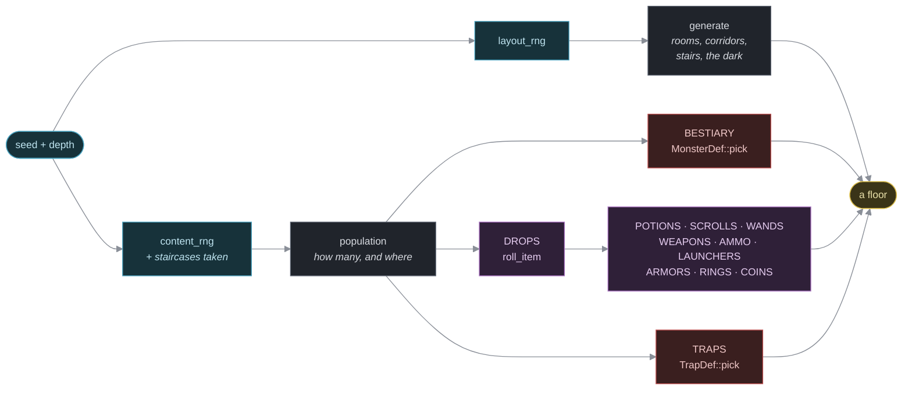

Reference: content tables
=========================

    Audience       Anyone editing content. Look things up here; do not
                   read it end to end.
    Prerequisites  None.
    Status         Describes the tables as they are in the source. If
                   this page and the source disagree, the source is
                   right and this page is a bug.

Every table in the game, every field, every default.

Where everything is
-------------------

| Table               | File                       | Row type       |
|---------------------|----------------------------|----------------|
| `BESTIARY`          | `models/src/monsters.rs`   | `MonsterDef`   |
| `POTIONS`           | `models/src/catalog.rs`    | `PotionDef`    |
| `SCROLLS`           | `models/src/catalog.rs`    | `ScrollDef`    |
| `WANDS`             | `models/src/catalog.rs`    | `WandDef`      |
| `WEAPONS`           | `models/src/catalog.rs`    | `WeaponDef`    |
| `AMMO`              | `models/src/catalog.rs`    | `AmmoDef`      |
| `LAUNCHERS`         | `models/src/catalog.rs`    | `LauncherDef`  |
| `ARMORS`            | `models/src/catalog.rs`    | `ArmorDef`     |
| `RINGS`             | `models/src/catalog.rs`    | `RingDef`      |
| `COINS`             | `models/src/catalog.rs`    | `CoinDef`      |
| `TRAPS`             | `models/src/traps.rs`      | `TrapDef`      |
| `DROPS`             | `models/src/spawn.rs`      | `DropCategory` |
| `EFFECTS`           | `models/src/effects.rs`    | `Grant`        |
| `PASSIVE_ABILITIES` | `models/src/abilities.rs`  | `PassiveAbility` |
| `ON_HIT_ABILITIES`  | `models/src/abilities.rs`  | `OnHitAbility` |
| `FLAGS`             | `models/src/pride.rs`      | `PrideFlag`    |

For the live contents of any of them:

    cargo run -p engine -- -content

BESTIARY — MonsterDef
----------------------

Constructor: `MonsterDef::row(name, glyph, color, movement, hp, power, power_bonus, armor, armor_bonus, min_depth)`, then optional chains.

| Field         | Type               | Def.    | Meaning                    |
|---------------|--------------------|---------|----------------------------|
| `name`        | `&'static str`     | --      | Unique; its save identity. |
| `glyph`       | `char`             | --      | One character on the map.  |
| `color`       | `Color`            | --      | See the palette below.     |
| `movement`    | `MovementType`     | --      | Static/Chase/Flee/Confused |
| `hp`          | `i32`              | --      | Hit points; also `max_hp`. |
| `power`       | `i32`              | --      | Attack die: `1d[power]`.   |
| `power_bonus` | `i32`              | --      | Flat, once, on that roll.  |
| `armor`       | `i32`              | --      | Defence die: `1d[armor]`.  |
| `armor_bonus` | `i32`              | --      | Flat, once, on that roll.  |
| `min_depth`   | `u8`               | --      | Shallowest floor it spawns.|
| `weight`      | `u32`              | `10`    | Rarity vs eligible pool.   |
| `grants`      | `&'static [Grant]` | `&[]`   | Effects it is born with.   |
| `invisible`   | `bool`             | `false` | Born unseeable.            |

Chains: `.grants(&[...])`, `.invisible()`, `.weight(n)`.

Combat: `damage = (1d[power] + power_bonus) - (1d[armor] + armor_bonus)`, both sides rolled independently. Nothing ever misses.

Spawning a row attaches: `Name`, `Mob`, `Fighter`, `Renderable`, `Position`, `Faction::Monster`, `Blood`, `Grants`, `Speed(Normal)`, plus each granted effect component, plus `Invisible` if the row asked.

`MovementType::Aggravated { tx, ty }` exists but is applied at run time by the scroll of aggravate monsters. Never put it in a row.

A species' whole special behaviour is its `grants`. The aquator is the one whose grant reaches for the *player's gear* rather than the player: `RustsArmor` means every blow it lands calls `equipment::corrode_armor` on what it hit, taking a point off the worn armour's `ArmorBonus` (never its die — ruined plate is still plate, and the plus can go negative). A scroll of enchant armour mends it; a ring of maintain armor (`SustainsArmor`) stops it; a wand of cancellation takes the corrosion out of the aquator.

Item tables
-----------

Every row implements `ItemDef`, which supplies:

    fn name(&self) -> &'static str            required
    fn spawn(&self, world, pos) -> Entity      required
    fn weight(&self) -> u32                    default 10
    fn min_depth(&self) -> u8                  default 1
    fn spawn_as_loot(&self, world, rng, pos)   default: calls spawn

No item row overrides `weight` or `min_depth` today — within a category nihilurk picks evenly on purpose.

### POTIONS — PotionDef

| Field    | Type           | Notes                                    |
|----------|----------------|------------------------------------------|
| `effect` | `PotionEffect` | Keys the mechanic; identity in saves.    |
| `name`   | `&'static str` |                                          |
| `color`  | `Color`        |                                          |

Draws `!`. Attaches `Item`, `Potion`, `Consume`. Mechanic: `apply_potion_effect` in `models/src/items/potions.rs`. That match has no catch-all, so a new `PotionEffect` variant will not compile until it has an arm — same rule as `TrapEffect` above. An arm is allowed to do nothing on purpose, though only two do today (`FruitJuice` and `Water`, which are a log line and a taste); the other fourteen all bite.

The dials the arms read — how much ceiling a dose of healing is worth, how much power poison takes — are `constants::potions`. Five arms reach straight into `Fighter` (healing, extra healing, gain strength, poison, restore strength) and one into `Magic` (the potion of magic, which fills the pool and lifts its ceiling the way gain strength lifts the arm's), three hand off to `crate::conditions` (blindness, confusion, paralysis — and haste, via `hasten`), two tag things `Detected`, one lends `SeesInvisible` for the floor, and `RaiseLevel` calls `transition_level` upward (and, on Depth 1 with the Element of Yoord in the pack, wins the run outright).

### SCROLLS — ScrollDef

| Field    | Type           | Notes                                    |
|----------|----------------|------------------------------------------|
| `effect` | `ScrollEffect` | Keys the mechanic; identity in saves.    |
| `name`   | `&'static str` |                                          |

Draws `?`, always white — a scroll has no colour field. Attaches `Item`, `Scroll`, `Consume`. Mechanic: `apply_scroll_effect` in `models/src/items/scrolls.rs`. That match has no catch-all, so a new `ScrollEffect` variant will not compile until it has an arm — same rule as `TrapEffect` above. Every row bites; `BlankPaper` is the only arm that does nothing, and it says so.

Each scroll has a flourish of its own — which one, and why that one, is `../explanation/the-feel-layer.md`.

The dials the arms read — what one enchantment is worth, how long sleep and hold last, how often sleep backfires — are `constants::scrolls`. Three arms go off across whatever the reader can see (scare monster, hold monster, sleep, via `helpers::hostiles_in_view`), two reach into the gear in a slot (the enchantments), one arms the reader's next blow (monster confusion, spent by the `ON_HIT_ABILITIES` row below), two tag things `Detected` — food detection takes precisely what a potion of magic detection rejects, so between them they find every item on the floor exactly once, with the Element of Yoord deliberately turning up for both.

### WANDS — WandDef

| Field    | Type           | Notes                                    |
|----------|----------------|------------------------------------------|
| `effect` | `WandEffect`   | Keys the mechanic; identity in saves.    |
| `name`   | `&'static str` |                                          |
| `color`  | `Color`        |                                          |
| `range`  | `i32`          | Feeds the aiming reticle. In use: 6, 8.  |

Draws `/`. Attaches `Item`, `Wand`, `Ranged`, `Battery`. A floor drop rolls its battery with `roll_wand_charges`. Charge dice, zap damage dice and both blast radii live in `models/src/constants.rs` → `wands` (see `constants.md`). Whether zapping opens the reticle: `WandEffect::needs_target`, which is true for everything except the wand of light. Mechanic: `apply_wand_effect` in `models/src/items/wands.rs`. That match has no catch-all, so a new `WandEffect` variant will not compile until it has an arm — same rule as `TrapEffect` above; every existing variant already does something real. Throwing a wand is resolved in `models/src/items/throwing.rs` (`resolve_wand_throw`), a narrower, still-`_`-fallback dispatch over only the six utility effects a thrown blast can carry (`apply_thrown_wand_effect`) — it is not the "unwired effect" checkpoint; `apply_wand_effect` is.

Every wand's zap, burst, poof and blast palette is described in `../explanation/the-feel-layer.md`; none of it is a field on this table.

Neither a zap nor a throw can be aimed at the player's own tile: the engine refuses it with "Great idea! But no." and no turn passes.

**Thrown**, a wand bursts on impact and spends every remaining charge at once. Which blast it makes is three rows:

| Wand kind | Radius | Damage | Payload |
|---|---|---|---|
| attack (`is_attack_wand`) | `GRENADE_RADIUS` | `GRENADE_DIE_PER_CHARGE` sides per charge, armour-ignoring | its element, if it has one |
| wand of light | `GRENADE_RADIUS` | the same | `dazzle` on every creature caught |
| utility | `BLAST_RADIUS` | none | the wand's own effect, on every creature caught |
| wand of nothing | — | none | confetti |

Dials: `constants::wands`. Resolution: `resolve_wand_throw` and `apply_thrown_wand_effect` in `models/src/items/throwing.rs`. What each of those looks like on screen is `../explanation/the-feel-layer.md`; what a condition does to the player it lands on is `components.md`.

### SPELLS — SpellDef

The one catalog row that never spawns anything: a spell carries no `Item`, no `Position`, no pack slot. It lives permanently in whoever's `Spellset` it's in (the player's, taught by a hero coin — see "COINS" above) and is triggered from there (the `Z` menu, by row letter).

| Field    | Type           | Notes                                                          |
|----------|----------------|-----------------------------------------------------------------|
| `effect` | `SpellEffect`   | Keys the mechanic; identity in saves (a `Spellset` is `Vec<SpellEffect>`). |
| `name`   | `&'static str` | Shown on the `Z` menu and in "You unleash your ___!"           |
| `cost`   | `u8`           | `Magic` points one use spends, times `constants::spells::TURBO_MAGIC_COST_MULT` when `TurboMagic` (a staff) meets an `Attack` — which multiplies that spell's damage by the larger `TURBO_MAGIC_POWER_MULT` in the same breath. |
| `range`  | `i32`          | Feeds the aiming reticle. Meaningless — left at `0` — for a spell whose `SpellEffect::needs_target()` is `false`. |
| `kind`   | `SpellKind`     | `Attack` or `Skill` — the same split `WandEffect`'s attack/utility divide makes, and the one `TurboMagic` checks. |

Sixteen rows, four `Magic`-cost tiers of four: see MANUAL.md, "Magic and spells", for what each one does. `SpellEffect::needs_target` says whether a spell opens the aiming reticle at all (an attack aimed at a tile) or fires on the caster/everyone-in-view the instant its slot is pressed (a self-cast skill, or a room-wide attack like Circle of Death) — the same courtesy `WandEffect::needs_target` gives the wand of light.

Mechanic: `apply_spell_effect` in `models/src/items/spells.rs`, keyed by `SpellEffect`, exhaustive with no catch-all like every other effect table in the game. Several rows are literally another category's own mechanic under a different name rather than a reinvention — Identify and Magic Mapping call straight into `scrolls::apply_scroll_effect`; Lux and Meteor Strike call `wands::elemental_blast` with a stand-in charge count, because a spell has no battery to read one off. Sting borrows the dart trap's own formula (`traps::trap_damage_tier`) rather than a fresh roll.

`MagicWard` (the spell) is an `EFFECTS` row like any other marker, lent for `Lifetime::Floor` by `effects::lend`, and it is checked in exactly two places — `helpers::apply_hit` (every `Hit` whose `magical` flag is set, zapped, thrown, breathed or cast, bounces off with a cosmetic ricochet, `wands::ward_ricochet`) and `abilities::fire_on_hit` (nothing a monster's landed blow carries with it takes hold). Lifted at the next staircase like any other floor-scoped effect, and named on the way out as a boon rather than an affliction (`conditions::FLOOR_BOONS`, `conditions::clear_player_conditions`).

`Bided` (Bide) is likewise a plain marker: `combat::fold_matchup` folds `constants::combat::BIDE_ATTACK_BONUS` into the bearer's next attack roll, and `combat::resolve_attack` removes the marker the instant that roll is folded — hit, glancing or miss, and before a double-striking estoc or a cleave can see it twice. Anything else the bearer does with a turn instead of landing an attack — a plain step, a used or thrown item, another move cast — spends it unfired: `equipment::reset_momentum` strips it on the same occasions it zeroes a rapier's `Momentum`.

A scroll of amnesia (`ScrollEffect::Amnesia`) is the one thing that un-teaches a spell: `scrolls::read_amnesia` drops one random entry from the reader's `Spellset` and clears their `Viewshed::revealed_tiles` for the current floor in the same breath.

### WEAPONS — WeaponDef

Constructor: `WeaponDef::new(name, color, power_die)`, then chains.

| Field        | Type           | Default      | Notes                     |
|--------------|----------------|--------------|---------------------------|
| `name`       | `&'static str` | --           |                           |
| `color`      | `Color`        | --           |                           |
| `power_die`  | `i32`          | --           | Damage rolls `1d[n]`.     |
| `thrown_die` | `i32`          | `power_die`  | Die rolled on impact.     |
| `projectile` | `bool`         | `false`      | Built to be thrown.       |
| `piercing`   | `bool`         | `false`      | Throw runs the whole line.|
| `reach`      | `i32`          | `0`          | Aimed rather than walked into: a bardiche (2), a whip (5). |
| `reach_piercing` | `bool`     | `false`      | The reach strike runs the whole line. |
| `grants`     | `&[Grant]`     | `&[]`        | Marker effects the wielder holds while it is in hand. |
| `on_wear`    | `Option<OnWear>` | `None`     | A one-shot fired the instant it is wielded. |
| `on_doff`    | `Option<OnDoff>` | `None`     | A one-shot fired the instant it is deliberately put away again. |

Chains: `.missile(die)` sets `thrown_die` and `projectile`; `.piercing()`, `.reach(tiles)`, `.reach_piercing()`, `.grants(&[...])`, `.on_wear(...)`, `.on_doff(...)` each set the field they name.

Draws `)`. Attaches `Item`, `Equipped::loose(Slot::Hand)`, `PowerDie`, `ThrownDamage`, and `Projectile` / `Piercing` / `Reach` / `ReachPiercing` / `Grants` / `OnWear` / `OnDoff` when asked. A floor drop is enchanted (see below). `grants`, `on_wear` and `on_doff` are all re-read from the row on load (`catalog::restore_from_catalog`), never stored in the save.

The staff is the only row with an `on_doff`, and the reason is worth repeating: it multiplies what every attacking spell costs and what it does (`constants::spells::TURBO_MAGIC_COST_MULT` and `TURBO_MAGIC_POWER_MULT`), and neither multiplier shows anywhere on the HUD. The two log lines are the whole of the player's notice, which is why the taking-off needs one as much as the putting-on. `OnDoff` fires only on the deliberate path (`equipment::toggle_equipped`), never from `force_unequip` — dropping, being disarmed and dying are not ceremonies, the same asymmetry `OnWear` already has against `equip_silently`.

`Projectile` means three things at once: the throw ignores the target's armour die, the missile is spent on what it hits, and nothing can catch it. A non-projectile throw is blunted by armour and can be caught and used against you.

### AMMO — AmmoDef

| Field         | Type           | Notes                                   |
|---------------|----------------|-----------------------------------------|
| `name`         | `&'static str` |                                         |
| `color`        | `Color`        |                                         |
| `die`          | `i32`          | Rolled when hurled by hand.             |
| `launched_die` | `i32`          | Rolled instead, once loosed from the launcher that answers to `launched_by`. A quarrel's is the plain double; an arrow's is short of that, a deliberate nerf on the bow. |
| `launched_by`  | `Grant`        | The effect that switches to `launched_die`. |

Draws `)`. Attaches `Item`, `ThrownDamage`, `LaunchedDamage`, `Projectile`, `LaunchedBy`, `Stack { count: 1 }`. No `PowerDie` and no `Equipped` — there is nothing to wield and nothing to wear.

Stacks to `STACK_LIMIT` per pack slot. A floor drop arrives as a bundle of `AMMO_BUNDLE_MIN..=AMMO_BUNDLE_MAX` (`constants::loot`) — never a lone arrow, because finding one arrow is not finding ammunition.

### LAUNCHERS — LauncherDef

| Field       | Type               | Notes                              |
|-------------|--------------------|------------------------------------|
| `name`      | `&'static str`     |                                    |
| `color`     | `Color`            |                                    |
| `grants`    | `&'static [Grant]` | Effects lent to whoever holds it.  |
| `melee_cap` | `i32`              | Most it is worth swung. Both are 1.|

Draws `}`. Attaches `Item`, `Equipped::loose(Slot::Hand)`, `Launcher`, `ThrowBonus(0)`, `Grants`, `MeleeCap`. Contributes no attack or armour die at all — its enchantment therefore lands on `ThrowBonus`.

`melee_cap` becomes a `MeleeCap` component, which clamps the wielder's melee damage however the dice fell. A launcher takes the hand a sword would have had; this is what that hand costs.

### ARMORS — ArmorDef

| Field       | Type           | Notes                                  |
|-------------|----------------|----------------------------------------|
| `name`      | `&'static str` |                                        |
| `color`     | `Color`        |                                        |
| `armor_die` | `i32`          | Defence roll adds `1d[n]`. In use 2-9. |

Draws `]`. Attaches `Item`, `Equipped::loose(Slot::Body)`, `ArmorDie`.

### RINGS — RingDef

Constructor: `RingDef::new(effect, name)`, then chains.

| Field         | Type                | Default | Notes                     |
|---------------|---------------------|---------|---------------------------|
| `effect`      | `RingEffect`        | --      | Identity for ident/saves. |
| `name`        | `&'static str`      | --      |                           |
| `power_die`   | `i32`               | `0`     | No row uses it today.     |
| `power_bonus` | `i32`               | `0`     | `.power_bonus(n)`         |
| `armor_die`   | `i32`               | `0`     | No row uses it today.     |
| `armor_bonus` | `i32`               | `0`     | `.armor_bonus(n)`         |
| `throw_bonus` | `i32`               | `0`     | `.throw_bonus(n)`         |
| `grants`      | `&'static [Grant]`  | `&[]`   | `.grants(&[...])`         |
| `on_wear`     | `Option<OnWear>`    | `None`  | `.on_wear(...)` — a one-shot fired the moment it goes on |

Draws `=`, always yellow. Attaches `Item`, `Ring`, `Equipped::loose(Slot::Finger)`, each non-zero modifier, `Grants` when non-empty, and `OnWear` when the row has one. A zero modifier attaches nothing. `grants` and `on_wear` are both re-read from the row on load, never stored in the save.

All twelve rings are live, and eleven of them are pure table — a modifier combat already folds, or a marker some system already asks about:

| Ring | Row content |
|---|---|
| protection | `.armor_bonus(2)` |
| strength | `.power_bonus(2)`, grants `SustainsStrength` |
| perception | grants `SeesInvisible` |
| aggravate monster | grants `AggravatesMonsters` |
| sharpshooting | `.throw_bonus(2)` |
| increase damage | `.power_bonus(2)` |
| regeneration | grants `Regenerates` |
| slow digestion | grants `Sluggish` |
| teleportation | grants `Teleportitis` |
| stealth | grants `Stealthy` |
| maintain armor | grants `SustainsArmor` |
| adornment | `.on_wear(items::rings::ADORNMENT)` |

The only ring behaviour code in the tree is `models/src/items/rings.rs`, and it holds three verbs, not a `match` on `RingEffect`: the adornment flourish (which the victory climb also calls), the regeneration tick and the teleportitis jump. Nothing outside that file asks which ring it has.

`do_it_with_style` is the flourish, and two things call it: wearing the ring, and `map::levels::win_with_style` (both ways out of the dungeon — the last stair, and a potion of raise level drunk on Depth 1). What it looks like is `../explanation/the-feel-layer.md`; what it is *worth* is `score::double`.

### COINS — CoinDef

Coins are the whole **pickup** category: an item that is never carried, works where it lies, and is gone. See `components.md`, "Components — items on the floor and in the pack".

| Field    | Type            | Notes                                          |
|----------|-----------------|------------------------------------------------|
| `name`   | `&'static str`  |                                                |
| `color`  | `Color`         |                                                |
| `effect` | `PickupEffect`  | Keys the mechanic; identity in saves.          |
| `amount` | `i32`           | The one dial. What it means is `effect`'s business: score for a treasure coin, hit points for the red one, afflictions lifted for the rosé. `0` for a row that needs no number. |
| `weight` | `u32`           | This row's share of the coin table against its table-mates. Ten is the baseline. |

Draws `$`. Attaches `Item`, `Pickup`, and — for a treasure coin only — `Value`, which is the component the score reads (the relic carries the same one).

| Coin | Effect | What it does |
|---|---|---|
| gold | `Coin` | `amount` into the score |
| silver | `Coin` | the same, less of it |
| red | `Health` | heals up to `amount`, never past `max_hp` |
| blue | `Power` | refills up to `amount` magic points |
| rosé | `Cleanse` | lifts up to `amount` afflictions, worst first |
| green | `Strength` | gives back up to `amount` drained `power` |
| platinum | `Platinum` | the `Plated` promise |
| forge | `Forge` | the `Forged` promise |
| hero coin | `LearnRandomSpell` | teaches one random, unlearned spell into the taker's `Spellset` (see "SPELLS — SpellDef"). Weight 3, well under the baseline — an uncommon find. Never disguised: it has no appearance and is never identified, because it is always just "a hero coin". |

Mechanic: `apply` in `models/src/items/pickups.rs`, an exhaustive match with no catch-all — a new `PickupEffect` does not build until it does something.

**One of them is not left to chance.** Every floor is stocked with a coin for the body before its item budget is spent -- a blue one on the odd floors, a red one on the even. The last floor of each difficulty tier (3, 6, 9, 12) also gets one draw from `catalog::PROGRESSION_ITEMS`: the platinum, forge and hero coins, the three potions that raise a ceiling (healing, magic, gain strength), and the three scrolls that sharpen gear for good (the two enchantments and vorpalize weapon). Neither comes out of the budget. See `../how-to/tune-rarity-and-depth.md`, "Dial 1".

**A coin that would do nothing is not taken.** `pickups::would_help` gates every one of them: a red coin at full health, a rosé coin with nothing wrong with you, a platinum coin when you already hold the promise. The coin stays on the floor, silently, and auto-explore skips it too (`autoexplore::known_item_tiles`) until the day it would help.

**A full pack is no obstacle**, because there is nothing to find room for. This is the one thing on the floor a full pack can still answer.

### The relic

Not a table — one function, `spawn_element_of_yoord`. Draws `"` in magenta, worth 25000, carries `Amulet`. Its name is the constant `ELEMENT_OF_YOORD`. Spawned in place of the down-stair on floor 13.

TRAPS — TrapDef
----------------

| Field         | Type          | Notes                                          |
|---------------|---------------|------------------------------------------------|
| `effect`      | `TrapEffect`  | Keys the mechanic; identity in saves.          |
| `name`        | `&'static str`| What `TrapEffect::label()` returns.            |
| `glyph`       | `char`        | `'^'` for all six.                             |
| `color`       | `Color`       | One per row.                                   |
| `weight`      | `u32`         | Rarity. All six are `10`.                      |
| `min_depth`   | `u8`          | All six are `1`.                               |
| `snare_turns` | `u32`         | Turns a bear / gas trap holds you; `0` otherwise. |

A trap entity carries `Name`, `Renderable`, `Position`, `Trap`, `Hidden`. It is never an `Item` and never a tile type.

Mechanic: `apply_trap_effect` in `models/src/traps.rs`. That match has no catch-all, so a new `TrapEffect` variant will not compile until it has an arm. A snaring trap reads its duration straight off the row, so it stays a one-file change.

Reveal style is rolled per trap at spawn, equal odds, not per row: `Sight` / `Adjacent` / `Triggered`.

A sprung trap gives out `TRAP_BREAK_CHANCE` of the time — the entity despawns and the log says `"The dart trap breaks!"` when the player can see it. The bear trap is exempt: it always bites once and is gone, quietly.

A trap set off *from a distance* — a missile that lands on it, a wand's blast that covers it — has nobody standing on it to bite, so it bursts instead: `detonate_trap` deals `TRICK_SHOT_DAMAGE_DICE d TRICK_SHOT_DAMAGE_SIDES` (armour-ignoring) over the `TRICK_SHOT_RADIUS` around its tile and then runs the mechanic once per creature caught. Dials: `constants::traps`.

### Trick shots — what a landing missile can set off

`traps::detonate_at(world, pos, shooter)` is the whole of it, called by `items::throwing::resolve_throw` for every throw, whatever was thrown. It returns a `TrickShot` saying what went off, or `None`. `shooter` is `Option<Entity>` because a coin caught in somebody else's chain reaction has no author to pay.

| On the tile | Reach | Damage | Follow-up |
|---|---|---|---|
| a `Trap` | `TRICK_SHOT_RADIUS` | the trick-shot dice | the trap's own effect, per survivor |
| a `Pickup` (a coin) | `PICKUP_TRICK_SHOT_RADIUS` (double) | the same dice | **the coin's effect, paid to the shooter** (`pickups::claim_from_afar`) — a red coin heals them, a gold one pays them, a platinum one makes them its promise. Worked *before* the burst, so the shooter's own blast cannot take the healing back off them. No `would_help` gate: stepping over a coin is leaving it for later, shooting one is a decision, and a decision is allowed to be a waste |
| the `Amulet` (the Element of Yoord) | `PICKUP_TRICK_SHOT_RADIUS`, then `TRICK_SHOT_RADIUS` twice | the dice, once per burst | see below. The relic is never destroyed, moved or spent |

A shot that sets *anything* off with something other than ammunition — a dagger, a potion, somebody's spare ring — logs "Very clever." Firing an arrow into a trap is what arrows are for; doing it with the rest of your kit is a choice.

**The ULTIMATE TRICK SHOT** (`traps::ultimate_trick_shot`) is what the relic does when a missile comes down on it: one wide burst where it lies, then a second burst centred on *every* creature that one caught, then a third on one of them (the first in reading order). Each can catch somebody the last one missed. All three burn in `BlastPalette::Ultimate` — white through magenta to dark magenta, the only blast no wand can produce — and the primary leaves a `Smoke` puff over every tile it covered. Only the first burst shouts — `BAM!`, or `WHY!` when the player is standing in their own blast; one shot is one trick shot however many times it goes off.

A wand's blast sets off everything it covers, traps first and then coins (`wands::elemental_blast`, via `things_in::<Trap>` / `things_in::<Pickup>`), and the coins pay *the zapper* — the blast's author is the shooter. None of those bursts is itself a blast, so nothing re-enters `elemental_blast` and a row of them cannot chain forever.

A coin set off with no author at all — caught in somebody else's chain reaction — is simply spent: `detonate_pickup` takes an `Option<Entity>` and pays nobody when there is nobody to pay.

Damage traps ignore the defender's armour *die* but still subtract the armour *plus* (`total_armor_plus`). Their bite also scales with depth in three bands (floors 1-4, 5-8, 9-13): each band adds a point to the arrow trap's roll and a point to the dart trap's permanent power drain. Dial: `constants::traps` (`TRAP_DAMAGE_TIER_LAST_DEPTH` and the per-tier steps).

The `Trap`, `TrapEffect` and `TrapReveal` types are defined in `components.rs`, not `traps.rs` — see `components.md`. The holds a trap applies (`Asleep`, `Pinned`, `Rooted`) are effects, in `effects.rs`.

DROPS — DropCategory
---------------------

    models/src/spawn.rs

| Field       | Type           | Notes                                   |
|-------------|----------------|-----------------------------------------|
| `name`      | `&'static str` | The category, not an item name.         |
| `weight`    | `u32`          | Share of a floor's drops.               |
| `min_depth` | `u8`           | Shallowest floor it drops on.           |

Three further fields are function pointers filled in by the `category!` macro from the table's name. Never write them by hand.

Current weights, which happen to total 1000:

| Category | Weight | Share |
|----------|--------|-------|
| scroll   | 300    | 30.0% |
| potion   | 270    | 27.0% |
| coin     | 170    | 17.0% |
| armor    |  80    |  8.0% |
| wand     |  50    |  5.0% |
| ring     |  50    |  5.0% |
| weapon   |  36    |  3.6% |
| ammo     |  28    |  2.8% |
| launcher |  16    |  1.6% |

The share column is derived, not maintained.

EFFECTS — the marker registry
------------------------------

    models/src/effects.rs

Each row pairs a **stable string id** with the component it attaches, and that id is what the save file stores. Rows may be reordered and retired freely; the one rule is **never rename an id**, the same rule a bestiary row lives by. There is no ceiling on how many effects there can be — the `u64` bitset that capped the list at 64 is gone.

A row may also carry the line the player reads when it runs out of turns, in brackets after the type:

    "asleep" => Asleep ["You shake off the drowsiness and come to."],

| # | Effect              | Meaning                                        |
|---|---------------------|------------------------------------------------|
| 0 | `FireImmune`        | Fire does nothing.                             |
| 1 | `ColdImmune`        | Cold does nothing.                             |
| 2 | `Undead`            | Draining passes through, healing nothing.      |
| 3 | `VorpalTarget`      | Any vorpal weapon slays it outright.           |
| 4 | `SeesInvisible`     | Sees hidden traps in view, invisible monsters, stashed items. |
| 5 | `SustainsStrength`  | Immune to dart-trap strength drain.            |
| 6 | `AggravatesMonsters`| Periodically wakes the floor. Passive.         |
| 7 | `ItemUser`          | Catches and wears thrown gear; reads scrolls.  |
| 8 | `FireArrow`         | Looses arrows properly (ups their die, short of doubling it). |
| 9 | `FireQuarrel`       | The crossbow's half of the same bargain.       |
|10 | `SustainsArmor`     | Worn armour cannot be corroded.                |
|11 | `RustsArmor`        | Every blow it lands eats a point of the victim's armour plus (the aquator). |
|12 | `Sluggish`          | Acts one notch below its own tempo. Folded in by `conditions::tempo`, never written to `Speed`. |
|13 | `Stealthy`          | Unnoticed until `rings::STEALTH_RANGE` tiles away. |
|14 | `Regenerates`       | Mends one condition, or a point of drained power, on a roll. Passive. |
|15 | `Teleportitis`      | Jumps somewhere else on a roll. Passive. Also arms the `T` key. |

Cap components — ceilings the dice cannot beat. Folded with `min`, not `+`, because the strictest one wins. Not in `EFFECTS`, not bits:

    MeleeCap     most the bearer can deal in one melee blow (a bow: 1)

Modifier components — numbers that stack across equipped gear, folded by `equipped_total::<C>()`. Not in `EFFECTS`, not bits:

    PowerDie     adds to the attack die size
    PowerBonus   flat, added once to the damage roll
    ArmorDie     adds to the defence die size
    ArmorBonus   flat, added once to the armour roll
    ThrowBonus   flat, added once to anything thrown

PASSIVE_ABILITIES — PassiveAbility
-----------------------------------

    models/src/abilities.rs

| Field     | Type                     | Notes                            |
|-----------|--------------------------|----------------------------------|
| `effect`  | `Grant`                  | The marker that arms it.         |
| `chance`  | `f64`                    | Probability per acting turn.     |
| `action`  | `fn(&mut World, Entity) -> bool` | Run on the bearer; reports whether it actually did anything. |
| `flavour` | `&'static str`           | Logged only for the player, and only when `action` returned `true`. |

Write `flavour` in the second person. The `bool` is what lets a passive that often has nothing to do (a ring of regeneration on an unhurt player, rolling every other turn) stay silent instead of narrating a non-event.

Three rows: `AggravatesMonsters` (10%), `Regenerates` (50%), `Teleportitis` (1/85). `passive_ability_system` runs at the **tail** of the turn schedule, after `ai` and before `visibility_system` — so a passive that moves its bearer lands the jump at the top of the bearer's next turn, and the player acts from the new tile before anything on the floor moves again.

ON_HIT_ABILITIES — OnHitAbility
--------------------------------

    models/src/abilities.rs

The other moment an effect can act on its own: a blow that connected. `combat::resolve_attack` fires the table for every hit that dealt damage and never learns what is in it.

| Field         | Type                             | Notes                        |
|---------------|----------------------------------|------------------------------|
| `effect`      | `Grant`                          | The marker on the *attacker*. |
| `on_glancing` | `bool`                           | Whether a glancing scrape counts. |
| `on_lethal`   | `bool`                           | Whether the killing blow counts. |
| `action`      | `fn(&mut World, Entity, Entity)` | Run as `(attacker, target)`. |

Two rows:

| Effect | Glancing? | Lethal? | Does |
|---|---|---|---|
| `ConfusingTouch` | no | no | `items::discharge_confusing_touch` — a scroll of monster confusion's charm, spent passing itself on. Needs skin, and there is no point charming a corpse. |
| `RustsArmor` | yes | yes | `equipment::corrode_armor` — the aquator. Acid does not care that the armour turned the blow; it landed on the armour. |

`ConfusingTouch` is named here by a `Grant` handle but is deliberately *not* in `EFFECTS`: it is a condition with its own save field (`saveload`), not a cancellable creature property. `Grant::probe` works either way — the registry is only about save bits and cancellation.

Enchantment
-----------

Rolled by `enchant_equipment` for every weapon, armour, launcher and ring that arrives as a floor drop. Never for a `spawn_named` spawn. The odds and the bonus ranges are `models/src/constants.rs` → `loot` (see `constants.md`).

| Quality     | Odds | Bonus            |
|-------------|------|------------------|
| Normal      | 25%  | +0               |
| Exceptional | 10%  | +1 .. +3         |
| Cursed      | 65%  | -5 .. +5, plus a `Curse` tag |

A cursed item can roll better than a clean one; it simply cannot be taken off once equipped, short of a scroll of remove curse (which destroys it) or the matching scroll of enchantment (which lifts the `Curse` tag and mends any minus to `+0` — see `constants::scrolls::ENCHANT_BONUS`).

The bonus lands on whichever roll the item feeds, read off the item itself: a thing with a `PowerDie` gets `PowerBonus`, a thing with an `ArmorDie` gets `ArmorBonus`, a `Launcher` gets `ThrowBonus`. Something that is two of those would get both. Never on the die size.

Identification
--------------

    models/src/identify.rs

Potions, scrolls, wands and rings are always shown by their true name -- no cosmetic appearance, no per-effect knowledge to track, nothing to keep in step with the catalog when a row is added.

Identification is equipment-only: a weapon, suit of armour or launcher hides its enchantment plus and cursed status until `KnownQuality` says otherwise (set by wearing it, or by a scroll of identify) -- and a ring, which `enchant_equipment` can also curse (never a plus, since it rolls no die), hides that curse the same way. `KnownQuality` is per-*instance* -- two rings of protection each rolled their own curse, so each needs its own.

A dud effect (`PotionEffect::Water`, `ScrollEffect::BlankPaper`, `WandEffect::Nothing`) is never a spawnable row; it only ever happens as the result of a wand of cancellation mutating a carried item in place (`items/wands.rs::cancel_entity`). Guarded by `the_dungeon_never_generates_a_dud_as_normal_loot` in `models/tests/content.rs`.

The colour palette
------------------

The save file packs a colour into one byte against this fixed list. Anything not on it draws correctly but reloads as `White`.

    Black       DarkGrey    Grey        White
    Red         DarkRed     Green       DarkGreen
    Yellow      DarkYellow  Blue        DarkBlue
    Magenta     DarkMagenta Cyan        DarkCyan

Dungeon constants
-----------------

The numbers a content author meets most often, and where each one is defined. The values are deliberately not repeated here — `constants.rs` is the only place they live, and a copy in prose is a copy that goes stale the first time somebody rebalances.

| Constant | Defined in |
|---|---|
| `MAP_WIDTH` / `MAP_HEIGHT` | `constants::map` |
| `FINAL_DEPTH` — the floor holding the relic | `constants::progression` |
| `DUNGEON_LORD_PATIENCE` — turns on one floor before eviction | `constants::progression` |
| `STACK_LIMIT` — most of one item per pack slot | `constants::items` |
| `PACK_CAPACITY` — most slots a pack holds at once | `constants::items` |
| `THROW_RANGE` — how far you can hurl a thing | `constants::items` |
| `Speed::COST` — energy one action costs | `components.rs`, on `Speed` itself |

Every one of them carries a doc comment saying what changing it costs you. See `constants.md` for the tour.

See also
--------

  ../explanation/the-feel-layer.md  what each of these looks like on screen
  spawn-api.md                  the functions that read these tables
  cli-and-env.md                flags and environment variables
  input-and-turn-loop.md        how confusion, snares, etc. play out at the keyboard
  ../how-to/add-an-item.md      how to add a row to one of these
