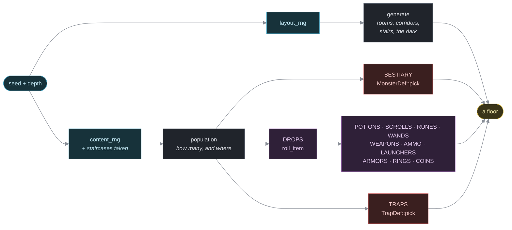

Reference: content tables
=========================

    Audience       Anyone editing content. Look things up here; do not
                   read it end to end.
    Prerequisites  None.
    Status         Describes the tables as they are in the source. If
                   this page and the source disagree, the source is
                   right and this page is a bug.

Every table in the game, every field, every default.

```mermaid
%%{init: {'theme':'base','themeVariables':{
  'primaryColor':'#20242b','primaryTextColor':'#d7dae0',
  'primaryBorderColor':'#5c6370','lineColor':'#8a8f98',
  'fontFamily':'ui-monospace, SFMono-Regular, Menlo, monospace',
  'fontSize':'13px'}}}%%
flowchart LR
  SEED(["seed + depth"]):::cold --> LAY["layout_rng"]:::cold
  LAY --> GEN["generate<br/><i>rooms, corridors,<br/>stairs, the dark</i>"]
  SEED --> CON["content_rng<br/><i>+ staircases taken</i>"]:::cold
  CON --> POP["population<br/><i>how many, and where</i>"]
  POP --> BEST["BESTIARY<br/>MonsterDef::pick"]:::peril
  POP --> DROPS["DROPS<br/>roll_item"]:::magic
  POP --> TRAPS["TRAPS<br/>TrapDef::pick"]:::peril
  DROPS --> CAT["POTIONS · SCROLLS · RUNES · WANDS<br/>WEAPONS · AMMO · LAUNCHERS<br/>ARMORS · RINGS · COINS"]:::magic
  GEN --> FLOOR(["a floor"]):::hero
  BEST --> FLOOR
  CAT --> FLOOR
  TRAPS --> FLOOR
  classDef hero fill:#3a3418,stroke:#d7ba4a,color:#e8dfa8
  classDef peril fill:#3a1f1f,stroke:#c05050,color:#f0c8c8
  classDef magic fill:#2f2038,stroke:#a86fc0,color:#e6cdf0
  classDef cold  fill:#17323a,stroke:#4aa3c0,color:#bfe4f0
```

Where everything is
-------------------

| Table               | File                       | Row type       |
|---------------------|----------------------------|----------------|
| `BESTIARY`          | `models/src/monsters.rs`   | `MonsterDef`   |
| `POTIONS`           | `models/src/catalog.rs`    | `PotionDef`    |
| `SCROLLS`           | `models/src/catalog.rs`    | `ScrollDef`    |
| `RUNES`             | `models/src/catalog.rs`    | `RuneDef`      |
| `WANDS`             | `models/src/catalog.rs`    | `WandDef`      |
| `WEAPONS`           | `models/src/catalog.rs`    | `WeaponDef`    |
| `AMMO`              | `models/src/catalog.rs`    | `AmmoDef`      |
| `LAUNCHERS`         | `models/src/catalog.rs`    | `LauncherDef`  |
| `ARMORS`            | `models/src/catalog.rs`    | `ArmorDef`     |
| `RINGS`             | `models/src/catalog.rs`    | `RingDef`      |
| `COINS`             | `models/src/catalog.rs`    | `CoinDef`      |
| `TRAPS`             | `models/src/traps.rs`      | `TrapDef`      |
| `DROPS`             | `models/src/spawn.rs`      | `DropCategory` |
| `EFFECTS`           | `models/src/effects.rs`    | `Effect`       |
| `ABILITIES`         | `models/src/abilities.rs`  | `Ability`      |
| `FLAGS`             | `models/src/pride.rs`      | `PrideFlag`    |

For the live contents of any of them:

    cargo run -p nihilurk -- -content

BESTIARY — MonsterDef
----------------------

Constructor: `MonsterDef::row(name, glyph, color, movement, hp, power, power_bonus, armor, armor_bonus, min_depth)`, then optional chains.

| Field         | Type               | Def.    | Meaning                    |
|---------------|--------------------|---------|----------------------------|
| `name`        | `&'static str`     | --      | Unique; its save identity. |
| `glyph`       | `char`             | --      | One character on the map.  |
| `color`       | `Color`            | --      | See the palette below.     |
| `movement`    | `MovementType`     | --      | Static/Chase/Flee/Confused |
| `hp`          | `i32`              | --      | Hit points; also `max_hp`. |
| `power`       | `i32`              | --      | Attack die: `1d[power]`.   |
| `power_bonus` | `i32`              | --      | Flat, once, on that roll.  |
| `armor`       | `i32`              | --      | Defence die: `1d[armor]`.  |
| `armor_bonus` | `i32`              | --      | Flat, once, on that roll.  |
| `min_depth`   | `u8`               | --      | Shallowest floor it spawns.|
| `weight`      | `u32`              | `10`    | Rarity vs eligible pool.   |
| `grants`      | `&'static [Grant]` | `&[]`   | Effects it is born with.   |
| `invisible`   | `bool`             | `false` | Born unseeable.            |

Chains: `.grants(&[...])`, `.invisible()`, `.weight(n)`.

Combat: `damage = (1d[power] + power_bonus) - (1d[armor] + armor_bonus)`, both sides rolled independently. Nothing ever misses.

Spawning a row attaches: `Name`, `Mob`, `Fighter`, `Renderable`, `Position`, `Faction::Monster`, `Blood`, `Grants`, `Speed(Normal)`, plus each granted effect component, plus `Invisible` if the row asked.

`MovementType::Aggravated { tx, ty }` exists but is applied at run time by the scroll of aggravate monsters. Never put it in a row.

A species' whole special behaviour is its `grants`. The aquator is the one whose grant reaches for the *player's gear* rather than the player: `RustsArmor` means every blow it lands calls `equipment::corrode_armor` on what it hit, taking a point off the worn armour's `ArmorBonus` (never its die — ruined plate is still plate, and the plus can go negative). A scroll of enchant armour mends it; a ring of maintain armor (`SustainsArmor`) stops it; a wand of cancellation takes the corrosion out of the aquator.

Item tables
-----------

Every row implements `ItemDef`, which supplies:

    fn name(&self) -> &'static str            required
    fn spawn(&self, world, pos) -> Entity      required
    fn weight(&self) -> u32                    default 10
    fn min_depth(&self) -> u8                  default 1
    fn spawn_as_loot(&self, world, rng, pos)   default: calls spawn

No item row overrides `weight` or `min_depth` — within a category nihilurk picks evenly on purpose.

### POTIONS — PotionDef

| Field    | Type           | Notes                                    |
|----------|----------------|------------------------------------------|
| `effect` | `PotionEffect` | Keys the mechanic; identity in saves.    |
| `name`   | `&'static str` |                                          |
| `color`  | `Color`        |                                          |

Draws `!`. Attaches `Item`, `Potion`, `Consume`. Mechanic: `apply_potion_effect` in `models/src/items/potions.rs`. That match has no catch-all, so a new `PotionEffect` variant will not compile until it has an arm — same rule as `TrapEffect` above. An arm is allowed to do nothing on purpose (`FruitJuice` and `Water` are a log line and a taste); every other arm bites.

The dials the arms read — how much ceiling a dose of healing is worth, how much power poison takes — are `constants::potions`. Five arms reach straight into `Fighter` (healing, extra healing, gain strength, poison, restore strength) and one into `Magic` (the potion of magic, which fills the pool and lifts its ceiling the way gain strength lifts the arm's), three hand off to `crate::conditions` (blindness, confusion, paralysis — and haste, via `hasten`), two tag things `Detected`, one lends `SeesInvisible` for the floor, and `RaiseLevel` calls `transition_level` upward (and, on Depth 1 with the Element of Yoord in the pack, wins the run outright).

### SCROLLS — ScrollDef

| Field    | Type           | Notes                                    |
|----------|----------------|------------------------------------------|
| `effect` | `ScrollEffect` | Keys the mechanic; identity in saves.    |
| `name`   | `&'static str` |                                          |

Draws `?`, always white — a scroll has no colour field. Attaches `Item`, `Scroll`, `Consume`. Mechanic: `apply_scroll_effect` in `models/src/items/scrolls.rs`. That match has no catch-all, so a new `ScrollEffect` variant will not compile until it has an arm — same rule as `TrapEffect` above. Every row bites; `BlankPaper` is the only arm that does nothing, and it says so.

Each scroll has a flourish of its own — which one, and why that one, is `../explanation/the-feel-layer.md`.

The dials the arms read — what one enchantment is worth, how long sleep and hold last, how often sleep backfires — are `constants::scrolls`. Three arms go off across whatever the reader can see (scare monster, hold monster, sleep, via `helpers::hostiles_in_view`), two reach into the gear in a slot (the enchantments), one arms the reader's next blow (monster confusion, spent by the `ON_HIT_ABILITIES` row below), two tag things `Detected` — food detection takes precisely what a potion of magic detection rejects, so between them they find every item on the floor exactly once, with the Element of Yoord deliberately turning up for both.

### RUNES — RuneDef

| Field    | Type           | Notes                                    |
|----------|----------------|------------------------------------------|
| `effect` | `RuneEffect`   | Keys the mechanic; identity in saves.    |
| `name`   | `&'static str` |                                          |

Draws `'`, always white. Attaches `Item` and `Rune { effect, charged: true }`, and no `Consume`: reading a rune spends its charge (`item_system` clears `charged`), and it stays in its pack slot, shown as `(inert)`. A staircase wakes every spent rune in the pack (`items::recharge_runes`, called from `transition_level` for `LevelChange::Stairs` only: a trapdoor or a portal does not). `r` reads scrolls and runes. Mechanic: `apply_rune_effect` in `models/src/items/runes.rs`, exhaustive with no catch-all like `apply_scroll_effect`.

There is no row for `RuneEffect::Blank`. A wand of cancellation makes one out of any rune the player carries, and a blank rune never wakes. Displacement is a scroll of teleportation; Chaos and Ice cast Haste Self and Frost Nova for free; Recharging adds `RECHARGE_STEP` to every wand's `Battery` up to `RECHARGE_CAP`; Justice lends `ExplodesOnDeath` to everything in view; Protection lends `Protected` for `PROTECTION_TURNS`. The dials are `constants::runes`. Runes drop from floor 3 (see DROPS). Only the player invokes one: a monster that catches a thrown rune does nothing with it.

### WANDS — WandDef

| Field    | Type           | Notes                                    |
|----------|----------------|------------------------------------------|
| `effect` | `WandEffect`   | Keys the mechanic; identity in saves.    |
| `name`   | `&'static str` |                                          |
| `color`  | `Color`        |                                          |
| `range`  | `i32`          | Feeds the aiming reticle. In use: 6, 8.  |

Draws `/`. Attaches `Item`, `Wand`, `Ranged`, `Battery`. Every wand spawns full, with `WAND_CHARGES`, however it was made. Zap damage dice and both blast radii live in `models/src/constants.rs` → `wands` (see `constants.md`). Whether zapping opens the reticle: `WandEffect::needs_target`, which is true for everything except the wand of light. Mechanic: `apply_wand_effect` in `models/src/items/wands.rs`. That match has no catch-all, so a new `WandEffect` variant will not compile until it has an arm — same rule as `TrapEffect` above; every existing variant already does something real. Throwing a wand is resolved in `models/src/items/throwing.rs` (`resolve_wand_throw`), a narrower, still-`_`-fallback dispatch over only the six utility effects a thrown blast can carry (`apply_thrown_wand_effect`) — it is not the "unwired effect" checkpoint; `apply_wand_effect` is.

Every wand's zap, burst, poof and blast palette is described in `../explanation/the-feel-layer.md`; none of it is a field on this table.

A thrown one bursts only on impact like any wand, so aim it at the rock. A zapped **wand of digging** (`dig_tunnel`) turns every wall on the aim's line, out to `DIG_RANGE` tiles, into passage, and never what `Map::diggable` refuses: the map's outer wall, and the floor and bounding walls of any room whose `SpecialRoom::undiggable` marker is set. Only the red room sets it. A tunnel is not in the seed, so the save carries it (`dug_tiles`, found by diffing the live map against `map::pristine_tiles`).

A zapped **wand of swapping** (`swap_with_target`) trades the zapper's tile for that of one thing on the aimed tile: a creature first, then a trap somebody has found, then an item. A hidden trap is passed over, the same rule as `traps::detonate_at`. Nobody is set down where they could not stand (`can_stand`: a phasing creature anywhere, a swimmer in deep water too, everyone and everything else on dry floor), so a ghost in the rock refuses the swap. Like a teleport, it springs no trap and lifts every hold (`effects::HOLDS`) on both sides.

Neither a zap nor a throw can be aimed at the player's own tile: the engine refuses it with "Great idea! But no." and no turn passes.

**Thrown**, a wand bursts on impact and spends every remaining charge at once. Which blast it makes is three rows:

| Wand kind | Radius | Damage | Payload |
|---|---|---|---|
| attack (`is_attack_wand`) | `GRENADE_RADIUS` | `GRENADE_DIE_PER_CHARGE` sides per charge, armour-ignoring | its element, if it has one |
| wand of light | `GRENADE_RADIUS` | the same | `dazzle` on every creature caught |
| utility | `BLAST_RADIUS` | none | the wand's own effect, on every creature caught |
| wand of nothing | — | none | confetti |
| wand of digging | `GRENADE_RADIUS` | none | a crater: every wall in the disc goes, in sight or not (`wands::crater`) |
| wand of swapping | `BLAST_RADIUS` | none | every creature caught on dry floor moves to another's tile, in a random ring so none keeps its own (`wands::shuffle_places`) |

Dials: `constants::wands`. Resolution: `resolve_wand_throw` and `apply_thrown_wand_effect` in `models/src/items/throwing.rs`. What each of those looks like on screen is `../explanation/the-feel-layer.md`; what a condition does to the player it lands on is `components.md`.

### SPELLS — SpellDef

The one catalog row that never spawns anything: a spell carries no `Item`, no `Position`, no pack slot. It lives permanently in whoever's `Spellset` it's in (the player's, taught by a hero coin — see "COINS" above) and is triggered from there (the `Z` menu, by row letter).

| Field    | Type           | Notes                                                          |
|----------|----------------|-----------------------------------------------------------------|
| `effect` | `SpellEffect`   | Keys the mechanic; identity in saves (a `Spellset` is `Vec<SpellEffect>`). |
| `name`   | `&'static str` | Shown on the `Z` menu and in "You unleash your ___!"           |
| `cost`   | `u8`           | `Magic` points one use spends, times `constants::spells::TURBO_MAGIC_COST_MULT` when `TurboMagic` (a staff) meets an `Attack` — which multiplies that spell's damage by the larger `TURBO_MAGIC_POWER_MULT` in the same breath. |
| `range`  | `i32`          | Feeds the aiming reticle. Meaningless — left at `0` — for a spell whose `SpellEffect::needs_target()` is `false`. |
| `kind`   | `SpellKind`     | `Attack` or `Skill` — the same split `WandEffect`'s attack/utility divide makes, and the one `TurboMagic` checks. |

One row per `SpellEffect`, in four `Magic`-cost tiers, any of which a coin or spirit may teach (`SpellDef::learnable`). `SpellEffect::needs_target` says whether a spell opens the aiming reticle at all (an attack aimed at a tile) or fires on the caster/everyone-in-view the instant its slot is pressed (a self-cast skill, or a room-wide attack like Circle of Death) — the same courtesy `WandEffect::needs_target` gives the wand of light.

Mechanic: `apply_spell_effect` in `models/src/items/spells.rs`, keyed by `SpellEffect`, exhaustive with no catch-all like every other effect table in the game. Several rows are literally another category's own mechanic under a different name rather than a reinvention — Identify and Magic Mapping call straight into `scrolls::apply_scroll_effect`; Lux and Meteor Strike call `wands::elemental_blast` with a stand-in charge count, because a spell has no battery to read one off. Sting borrows the dart trap's own formula (`traps::trap_damage_tier`) rather than a fresh roll.

`MagicWard` (the spell) is an `EFFECTS` row like any other marker, lent for `Lifetime::Floor` by `effects::lend`, and it is checked in exactly two places — `helpers::apply_hit` (every `Hit` whose `magical` flag is set, zapped, thrown, breathed or cast, bounces off with a cosmetic ricochet, `wands::ward_ricochet`) and `abilities::fire_on_hit` (nothing a monster's landed blow carries with it takes hold). Lifted at the next staircase like any other floor-scoped effect, and named on the way out as a boon rather than an affliction (`conditions::FLOOR_BOONS`, `conditions::clear_player_conditions`).

`Bided` (Bide) is likewise a plain marker: `combat::fold_matchup` folds `constants::combat::BIDE_ATTACK_BONUS` into the bearer's next attack roll, and `combat::resolve_attack` removes the marker the instant that roll is folded — hit, glancing or miss, and before a double-striking estoc or a cleave can see it twice. Anything else the bearer does with a turn instead of landing an attack — a plain step, a used or thrown item, another move cast — spends it unfired: `equipment::reset_momentum` strips it on the same occasions it zeroes a rapier's `Momentum`.

A scroll of amnesia (`ScrollEffect::Amnesia`) is the one thing that un-teaches a spell: `scrolls::read_amnesia` drops one random entry from the reader's `Spellset` and clears their `Viewshed::revealed_tiles` for the current floor in the same breath.

### WEAPONS — WeaponDef

Constructor: `WeaponDef::new(name, color, power_die)`, then chains.

| Field        | Type           | Default      | Notes                     |
|--------------|----------------|--------------|---------------------------|
| `name`       | `&'static str` | --           |                           |
| `color`      | `Color`        | --           |                           |
| `power_die`  | `i32`          | --           | Damage rolls `1d[n]`.     |
| `thrown_die` | `i32`          | `power_die`  | Die rolled on impact.     |
| `projectile` | `bool`         | `false`      | Built to be thrown.       |
| `piercing`   | `bool`         | `false`      | Throw runs the whole line.|
| `reach`      | `i32`          | `0`          | Aimed rather than walked into: a bardiche (2), a whip (5). |
| `reach_piercing` | `bool`     | `false`      | The reach strike runs the whole line. |
| `grants`     | `&[Grant]`     | `&[]`        | Marker effects the wielder holds while it is in hand. |
| `on_wear`    | `Option<OnWear>` | `None`     | A one-shot fired the instant it is wielded. |
| `on_doff`    | `Option<OnDoff>` | `None`     | A one-shot fired the instant it is deliberately put away again. |

Chains: `.missile(die)` sets `thrown_die` and `projectile`; `.piercing()`, `.reach(tiles)`, `.reach_piercing()`, `.grants(&[...])`, `.on_wear(...)`, `.on_doff(...)` each set the field they name.

Draws `)`. Attaches `Item`, `Equipped::loose(Slot::Hand)`, `PowerDie`, `ThrownDamage`, and `Projectile` / `Piercing` / `Reach` / `ReachPiercing` / `Grants` / `OnWear` / `OnDoff` when asked. A floor drop is enchanted (see below). `grants`, `on_wear` and `on_doff` are all re-read from the row on load (`catalog::restore_from_catalog`), never stored in the save.

The staff is the only row with an `on_doff`, and the reason is worth repeating: it multiplies what every attacking spell costs and what it does (`constants::spells::TURBO_MAGIC_COST_MULT` and `TURBO_MAGIC_POWER_MULT`), and neither multiplier shows anywhere on the HUD. The two log lines are the whole of the player's notice, which is why the taking-off needs one as much as the putting-on. `OnDoff` fires only on the deliberate path (`equipment::toggle_equipped`), never from `force_unequip` — dropping, being disarmed and dying are not ceremonies, the same asymmetry `OnWear` already has against `equip_silently`.

`Projectile` means three things at once: the throw ignores the target's armour die, the missile is spent on what it hits, and nothing can catch it. A non-projectile throw is blunted by armour and can be caught and used against you.

### AMMO — AmmoDef

| Field         | Type           | Notes                                   |
|---------------|----------------|-----------------------------------------|
| `name`         | `&'static str` |                                         |
| `color`        | `Color`        |                                         |
| `die`          | `i32`          | Rolled when hurled by hand.             |
| `launched_die` | `i32`          | Rolled instead, once loosed from the launcher that answers to `launched_by`. A quarrel's is the plain double; an arrow's is short of that, a deliberate nerf on the bow. |
| `launched_by`  | `Grant`        | The effect that switches to `launched_die`. |

Draws `)`. Attaches `Item`, `ThrownDamage`, `LaunchedDamage`, `Projectile`, `LaunchedBy`, `Stack { count: 1 }`. No `PowerDie` and no `Equipped` — there is nothing to wield and nothing to wear.

Stacks to `STACK_LIMIT` per pack slot. A floor drop arrives as a bundle of `AMMO_BUNDLE_MIN..=AMMO_BUNDLE_MAX` (`constants::loot`) — never a lone arrow, because finding one arrow is not finding ammunition.

### LAUNCHERS — LauncherDef

| Field       | Type               | Notes                              |
|-------------|--------------------|------------------------------------|
| `name`      | `&'static str`     |                                    |
| `color`     | `Color`            |                                    |
| `grants`    | `&'static [Grant]` | Effects lent to whoever holds it.  |
| `melee_cap` | `i32`              | Most it is worth swung.            |

Draws `}`. Attaches `Item`, `Equipped::loose(Slot::Hand)`, `Launcher`, `ThrowBonus(0)`, `Grants`, `MeleeCap`. Contributes no attack or armour die at all — its enchantment therefore lands on `ThrowBonus`.

`melee_cap` becomes a `MeleeCap` component, which clamps the wielder's melee damage however the dice fell. A launcher takes the hand a sword would have had; this is what that hand costs.

### ARMORS — ArmorDef

| Field       | Type           | Notes                                  |
|-------------|----------------|----------------------------------------|
| `name`      | `&'static str` |                                        |
| `color`     | `Color`        |                                        |
| `armor_die` | `i32`          | Defence roll adds `1d[n]`. In use 2-9. |

Draws `]`. Attaches `Item`, `Equipped::loose(Slot::Body)`, `ArmorDie`.

### RINGS — RingDef

Constructor: `RingDef::new(effect, name)`, then chains.

| Field         | Type                | Default | Notes                     |
|---------------|---------------------|---------|---------------------------|
| `effect`      | `RingEffect`        | --      | Identity for ident/saves. |
| `name`        | `&'static str`      | --      |                           |
| `power_die`   | `i32`               | `0`     | Adds to the attack die size, the way `power_bonus` adds a flat amount. |
| `power_bonus` | `i32`               | `0`     | `.power_bonus(n)`         |
| `armor_die`   | `i32`               | `0`     | Adds to the defence die size, the way `armor_bonus` adds a flat amount. |
| `armor_bonus` | `i32`               | `0`     | `.armor_bonus(n)`         |
| `throw_bonus` | `i32`               | `0`     | `.throw_bonus(n)`         |
| `grants`      | `&'static [Grant]`  | `&[]`   | `.grants(&[...])`         |
| `on_wear`     | `Option<OnWear>`    | `None`  | `.on_wear(...)` — a one-shot fired the moment it goes on |

Draws `=`, always yellow. Attaches `Item`, `Ring`, `Equipped::loose(Slot::Finger)`, each non-zero modifier, `Grants` when non-empty, and `OnWear` when the row has one. A zero modifier attaches nothing. `grants` and `on_wear` are both re-read from the row on load, never stored in the save.

Every ring is live, and all but adornment are pure table — a modifier combat already folds, or a marker some system already asks about:

| Ring | Row content |
|---|---|
| protection | `.armor_bonus(2)` |
| strength | `.power_bonus(2)`, grants `SustainsStrength` |
| perception | grants `SeesInvisible` |
| aggravate monster | grants `AggravatesMonsters` |
| sharpshooting | `.throw_bonus(2)` |
| increase damage | `.power_bonus(2)` |
| regeneration | grants `Regenerates` |
| slow digestion | grants `Sluggish` |
| teleportation | grants `Teleportitis` |
| polymorph | grants `Polymorphitis` |
| stealth | grants `Stealthy` |
| maintain armor | grants `SustainsArmor` |
| adornment | `.on_wear(items::rings::ADORNMENT)` |

The only ring behaviour code in the tree is `models/src/items/rings.rs`, and it holds four verbs, not a `match` on `RingEffect`: the adornment flourish (which the victory climb also calls), the regeneration tick, the teleportitis jump and the polymorphitis roll. Nothing outside that file asks which ring it has.

`do_it_with_style` is the flourish, and two things call it: wearing the ring, and `map::levels::win_with_style` (both ways out of the dungeon — the last stair, and a potion of raise level drunk on Depth 1). What it looks like is `../explanation/the-feel-layer.md`; what it is *worth* is `score::double`.

### COINS — CoinDef

Coins are the whole **pickup** category: an item that is never carried, works where it lies, and is gone. See `components.md`, "Components — items on the floor and in the pack".

| Field    | Type            | Notes                                          |
|----------|-----------------|------------------------------------------------|
| `name`   | `&'static str`  |                                                |
| `color`  | `Color`         |                                                |
| `effect` | `PickupEffect`  | Keys the mechanic; identity in saves.          |
| `amount` | `i32`           | The one dial. What it means is `effect`'s business: score for a treasure coin, hit points for the red one, afflictions lifted for the rosé. `0` for a row that needs no number. |
| `weight` | `u32`           | This row's share of the coin table against its table-mates. Ten is the baseline. |

Draws `$`. Attaches `Item`, `Pickup`, and — for a treasure coin only — `Value`, which is the component the score reads (the relic carries the same one).

| Coin | Effect | What it does |
|---|---|---|
| gold | `Coin` | `amount` into the score |
| silver | `Coin` | the same, less of it |
| red | `Health` | heals up to `amount`, never past `max_hp` |
| blue | `Power` | refills up to `amount` magic points |
| rosé | `Cleanse` | lifts up to `amount` afflictions, worst first |
| green | `Strength` | gives back up to `amount` drained `power` |
| platine | `Platinum` | the `Plated` promise |
| forge | `Forge` | the `Forged` promise |
| hero coin | `LearnRandomSpell` | teaches one random, unlearned spell into the taker's `Spellset` (see "SPELLS — SpellDef"). Well under the baseline weight — an uncommon find. Never disguised: it has no appearance and is never identified, because it is always just "a hero coin". |

Mechanic: `apply` in `models/src/items/pickups.rs`, an exhaustive match with no catch-all — a new `PickupEffect` does not build until it does something.

**One of them is not left to chance.** Every floor is stocked with a coin for the body before its item budget is spent — a blue one on the odd floors, a red one on the even. The last floor of each difficulty tier (`DIFFICULTY_TIER_LAST_DEPTH`, `constants::progression`) also gets one draw from `catalog::PROGRESSION_ITEMS`: the platinum, forge and hero coins, the three potions that raise a ceiling (healing, magic, gain strength), and the three scrolls that sharpen gear for good (the two enchantments and vorpalize weapon). Neither comes out of the budget. See `../how-to/tune-rarity-and-depth.md`, "Dial 1".

**A coin that would do nothing is not taken.** `pickups::would_help` gates every one of them: a red coin at full health, a rosé coin with nothing wrong with you, a platinum coin when you already hold the promise. The coin stays on the floor, silently, and auto-explore skips it too (`autoexplore::known_item_tiles`) until the day it would help.

**A full pack is no obstacle**, because there is nothing to find room for. This is the one thing on the floor a full pack can still answer.

### TREATS — TreatDef

A treat is only ever thrown. It is an offer of loyalty: see "Helpers" below.

| Field            | Type           | Notes                                   |
|------------------|----------------|-----------------------------------------|
| `name`           | `&'static str` |                                         |
| `color`          | `Color`        |                                         |
| `for_item_users` | `bool`         | Whether it is meant for a creature with hands (`ItemUser`). |

Draws `%`. Attaches `Item`, `Treat` and `Stack`: treats stack like ammo, and `split_one` throws one at a time. `restore_from_catalog` puts `Treat` back on load.

| Treat | Colour | For |
|---|---|---|
| snack | dark yellow | a creature without hands |
| fancy of peace | cyan | a creature with hands |

Treats share the coins' old slice of the drop table (Rogue's food slot). The coin guaranteed to every floor, and the coins in a hoard, are still coins.

**Use** on a treat, or on ammunition (anything with `LaunchedBy`), logs that it is for throwing and costs no turn (`items::use_refusal`).

**Helpers.** A treat that lands on the right kind of monster, thrown by the player, is eaten. On a `constants::helpers::ACCEPT_CHANCE` roll the monster becomes the player's Helper (`companion::recruit`): `Faction::Ally` plus the `Helper` component. Anything else the treat bounces off, and it lands. Only one *ordinary* Helper at a time: recruiting a second explodes the first, cosmetically. A creature with `PriorityHelper` (the dog) is never that first one and any number can stand beside you; recruiting one explodes the ordinary Helper. `AlwaysTamed` makes every treat take, `AlwaysHelper` makes a charm or a conjuring the Helper outright, and `ShapeshiftOnKill` rolls `constants::helpers::SHAPESHIFT_CHANCE` on each melee kill to turn the dog into another monster (`monsters::shapeshift`, which keeps whichever of the five grants it held, and its side). `FaerieOnDeath` is the reveal: when the dog dies it is revealed as a faerie shapeshifter and is gone, the way a spirit poofs: no corpse, no gore, no score, no blood even from the wounds before (`combat::reveal_faerie`). The faerie has no body: it is a log line only, in pink (`LogCategory::Faerie`), "It was never a dog, but a faerie shapeshifter!", and it stands in for the kill line. The (d) is a (d)oppelganger, or rather a dogppelganger: a faerie shapeshifter wearing a dog. That is why nothing cancels it, why a kill can change its shape, and why no dog ever dies. What "dies" was never a dog. Each is its own grant, and each is an identity effect that no cancellation strips; the dog row is just all five (`monsters::DOG_GRANTS`). A Helper:

* goes for the nearest monster on a tile the player can see, shooting if it holds a launcher, and otherwise comes back to the player's side (the `HELPER` rule set in `agents.rs`);
* is hit back by a monster next to it that is not next to the player;
* trades places with the player who walks into it, and is never hit by the player's cleave, whirl, lunge, or auto-fight;
* every Helper follows the player to every new floor at full HP (`companion::follow_downstairs`), gear and all;
* pays no score when it dies (`companion::mourn`).

`Helper` is a plain component, saved as its own field, not an `EFFECTS` row: a wand of cancellation does not undo loyalty.

### The relic

Not a table — one function, `spawn_element_of_yoord`. Draws `"` in magenta, carries a `Value` and an `Amulet`. Its name is the constant `ELEMENT_OF_YOORD`. Spawned in place of the down-stair on the deepest floor (`FINAL_DEPTH`, `constants::progression`).

TRAPS — TrapDef
----------------

| Field         | Type          | Notes                                          |
|---------------|---------------|------------------------------------------------|
| `effect`      | `TrapEffect`  | Keys the mechanic; identity in saves.          |
| `name`        | `&'static str`| What `TrapEffect::label()` returns.            |
| `glyph`       | `char`        | `'^'` for every row.                             |
| `color`       | `Color`       | One per row.                                   |
| `weight`      | `u32`         | Rarity relative to its table-mates.            |
| `min_depth`   | `u8`          | Shallowest floor it can spawn on.               |
| `snare_turns` | `u32`         | Turns a bear / gas trap holds you; `0` otherwise. |

A trap entity carries `Name`, `Renderable`, `Position`, `Trap`, `Hidden`. It is never an `Item` and never a tile type.

Mechanic: `apply_trap_effect` in `models/src/traps.rs`. That match has no catch-all, so a new `TrapEffect` variant will not compile until it has an arm. A snaring trap reads its duration straight off the row, so it stays a one-file change.

Reveal style is rolled per trap at spawn, equal odds, not per row: `Sight` / `Adjacent` / `Triggered`.

A sprung trap gives out `TRAP_BREAK_CHANCE` of the time — the entity despawns and the log says `"The dart trap breaks!"` when the player can see it. The bear trap is exempt: it always bites once and is gone, quietly.

A trap set off *from a distance* — a missile that lands on it, a wand's blast that covers it, another burst chaining into it — has nobody standing on it to bite, so it bursts instead: `detonate_trap` deals `TRICK_SHOT_DAMAGE_DICE d TRICK_SHOT_DAMAGE_SIDES` (armour-ignoring) over the `TRICK_SHOT_RADIUS` around its tile and then runs the mechanic once per creature caught. Dials: `constants::traps`.

### Trick shots — what a landing missile can set off

`traps::detonate_at(world, pos, shooter)` is the whole of it, called by `items::throwing::resolve_throw` for every throw, whatever was thrown. It returns a `TrickShot` saying what went off, or `None`. `shooter` is `Option<Entity>` because a chain reaction can run past the last thing its author was around for.

A missile stops on the first creature in its way, so the tile handed to `detonate_at` is *that creature's* tile: hitting a monster standing on a trap, a coin or the relic sets the thing underneath off with the blow. That is what the renderer's magenta cell is advertising (see `rendering.md`, layer 9a).

**Only a trap the player has found can be aimed at.** `detonate_at` skips one still carrying `Hidden` and returns `None` — the shot lands and nothing happens. Lining a shot up on a mechanism nobody has discovered would be the dungeon setting off its own trap on the player's behalf. Blasts and chain reactions are under no such rule.

| On the tile | Reach | Damage | Follow-up |
|---|---|---|---|
| a `Trap` | `TRICK_SHOT_RADIUS` | the trick-shot dice | the trap's own effect, per survivor |
| a `Pickup` (a coin) | `PICKUP_TRICK_SHOT_RADIUS` (double) | the same dice | **the coin's effect, paid to the shooter** (`pickups::claim_from_afar`) — a red coin heals them, a gold one pays them, a platinum one makes them its promise. Worked *before* the burst, so the shooter's own blast cannot take the healing back off them. No `would_help` gate: stepping over a coin is leaving it for later, shooting one is a decision, and a decision is allowed to be a waste |
| a hero coin (`PickupEffect::LearnRandomSpell`) | `PICKUP_TRICK_SHOT_RADIUS`, then `TRICK_SHOT_RADIUS` twice | the dice, once per burst | the spell, taught to the shooter, and then the ULTIMATE TRICK SHOT below. Spent like any other coin |
| the `Amulet` (the Element of Yoord) | `PICKUP_TRICK_SHOT_RADIUS`, then `TRICK_SHOT_RADIUS` twice | the dice, once per burst | see below. The relic is never destroyed, moved or spent |

A shot that sets *anything* off with something other than ammunition — a dagger, a potion, somebody's spare ring — logs "Very clever." Firing an arrow into a trap is what arrows are for; doing it with the rest of your kit is a choice.

**The ULTIMATE TRICK SHOT** (`traps::ultimate_burst`) is what the relic does when a missile comes down on it (`traps::ultimate_trick_shot`), and what a **hero coin** does when one comes down on *it* — the one pickup worth shooting for the shot rather than the payout. The coin, unlike the relic, does not survive saying it: it teaches the shooter its spell, logs "The hero coin gives up everything it knows at once.", and is gone. The shape is one wide burst where it lies, then a second burst centred on *every* creature that one caught, then a third on one of them (the first in reading order). Each can catch somebody the last one missed. All three burn in `BlastPalette::Ultimate` — white through magenta to dark magenta, the only blast no wand can produce — and the primary leaves a `Smoke` puff over every tile it covered. Only the first burst shouts — `BAM!`, or `WHY!` when the player is standing in their own blast; one shot is one trick shot however many times it goes off.

**Chain reactions.** Every burst ends by setting off everything in its own footprint that a shot could have set off (`traps::chain_react`, called from `traps::burst` — the one place every trick-shot burst is queued). Traps first, then coins, and the author is carried through: a coin your chain reaches still pays you. A trap nobody has found *is* a valid link — the `Hidden` rule is about aiming, and a blast rolling over a tile does not have to know what is buried in it. The chain always ends, because every link is despawned before its own burst opens, so nothing is ever a link twice. The Element of Yoord is deliberately not a link: it is never spent, and a burst that reached it would answer itself forever.

Each link's explosion is queued *behind* the last one (`Particles::explosion` returns its span, `Particles::hold` pushes the rest of the batch back by it), so a chain reads as a run of explosions rather than one indistinguishable flash.

A wand's blast sets off everything it covers, traps first and then coins (`wands::elemental_blast`, via `traps::things_in`), and the coins pay *the zapper* — the blast's author is the shooter. Those bursts chain on their own; none of them re-enters `elemental_blast`.

A coin set off with no author at all is simply spent: `detonate_pickup` takes an `Option<Entity>` and pays nobody when there is nobody to pay.

Damage traps ignore the defender's armour *die* but still subtract the armour *plus* (`total_armor_plus`). Their bite also scales with depth in three bands (floors 1-4, 5-8, 9-13): each band adds a point to the arrow trap's roll and a point to the dart trap's permanent power drain. Dial: `constants::traps` (`TRAP_DAMAGE_TIER_LAST_DEPTH` and the per-tier steps).

The `Trap`, `TrapEffect` and `TrapReveal` types are defined in `components.rs`, not `traps.rs` — see `components.md`. The holds a trap applies (`Asleep`, `Pinned`, `Rooted`) are effects, in `effects.rs`.

DROPS — DropCategory
---------------------

    models/src/spawn.rs

| Field       | Type           | Notes                                   |
|-------------|----------------|-----------------------------------------|
| `name`      | `&'static str` | The category, not an item name.         |
| `weight`    | `u32`          | Share of a floor's drops.               |
| `min_depth` | `u8`           | Shallowest floor it drops on.           |

Three further fields are function pointers filled in by the `category!` macro from the table's name. Never write them by hand.

Current weights, which total 1041 from floor 3 down. Runes drop from floor 3, so floors 1 and 2 total 1011 and every share there is a little higher:

| Category | Weight | Share |
|----------|--------|-------|
| scroll   | 300    | 28.8% |
| potion   | 270    | 25.9% |
| coin     | 130    | 12.5% |
| armor    |  80    |  7.7% |
| wand     |  50    |  4.8% |
| ring     |  50    |  4.8% |
| rune     |  30    |  2.9% |
| weapon   |  36    |  3.5% |
| ammo     |  28    |  2.7% |
| launcher |  16    |  1.5% |
| treat    |  40    |  3.8% |
| deck     |  11    |  1.1% |

The share column is derived, not maintained.

EFFECTS — the marker registry
------------------------------

    models/src/effects.rs

Each row pairs a **stable string id** with the component it attaches, and that id is what the save file stores. Rows may be reordered and retired freely; the one rule is **never rename an id**, the same rule a bestiary row lives by. There is no ceiling on how many effects there can be.

A row may also carry the line the player reads when it runs out of turns, in brackets after the type:

    "asleep" => Asleep ["You shake off the drowsiness and come to."],

**Identity effects: parts nothing can cancel.** A wand of cancellation strips every effect a creature holds, except the ones whose id is listed in `IDENTITY_EFFECTS` in `effects.rs`. `revoke_all` removes the rest, then puts the identity ones back with their ledger entry, so they are still saved. Today that is `lurk` (the lurk's body) and the five that make a dog: `always_tamed`, `always_helper`, `priority_helper`, `shapeshift_on_kill` and `faerie_on_death`. The rule of thumb: an identity effect is what a creature *is*, not magic it merely has. A dragon's `FireImmune` stays cancellable on purpose. To make a part of a monster uncancellable, write the effect as usual (`../how-to/add-an-effect.md`), list its id in `IDENTITY_EFFECTS`, and grant it from the bestiary row (`../how-to/add-a-monster.md`).

| # | Effect              | Meaning                                        |
|---|---------------------|------------------------------------------------|
| 0 | `FireImmune`        | Fire does nothing.                             |
| 1 | `ColdImmune`        | Cold does nothing.                             |
| 2 | `Undead`            | Draining passes through, healing nothing.      |
| 3 | `VorpalTarget`      | Any vorpal weapon slays it outright.           |
| 4 | `SeesInvisible`     | Sees hidden traps in view, invisible monsters, stashed items. |
| 5 | `SustainsStrength`  | Immune to dart-trap strength drain.            |
| 6 | `AggravatesMonsters`| Periodically wakes the floor. Passive.         |
| 7 | `ItemUser`          | Catches and wears thrown gear; reads scrolls.  |
| 8 | `FireArrow`         | Looses arrows properly (ups their die, short of doubling it). |
| 9 | `FireQuarrel`       | The crossbow's half of the same bargain.       |
|10 | `SustainsArmor`     | Worn armour cannot be corroded.                |
|11 | `RustsArmor`        | Every blow it lands eats a point of the victim's armour plus (the aquator). |
|12 | `Sluggish`          | Acts one notch below its own tempo. Folded in by `conditions::tempo`, never written to `Speed`. |
|13 | `Stealthy`          | Unnoticed until `rings::STEALTH_RANGE` tiles away. |
|14 | `Regenerates`       | Mends one condition, or a point of drained power, on a roll. Passive. |
|15 | `Teleportitis`      | Jumps somewhere else on a roll. Passive. Also arms the `T` key. |
|16 | `Flies`             | Never springs a floor trap. |
|17 | `Batty`             | After a landed blow, hops to a random open adjacent tile. |
|18 | `Binds`             | Every hit clamps the victim in a bear trap's jaws. |
|19 | `Gorgon`            | Petrifies whoever targets, shoots or zaps it. |
|20 | `Vampiric`          | Every hit drinks a point of the victim's maximum HP. |
|21 | `Venomous`          | Its bite saps the victim's base power, with no floor. |
|22 | `ScoreBounty`       | Its corpse pays a multiple of the usual score. |
|23 | `Splits`            | Cut down short of the last point, it buds a copy of itself. |
|24 | `GreenBlood`        | Wounds well up green. Cosmetic. |
|25 | `Freezing`          | A chance on every hit to paralyse the victim. |
|26 | `StealsAndFlees`    | Lifts something loose from the victim's pack, uses it, and vanishes (the leprechaun). |
|27 | `StealsAndVanishes` | Strips one equipped item and vanishes with it (the nymph). |
|28 | `AlwaysTamed`       | Any treat takes, every time (the dog). |
|29 | `AlwaysHelper`      | Charmed or conjured, it is the Helper, not a plain ally (the dog). |
|30 | `PriorityHelper`    | A Helper that never explodes to make room, and explodes the ordinary one (the dog). |
|31 | `ShapeshiftOnKill`  | A melee kill sometimes turns it into another random monster (the dog). |
|32 | `FaerieOnDeath`     | Dying, it is revealed as a faerie shapeshifter and is gone, with no gore (the dog). |
|33 | `Swims`             | Deep water is floor. |
|34 | `Phasing`           | Walks through walls and water; no diagonal rule, no room leash. |
|35 | `Cleaves`           | A connecting swing also lands on every other enemy next to the wielder. |
|36 | `HeavySwing`        | A hit that lands staggers the victim for a turn; the swing costs the wielder an extra monster round. |
|37 | `Fencer`            | Every attack is thrown twice. |
|38 | `Lunges`            | Closing the last stride of a run lands a lunge instead of a step. |
|39 | `Lurk`              | The lurk's body. An identity effect: `revoke_all` leaves it. |
|40 | `WhirlOnMove`       | Stepping between two tiles beside the same enemy lands a free attack. |
|41 | `VorpalOnCondition` | A hit on a target with a negative condition slays it outright. |
|42 | `TurboMagic`        | Damaging spells cost `TURBO_MAGIC_COST_MULT` times the Magic and deal `TURBO_MAGIC_POWER_MULT` times the damage. |
|43 | `SelfDamageOnHit`   | Every connecting hit costs the wielder a point of HP. |
|44 | `BuildsMomentum`    | Every hit builds `Momentum` on the weapon. |
|45 | `ShattersStone`     | Lands whole on a `Petrified` target, past `stone_chip`. |
|46 | `ConfusingTouch`    | Charged by a scroll: the next blow it lands confuses the target, then the charge is spent. |
|47 | `Bided`             | The spell Bide: the next attack gets `BIDE_ATTACK_BONUS`, then it is spent or lost. |
|48 | `Asleep`            | Hold: out cold, no action of any kind. |
|49 | `Petrified`         | Hold, but not in `HOLDS`: stone is the body, so it travels with its owner. |
|50 | `Pinned`            | Hold: cannot step, can still strike. Straining costs a turn and blood. |
|51 | `Rooted`            | Hold: cannot step, can still strike. Straining costs only the turn. |
|52 | `Clamped`           | Hold: a biter's grip. Killing the biter frees the victim. |
|53 | `Confused`          | Player affliction. A share of moves (`CONFUSION_STUMBLE_CHANCE`) goes astray. Lifted by a staircase or cancellation. |
|54 | `Blind`             | Player affliction. Sight shrinks to the tile underfoot and no creature is perceptible. |
|55 | `Paralyzed`         | Affliction: slowed, and the player loses a share of their turns. |
|56 | `MagicWard`         | The spell: magical hits and a blow's riders bounce off, for the floor. |
|57 | `Detected`          | Drawn on the map where unseen, for the floor. The glyph does not animate or get announced. |
|58 | `Polymorphed`       | A species' powers on loan (`POLY`): for the floor on the player, permanent on a monster, so a Helper keeps it down the stairs. The species is the grants lent beside it; the creature's own name, glyph and numbers never change. A shape without `ItemUser` has no hands. Polymorphing a creature that holds it is a coin flip (`SYSTEM_SHOCK_CHANCE`): system shock (a monster bursts in gore, the player is left on 1 HP), or a chimeric form. |
|59 | `Polymorphitis`     | Turns the bearer into something else on a roll (`POLYMORPHITIS_CHANCE`): the polymorph a wand casts, without the system shock (`polymorph_entity_with(.., false)`), so a bearer already `Polymorphed` settles into a form instead. Passive. |
|60 | `Chimera`           | One of three chimeric forms (`FORMS`), held at most one at a time: a twice-polymorphed creature is drawn as `C` and named for it. Read at the point of use (`chimeric_form`), never written to `Name` or `Renderable`, so a staircase or cancellation ends it. |
|61 | `Typhon`            | The form drawn as `T`. |
|62 | `Echidna`           | The form drawn as `E`. |
|63 | `Protected`         | A rune of protection: no damage of any kind for `PROTECTION_TURNS` turns. Checked in `apply_hit` and in melee's `clamp_swing`, the two places HP comes off. |
|64 | `ExplodesOnDeath`   | A rune of justice: dying, it bursts in one fire blast rolled off its own power die (`combat::burst_on_death`). |

Cap components — ceilings the dice cannot beat. Folded with `min`, not `+`, because the strictest one wins. Not in `EFFECTS`, not bits:

    MeleeCap     most the bearer can deal in one melee blow (a bow: 1)

Modifier components — numbers that stack across equipped gear, folded by `equipped_total::<C>()`. Not in `EFFECTS`, not bits:

    PowerDie     adds to the attack die size
    PowerBonus   flat, added once to the damage roll
    ArmorDie     adds to the defence die size
    ArmorBonus   flat, added once to the armour roll
    ThrowBonus   flat, added once to anything thrown

ABILITIES — Ability
--------------------

    models/src/abilities.rs

What an effect does *on its own*, one list for every moment there is.

| Field         | Type                                              | Notes                        |
|---------------|----------------------------------------------------|------------------------------|
| `effect`      | `Grant`                                            | The marker that arms it — on the **attacker** for `Moment::OnHit`, on the bearer for everything else. |
| `when`        | `Moment`                                           | See below.                    |
| `player_only` | `bool`                                              | The player's own trick — a monster that steals or catches the weapon behind it still fights the plain way. |
| `action`      | `fn(&mut World, Entity, Option<Entity>) -> bool`   | The mechanic, run as `(bearer, other_end)`. Reports whether it actually did anything. |
| `flavour`     | `Option<&'static str>`                             | Logged only for the player, and only when `action` returned `true`. Write it in the second person. |

The `bool` `action` returns is what lets a row that often has nothing to do (a
ring of regeneration on an unhurt player, rolling every other turn) stay
silent instead of narrating a non-event.

`Moment` — one variant per moment the game has:

| Moment | Fires | Notes |
|---|---|---|
| `OnHit { glancing, lethal }` | A blow the bearer landed | The two flags are the only gating there is: does a glancing scrape count (acid says yes, a charm that needs skin says no), and does the killing blow count (there is no point charming a corpse). Driven by `combat::resolve_attack`, for every hit that dealt damage, never learning what is in the table. |
| `EachTurn(f64)` | Every turn the bearer acts, at this probability | `AggravatesMonsters`, `Regenerates`, `Teleportitis` and `Polymorphitis` are the rows; see the table for their exact odds. |
| `OnDamaged` | The bearer was hurt and lived | Driven by `helpers::took_damage`. |
| `OnTargeted` | The player turned their attention on the bearer | Fires before the blow, whether or not it lands — a gorgon's gaze is the danger. |

There is no moment for a decision. What a creature *chooses* to do with its turn — a dragon's fireball included — is its rule set's business, not an ability's: see `agents.md`.

`ability_system` drives `EachTurn` at the **tail** of
the turn schedule, after `ai` and before `visibility_system` — so a passive
that moves its bearer lands the jump at the top of the bearer's next turn, and
the player acts from the new tile before anything on the floor moves again.

Adding a moment nobody has yet is a `Moment` variant and one arm in whatever
drives it. Adding an ability at a moment that already exists is one row.

`ConfusingTouch` arms an `OnHit` row but is deliberately *not* in `EFFECTS`: it
is a condition with its own save field (`saveload`), not a cancellable
creature property. `Grant::probe` works either way — the registry is only
about save bits and cancellation.

Enchantment
-----------

Rolled by `enchant_equipment` for every weapon, armour, launcher and ring that arrives as a floor drop. Never for a `spawn_named` spawn. The odds and the bonus ranges are `models/src/constants.rs` → `loot` (see `constants.md`).

| Quality     | Odds                        | Bonus                        |
|-------------|-----------------------------|-------------------------------|
| Normal      | `NORMAL_QUALITY_PCT`        | +0                            |
| Exceptional | `EXCEPTIONAL_QUALITY_PCT`   | `EXCEPTIONAL_BONUS_MIN` .. `EXCEPTIONAL_BONUS_MAX` |
| Cursed      | whatever is left            | `CURSED_BONUS_MIN` .. `CURSED_BONUS_MAX`, plus a `Curse` tag |

A cursed item can roll better than a clean one; it simply cannot be taken off once equipped, short of a scroll of remove curse (which destroys it) or the matching scroll of enchantment (which lifts the `Curse` tag and mends any minus to `+0` — see `constants::scrolls::ENCHANT_BONUS`).

The bonus lands on whichever roll the item feeds, read off the item itself: a thing with a `PowerDie` gets `PowerBonus`, a thing with an `ArmorDie` gets `ArmorBonus`, a `Launcher` gets `ThrowBonus`. Something that is two of those would get both. Never on the die size.

Identification
--------------

    models/src/identify.rs

Potions, scrolls, wands and rings are always shown by their true name — no cosmetic appearance, no per-effect knowledge to track, nothing to keep in step with the catalog when a row is added.

Identification is equipment-only: a weapon, suit of armour or launcher hides its enchantment plus and cursed status until `KnownQuality` says otherwise (set by wearing it, or by a scroll of identify) — and a ring, which `enchant_equipment` can also curse (never a plus, since it rolls no die), hides that curse the same way. `KnownQuality` is per-*instance* — two rings of protection each rolled their own curse, so each needs its own.

A dud effect (`PotionEffect::Water`, `ScrollEffect::BlankPaper`, `WandEffect::Nothing`) is never a spawnable row; it only ever happens as the result of a wand of cancellation mutating a carried item in place (`items/wands.rs::cancel_entity`). Guarded by `the_dungeon_never_generates_a_dud_as_normal_loot` in `models/tests/content.rs`.

The colour palette
------------------

The save file packs a colour into one byte against this fixed list. Anything not on it draws correctly but reloads as `White`.

    Black       DarkGrey    Grey        White
    Red         DarkRed     Green       DarkGreen
    Yellow      DarkYellow  Blue        DarkBlue
    Magenta     DarkMagenta Cyan        DarkCyan

Dungeon constants
-----------------

The numbers a content author meets most often, and where each one is defined. The values are deliberately not repeated here — `constants.rs` is the only place they live, and a copy in prose is a copy that goes stale the first time somebody rebalances.

| Constant | Defined in |
|---|---|
| `MAP_WIDTH` / `MAP_HEIGHT` | `constants::map` |
| `FINAL_DEPTH` — the floor holding the relic | `constants::progression` |
| `DUNGEON_LORD_PATIENCE` — turns on one floor before eviction | `constants::progression` |
| `STACK_LIMIT` — most of one item per pack slot | `constants::items` |
| `PACK_CAPACITY` — most slots a pack holds at once | `constants::items` |
| `THROW_RANGE` — how far you can hurl a heavy thing | `constants::items` |
| `LIGHT_THROW_RANGE` — the same, for a potion, scroll, wand or ring | `constants::items` |
| `LAUNCHER_RANGE` — how far a bow or crossbow carries its own ammo | `constants::items` |
| `Speed::COST` — energy one action costs | `components.rs`, on `Speed` itself |

Every one of them carries a doc comment saying what changing it costs you. See `constants.md` for the tour.

See also
--------

  ../explanation/the-feel-layer.md  what each of these looks like on screen
  spawn-api.md                  the functions that read these tables
  cli-and-env.md                flags and environment variables
  input-and-turn-loop.md        how confusion, snares, etc. play out at the keyboard
  ../how-to/add-an-item.md      how to add a row to one of these
  ../explanation/adr-0006-effects-saved-by-id.md  why an effect is saved by id
