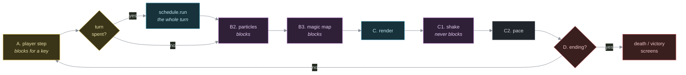
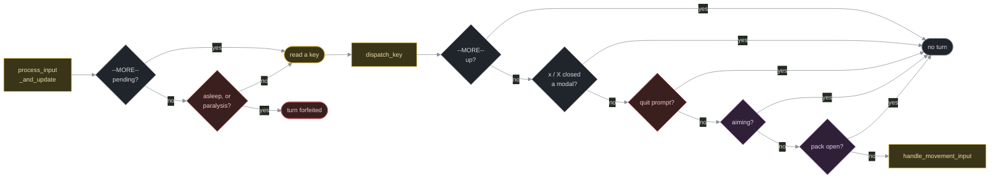
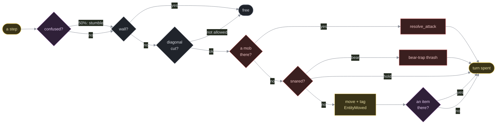

Reference: input handling and the turn loop
============================================

    Audience       Engine developers only. There is no table here, no
                   row to copy — this is the engine itself: the main
                   loop, the keyboard, the modal stack.
    Prerequisites  A passing familiarity with bevy_ecs, and
                   `components.md` for the resources named
                   below (`GameLog`, `PackIsOpen`, `TargetingState`,
                   `AutoExplore`, `FastMove`, `TravelCursor`, `Ending`).
    Status         Describes `engine/src/update.rs` and the main loop
                   in `engine/src/main.rs` as they are in the source.
                   If this page and the source disagree, the source is
                   right and this page is a bug.

**This is higher-risk ground than a content table.** A wrong row in `models/src/monsters.rs` is a monster with too much HP; a wrong branch here is a keypress that eats a turn it shouldn't, a modal that can't be closed, or a run loop that spins. `engine/` carries very little test coverage: `update.rs`'s two numpad tests and `view.rs`'s frame-geometry tests are all of it, and none of them touches the modal stack — so a mistake here is far more likely to be caught by a person playing the game than by `cargo test`. Change this file by reading it end to end first, and test by hand: walk into a wall confused, open the pack mid-throw, run a Shift-direction into a monster.


The split this code sits on
----------------------------

`models/` holds the pathfinding and state machines (`autoexplore.rs`, `fastmove.rs`) as **pure functions that only read the world** — no terminal, no sleeping, no turn-taking. `engine/src/update.rs` is the other half: it owns the keyboard (`crossterm::event::read`/`poll`), decides when a turn is spent, and drives those pure functions to completion. Nothing in `models/` blocks on input or sleeps; nothing in `engine/` does pathfinding. If you find yourself wanting to add a `World` query that decides *where* to go, it almost certainly belongs in `models/`, not here — see the module doc comments at the top of `autoexplore.rs` and `fastmove.rs`.


The main loop
-------------

    engine/src/main.rs, fn main



One `Schedule`, run once per turn, in this fixed order:

    smoke_system -> tick_effects -> reveal_mimics -> spell_system
      -> item_system -> throw_system -> ai -> monster_pickup_system
      -> trap_system
      -> equipment_effects_system -> combat_system -> reaper_system
      -> dungeon_lord_system -> passive_ability_system
      -> visibility_system -> score_turn_system

`reveal_mimics` runs before `ai`: a xeroc's disguise falls away the instant the player is standing next to it, so the same turn that happens, `ai` already sees the plain `Ambush` monster underneath and can lash out. `monster_pickup_system` runs before `trap_system`, while `EntityMoved` still marks whoever just stepped: a coin-greedy monster (an orc) that walked onto a coin it can use claims it there, before `trap_system` clears the tag. `spell_system` runs before `ai`: an active spell (`Z`, the only way to one) spends its `Magic` cost and resolves before monsters get their response. This matches ordinary movement, which is applied while handling the key before the schedule runs. A damaging spell only zeroes its victim's HP — `reaper_system` sweeps the body at the far end of the turn — so `ai` skips any mob already at 0 HP rather than letting a corpse take a parting shot on its way out.

**Everything the player does resolves before `ai` does.** Movement and melee never reach the schedule at all — both are applied while the key is handled (`handle_movement_input` → `models::melee_attack`). The three that do queue — a spell (`SpellQueue`), a used item (`UseQueue`), a throw (`ThrowQueue`) — are drained by `spell_system`, `item_system` and `throw_system`, all of them ahead of `ai`. None of those three queues is ever filled by anything but the player, so nothing of the dungeon's own is hurried along by the order. Monster attacks are the other side of it: `ai` fills `AttackQueue` and `combat_system` drains it *after*, which is why that one stays where it is.

`item_system` runs before `ai` for the same reason, and for a while it did not — which is what made the aiming reticle look broken. A zapped wand is aimed at the dungeon as it stood when the key was pressed; resolved after `ai`, it read a tile the target had already walked off. The bolt wands hid it (a bolt sweeps a line, a blast a disc, so they still caught somebody), but every wand that reads one exact tile — teleport away, teleport to, polymorph, haste, slow, cancellation — reported finding nothing there while the reticle had been sitting on the monster the whole time. `throw_system` moved for the same reason and shows the same tell from the other side: aimed at the empty tile in front of an approaching orc, the dagger used to arrive after the orc had stepped onto it and hit one it was never thrown at. Pinned by `a_zap_lands_on_the_tile_the_player_aimed_at_not_the_one_the_target_left` and `a_throw_lands_where_the_floor_was_when_the_player_let_go` in `update.rs` — which is also why the schedule is built by `turn_schedule()` rather than inline in `main`: a turn order with load-bearing edges needs something able to run it.

One edge was dropped to do it: `throw_system` used to be ordered after `trap_system`. Nothing needed that. A shot that comes down on a trap sets the trap off through `detonate_at`, inside the throw's own resolution, not by waiting for the trap step.

`passive_ability_system` sits second-to-last on purpose. A passive that merely happens to you can roll anywhere; one that *moves* you cannot. Rolled after `ai`, a ring of teleportation's jump lands at the top of the player's next turn — they see the new tile and act from it before anything on the floor moves again — and there is still a visibility pass and a render left in the turn to show it to them.

`score_turn_system` is dead last, after `visibility_system`, because it is the one step that must never run early: it totals the turn's kills with the combo multiplier and pays them out in one go, and a multiplier applied to a pile that is still growing is not a number anyone could read.

Each pass through `while world.resource::<GameState>().is_running`:

  1. **Advance the game.** A fast-move run in progress (`FastMove::active`) resolves entirely inside `fast_move_run` — it steps the schedule itself, turn by turn, without repainting. Otherwise, one player step is taken (see `player_step` below); if it consumed a turn, `schedule.run` fires once.
  2. **Play any queued animation.** `view::play_particles` then `view::play_magic_map` — both no-ops unless something armed them this turn. Both **block**: input is frozen for the length of the effect, and a keypress skips to the end and is swallowed. Which is why the `--MORE--` prompt is held back while particles are playing (`log_panel`, in `rendering.md`): a prompt up during an animation asks for the very keypress that skips it.
  3. **Render.** `view::render`.
  4. **Let the screen shake settle.** `view::play_shake`, and this one is the odd step out: it does **not** block. It animates only while nothing is waiting to be read, and the moment a key arrives it settles the map and returns *leaving the key unread* for step 1 of the next pass. That is also what guarantees the map is never left skewed while the loop blocks — the shake either runs out here or is settled here. A no-op unless a turn armed one (and `-nshake` means none ever is); see `rendering.md`, "The screen shake".
  5. **Pace it.** A 35ms sleep per step while auto-exploring, a 90ms sleep per turn while the player is incapacitated (asleep), so both read as time passing rather than a freeze or a blur.
  6. **Check the ending.** `Ending::player_dead` or `player_won` breaks the loop into the death or victory screens.

```
fn player_step(world: &mut World) -> std::io::Result<bool>
```

One player-side step, in priority order: an `AutoExplore` tick, else a `TravelCursor` tick, else a blocking read of the player's own move via `process_input_and_update`. Returns whether a turn was spent — the main loop only runs the schedule (lets monsters act) when this is `true`.


The modal stack
----------------



```
pub fn process_input_and_update(world: &mut World) -> std::io::Result<bool>
pub(crate) fn dispatch_key(world: &mut World, key: KeyEvent) -> std::io::Result<bool>
```

The split between the two is the line between "needs a keyboard" and "does not". `process_input_and_update` owns the three things that can consume a frame with no key read at all, and the blocking `read()`; everything after that key arrives is `dispatch_key`, which is a pure state machine over `(world, key)` and is tested as one — see "Testing" below.

Before reading a key at all, three things can consume the frame without one: a pending `--MORE--` prompt (only Space/Enter clears it; every other key is swallowed), `player_incapacitated` (asleep — in gas, or in a scroll of sleep that turned in your own mouth: the turn is forfeited outright with no key read; a bear trap or a scroll's hold does *not* forfeit the turn, since either only blocks movement, not the whole turn — see "Movement and attack" below), and `paralysis_forfeits_turn` (a potion of paralysis: the coin is flipped **once per turn**, here, before any key is read, so a lost turn is a turn the monsters get and the player does not, rather than a swallowed keystroke; a forfeited one holds the screen `PARALYSIS_PAUSE_MS` so it reads as time passing).

Once a key is read, `x` and `X` are checked first, everywhere: they are the universal escape hatch, closing whichever modal is open (`close_all_modals`, the quit prompt included) and returning to plain movement with no turn spent. `X` is checked *here*, rather than next to `Q` in `handle_movement_input`, precisely so that it escapes rather than asks about ending the run — it is one shift away from `x`, and only falls through to the quit prompt when `close_all_modals` reports there was nothing to close. After that, exactly one of four contexts owns the keypress:

| Context (checked in this order) | Resource      | Handler                    |
|----------------------------------|---------------|-----------------------------|
| "Really quit?"                   | `QuitPrompt.open` | `answer_quit_prompt`   |
| Aiming (a throw or a ranged use)| `TargetingState.active` | `handle_targeting_input` |
| Pack open                        | `PackIsOpen.open` | `handle_inventory_input` |
| Walking the map                  | (default)     | `handle_movement_input`    |

They nest one level deep only: the pack can open the aiming reticle (`Throw`, or a `Use` that needs a target), but the reticle itself has no modal under it. The quit prompt is raised only from the map, so it never has anything under it either — it is first in the list because while it is up, that question is the only one on the table. `y` quits, `n` / `Esc` cancels (and so do `x` / `X`, upstream), every other key is ignored rather than guessed at.


Movement and attack
--------------------



```
fn move_player(world: &mut World, dx: i16, dy: i16) -> bool
```

The single path every step and every melee attack goes through (auto-explore, fast-move and the plain arrow keys all call this). Checked in order, each one able to end the attempt:

  0. **Paralysis** — not checked here at all: a potion of paralysis eats its turns upstream, in `process_input_and_update`, and drops the player's `Speed` to `Slow` for the ones it leaves. By the time a step reaches `move_player` the turn is the player's to spend.
  1. **Confusion stumble** (`maybe_stumble`) — while `Confused`, a coin flip hijacks the step into one of the eight `STUMBLE_DIRS` at random, logging "You stumble foolishly." A stumble into a wall still burns the turn; a deliberate wall-bump does not.
  1.5. **An estoc's lunge** (`models::try_lunge`) — checked before the wall/diagonal gates below, since it targets the tile *past* the one those gates would otherwise judge. Self-checks `Fencer` (lent to the wielder while an estoc is in hand) and the geometry: the near tile (`new_x, new_y`) open and unoccupied, a `Mob` on the tile past it in the same direction. If both hold, it resolves a guaranteed triple-damage strike (`combat::resolve_lunge`) and carries the player into the near tile itself, tagging `EntityMoved` — a full alternate ending to the function, never falling through to steps 2+. A no-op, returning `false`, for anyone not wielding one.
  2. **Wall.** `Map::blocks`.
  3. **Diagonal cut.** `Map::diagonal_step_ok` — a diagonal step must connect two tiles of the same kind, so you can't cut a doorway corner or squeeze from a corridor into a room diagonally.
  4. **A `Mob` on the target tile** — attacks instead of moving (`models::melee_attack`, which resolves the plain opposed-roll swing via `resolve_attack` plus whatever a wielded weapon lends on top of it — an estoc's second strike, a battle axe's cleave onto every other adjacent `Mob` — each self-checked against the weapon's own marker, so this call site never has to know either trick exists).
  4.5. **Momentum resets** (`models::reset_momentum`) — reached only when step 4 did *not* fire: a rapier's built-up `Momentum` is done the moment its wielder does anything but keep swinging it.
  5. **Something holding the player** (`Pinned`, `Rooted`) — an adjacent swing above still lands as an attack (step 4), but a plain step does not. A bear trap makes it `bear_trap_thrash`: a wasted turn, a scratch of damage, blood. A scroll's hold costs the turn and nothing else. See `docs/*traps*` for the trap itself. (Nothing in the dungeon holds the *player* today — no monster has a viewshed to read a scroll of hold monster by — the branch is there so that stays true if one ever does.)
  6. **The move.** Position updates, the player's `Viewshed` is marked dirty, and `EntityMoved` is tagged on the player so `trap_system` checks the new tile.
  6.5. **A chain-sickle's whirl** (`models::try_whirl_attack`) — self-checks `WhirlOnMove` and looks for a `Mob` adjacent to *both* the tile just left and the tile just reached (a step taken alongside an enemy), landing a free `melee_attack` on it if one qualifies.
  7. **Pickup.** An `Item` on the landed tile is stowed (`models::stow`) — which can merge into an existing quiver stack, leave part of a pile behind if the pack is full, or refuse outright ("Your pack is full."). A `Hidden` (invisibly stashed) item announces itself the instant it's stepped on.

Every one of steps 1.5–5 can return early; only reaching the move at step 6 (or a hijacked stumble into a wall) consumes a turn. Every weapon trick above lives in `models::combat`/`models::abilities`, self-checking the marker it answers to — `move_player` never mentions `Fencer`, `Cleaves` or `WhirlOnMove` by name, the same way it never mentions a ring.

A greatclub's own trick (`HeavySwing`) doesn't live here at all: it fires as an on-hit ability inside `resolve_attack` itself (staggering the victim one turn, `Asleep`), and sets `ExtraMonsterRound`, a resource `models::ai::ai` checks on its next run to hand the floor one extra monster round on top of whatever the player's own tempo already bought.

A reach weapon's own strike (a bardiche, a whip) does not go through `move_player` at all — `v` opens the aiming reticle instead (see "The aiming reticle" below) and resolves through `models::resolve_reach_attack`.


The keyboard on the map
------------------------

Movement is vi keys, arrows and the numpad, eight ways, plus Shift+direction to run (`run_direction`). **WASD is not a movement scheme any more**, shifted or otherwise: those letters are commands.

**`Esc` does not quit.** It is the key a player mashes to get out of a menu; from the map it now does nothing at all. Quitting is `Q` or `X` through the prompt, or Ctrl+C without one.

| Key | `handle_movement_input` does |
|-----|------------------------------|
| `i` `a` `t` `d` `e` `q` `r` `z` `w` `W` `P` | `open_pack(world, PackMode::…)` — see below |
| `o` / `O` | auto-explore / travel cursor |
| `A` | `toggle_auto_pickup` — flips `AutoPickup::enabled`, logs which way it landed, spends no turn |
| `f` / `Tab` | fire the wielded launcher / auto-fight |
| `v` | `begin_reach_attack` — gated on `models::wielded_reach_weapon`, opens the aiming reticle out to the weapon's own `Reach` (`TargetingState.reach_attack`) |
| `T` | **undocumented on purpose.** `models::willed_teleport`: with `Teleportitis` on the player (a worn ring of teleportation) and at least `rings::TELEPORT_MAGIC_COST` magic points, it spends them and jumps. Every other path returns `false` and **logs nothing at all** — no refusal, no hint the key exists. Keep it out of `MANUAL.md`. |
| `;` | `begin_look` — opens the reticle in look mode (see below). Not `L`: that is the shifted vi key for east and `run_direction` claims it first |
| `Z` | `begin_spells_menu` — the spells list, rows lettered `a`-`d`. The only way to an active spell: there is **no** direct-fire key for a slot, and adding one means finding a key that neither `run_direction` nor a menu's letter arm already claims and that is not layout-dependent |
| `>` `.` / `<` `,` | stairs, or travel to them |
| `Q` / `X` | raise `QuitPrompt` — the "Really quit?" modal. `X` only reaches here with nothing open; otherwise it is the escape hatch above |
| Ctrl+C | **never reaches this table.** `dispatch_key` claims it first, above the `--MORE--` gate, so it quits from every context — a menu that selects rows by letter would otherwise read it as picking row `c` |

Adding a command key is a row in that `match` and (if it opens the pack) a row in `PackMode`. Two things claim keys before that `match` ever runs, and both have silently eaten a command before:

  * **`run_direction`**, called at the top of `handle_movement_input`, owns `H J K L Y U B N` outright. A command on any of those eight is dead code — this is what happened to `L` for look.
  * **the `x`/`X` escape hatch** in `dispatch_key`, which fires from every context including the map.
  * **Ctrl+C**, taken at the very top of `dispatch_key`, above everything.

Check a new key against the menus' own letters too: pack rows are `a`..`i` (`PACK_CAPACITY` is 9) and spells rows are `a`..`d`, and both menus' letter arms claim every lowercase key that isn't already navigation. In a menu, navigation is read before the letter, so `j` and `k` can never select a row.


The pack and the action modal
-------------------------------

Eleven keys open the pack, each in a `PackMode` (`models/src/pack.rs`) that decides the title, which rows are shown (`pack_rows`) and what picking one does (`PackMode::action`). `i` is the only one that asks afterwards; the rest carry their own verb and commit on the spot, closing the pack as they go. `open_pack` refuses with the mode's own line ("You have nothing to read.") rather than opening an empty box.

Rows are **backpack indices**, not row numbers, everywhere — `PackIsOpen::selected`, `pack_rows`, `commit_item_action`'s `item_idx`, and the letter `draw_inventory` paints. That is what keeps an item's letter the same in every menu; `step_row` walks the cursor between the admitted indices, skipping the rest.

The action modal (`run_action_modal`, `PackMode::Browse` only) is a fixed three-row menu — `ItemAction::MENU` — that dispatches to `commit_item_action`:

| `ItemAction` | What happens | Spends a turn? |
|--------------|--------------|-----------------|
| `Use`        | `use_or_aim`: a plain item queues onto `UseQueue` immediately; a ranged one (has `Ranged`, and isn't a self-targeted wand like light) instead reopens the aiming reticle. | Only the immediate case |
| `Throw`      | `aim_throw`: opens the aiming reticle, unless `throw_refusal` objects (the Element of Yoord, cursed worn gear). | Never here — the throw itself is queued from the reticle |
| `Drop`       | `drop_from_pack`: refused by `drop_refusal` (cursed and equipped) with the item returned to the pack; otherwise unequipped and placed on the floor. | Yes, on success |

`take_pack_item` / `return_to_pack` move an item out of the `Backpack` and back by index — used so an item earmarked for aiming can sit "in flight" without being in either the pack or on the floor while the reticle is up.


The aiming reticle
--------------------

The reticle opens on the closest visible monster within its own reach (`nearest_mob`, ties broken in reading order), so one monster and one wand is `z`, pick, `Enter` with no cursor keys in between; with nothing in view it opens on the player. Look mode is the exception and always opens on your own tile — its cursor *is* your attention (`meet_its_eyes` fires `OnTargeted` on every move), and snapping it onto a medusa would petrify you for pressing `L`.

`TargetingState` holds which of an item, an active spell, a plain look, or a reach weapon's own strike the reticle is for (exactly one of `item` / `spell_effect` / `looking` / `reach_attack` is meaningfully set — `reach_attack` is the one exception that still carries `item`, since the weapon never leaves the wielder's hand), plus whether it's a throw, and the cursor. `spell_target_cursor` only allows the cursor onto a tile that is both currently visible and within `aim_range` — `THROW_RANGE` for a throw, the spell's own `SpellDef.range`, the wielded weapon's own `Reach` for a reach attack, the item's own `Ranged.range` for a zap, a look's own reach the width of the map (the `in_view` check does the real bounding), `8` as a fallback. `Tab` (`cycle_target`) snaps the cursor to the next monster or item in view instead of nudging it one tile. Confirming (`fire_at_target`) refuses a shot at the player's own tile ("Great idea! But no.") for every purpose except looking — that one is allowed on your own tile, and spends no turn at all. A reach attack resolves in place (`models::resolve_reach_attack`) and never touches the pack; otherwise it removes the item from the pack and pushes a `WantsToThrow` or `WantsToUse` onto the matching queue, or a `WantsToCast` onto `SpellQueue`, for `throw_system` / `item_system` / `spell_system` to resolve next schedule run. A throw of a stacked item (arrows) goes through `models::draw_one` first, which splits one unit off and leaves the rest in the pack slot.

`;` opens the reticle in look mode; every cursor move (arrows or `Tab`) reads the tile out loud through `announce_look` rather than waiting for `Enter` — `;` then `Tab Tab Tab` walks everything in view. On a monster, it also lists `"Beware their ___."` for each notable ability or on-hit trick it carries. The phrases come from `models::dangers_of`, which reads the `beware` field off each `EFFECTS` row — the engine crate names no markers of its own. Every creature is a *they*, whatever it is.


Running, auto-explore, and travel
-----------------------------------

Three engine-owned loops replace a single `process_input_and_update` call while they're active; each is a thin driver around a pure planner in `models/` (`fastmove.rs`, `autoexplore.rs`):

| Loop | Armed by | Resource | Planner | Stops on |
|------|----------|----------|---------|----------|
| Fast move ("run") | Shift+direction | `FastMove` | `fast_move_plan`, then `travel_step`/`straight_step` each step | keypress, a monster in view, a message logged, junction/target reached, `FAST_MOVE_STEP_CAP` |
| Auto-explore | `o` | `AutoExplore` (`target: None`) | `explore_step` | same, plus "nowhere left to explore" |
| Travel | `>`/`<` to a known but distant staircase, or the `O` cursor | `AutoExplore` (`target: Some(tile)`) | `travel_step` | same, plus arrival |
| Travel cursor | `O` | `TravelCursor` | (none — it's just a cursor) | Esc/`O`/`x`/`X`, or Enter to commit into a travel `AutoExplore` |

`explore_step` gives a spotted item (see `known_item_tiles`) priority over frontier exploration outright: while any item it judges worth the walk remains on the floor, it beelines for the nearest one via `first_step` rather than consulting `AutoExplore::frontier` at all. `move_player`'s own pickup-on-arrival logic (see above) does the actual stowing; once the item is gone from the floor, frontier exploration resumes as before.

`detours_for_loot` is what can call the beeline off wholesale, and it is the `A` toggle (`AutoPickup::enabled`) and nothing else. Whether a *particular* item is worth walking to is asked item by item, in `known_item_tiles` → `worth_the_walk`: a coin the player cannot use yet is skipped (`items::would_help`), and so is anything needing a pack slot once the pack is at `PACK_CAPACITY`. That per-item gate is not politeness — without it, a full pack walks to an item, is halted by "Your pack is full.", and beelines to the same item on the next `o`, so the floor never gets explored. A coin needs no slot, which is why a full pack no longer calls the whole detour off.

Fast move (`fast_move_run`) is the odd one out: it runs its entire walk **inside one call**, stepping `schedule.run` itself between moves and never repainting until it returns, so a run reads as a single jump rather than an animated walk. Auto-explore and travel instead take one step per `player_step` call (`auto_explore_step`), returning to the main loop's normal render-and-pace cycle after each — which is why auto-explore visibly walks while a run visibly jumps.

All three refuse to *start* while confused or with a monster in sight, and both `auto_explore_step` and `fast_move_run` poll for a pending keypress before every step and swallow it (`let _ = read()?`) if the walk needs to abort — otherwise that keypress would also be read as a move on the next frame.

`travel_cursor_step` is different again: it isn't a walk at all, just a blinking highlight the player steers with arrow/vi/numpad keys over already-`revealed` ground (sliding along one axis when the diagonal neighbour is still unseen), gated to 400ms polls so the blink phase flips on a timeout. It runs its own loop outside `process_input_and_update`, so the universal escape hatch never sees its keys — `x` / `X` are handled in its own cancel arm instead, which is the only reason closing it works at all. Enter commits the tile to a travel `AutoExplore` via `nearest_reachable` if the chosen tile isn't itself walkable.


Testing
-------

`engine/src/update.rs` carries a `#[cfg(test)] mod tests`, and what it covers is everything `dispatch_key` decides — none of which needs a terminal, because none of it is downstream of `read()`:

  * **The `--MORE--` gate.** No key but Space/Enter does anything while messages are waiting; acknowledging drops *exactly* the messages the panel showed, not all of them and not one; and the gate outranks the escape hatch, so a player mashing `x` cannot lose the line telling them why they are about to die.
  * **The `x` / `X` escape hatch.** Either closes whichever modal is open. `X` escapes rather than raising the quit prompt when something *is* open, and falls through to the prompt only when nothing is. A bare `x` on the map is not swallowed.
  * **The quit prompt.** `y` / `n`; every other key ignored rather than guessed at; it outranks a movement key; `Esc` closes one but never raises one.
  * **The keyboard.** A numpad digit moves identically to its vi-key equivalent, and Shift+numpad reads as a run direction like Shift+arrow.

`view.rs` has no tests at all, on purpose — see `rendering.md`. What is exercised only by playing the game: everything the renderer draws, the run / travel / auto-explore loops (they poll and sleep), and the aiming reticle. What *can* be tested is also tested one level down, in `models/`: `tests/pack.rs` pins what each menu shows, and `tests/autoexplore.rs` pins when the loot beeline is called off.

When you add a branch here, prefer moving the *decision* (what should happen) into a pure function — `dispatch_key`, or something in `models/` — and leave `engine/` holding only the parts that must touch the terminal.


See also
--------

  rendering.md                  the other half of the frame: `view.rs`
  ../how-to/work-with-the-ecs.md   adding a system, and the borrow patterns
  ../explanation/ecs-in-nihilurk.md    why the schedule is shaped this way
  ../reference/components.md    the resources named throughout this page
  ../reference/cli-and-env.md   the flags this code reads (`-anim-rate`, `-nshake`)
  ../explanation/code-calisthenics.md   the shape this code (and all engine code) is held to
