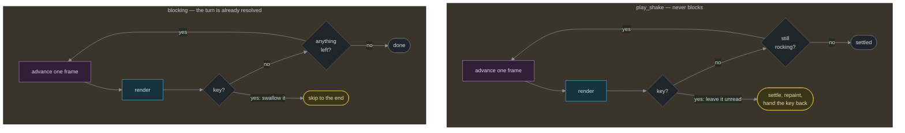

Reference: rendering
=====================

    Audience       Engine developers only. There is no table here —
                   this describes how a frame is painted, not what
                   appears in it.
    Prerequisites  A passing familiarity with bevy_ecs and
                   `crossterm`, and `components.md` for the
                   resources read below (`BloodStains`, `Corpses`,
                   `Smoke`, `Particles`, `Shake`, `MagicMapReveal`, `AnimRate`).
    Status         Describes `engine/src/view.rs` as it is in the
                   source. If this page and the source disagree, the
                   source is right and this page is a bug.

**Nothing on this page is covered by an automated test, and that is the policy rather than a gap.** The renderer, the HUD and the frame geometry were all asserted once; those tests were removed deliberately. What they checked was presentation — which glyph landed in which cell, which colour a log line came out — so they broke whenever a layer moved and never once caught something a glance at the terminal would have missed. See `../explanation/the-feel-layer.md`, "Why none of this is unit-tested".

So the thing easiest to get subtly wrong here — the draw order in `render`, where a later layer silently covers an earlier one — is caught by you, not by CI. Change it, then run the game and look, in more than one terminal if you can.

The one thing here that *is* asserted is not presentation: `log_panel` — the rule that holds the `--MORE--` prompt back while particles are playing, below — is pinned by two tests in `view.rs`, on a fixture of two resources. What it protects is a keypress the player loses an animation to, not which cell a glyph landed in, and it cannot be checked by looking: the frame it is wrong in looks exactly right.


The frame buffer
-----------------

```
pub struct Screen {
    cur: Vec<Cell>,        // this frame, being painted
    prev: Vec<Cell>,       // last frame, as flushed
    map_shift: (i16, i16), // where the screen shake has thrown the map
    ...
}
type Cell = (char, Color, Color); // glyph, foreground, background
```

`render` paints the entire 80x25 grid into `cur` every call — nothing is incremental at that level. `Screen::flush` is what's incremental: it diffs `cur` against `prev` cell by cell and only emits a `MoveTo`/`Print` (plus `SetForegroundColor`/`SetBackgroundColor` when the colour actually changed) for cells that differ, then swaps the two buffers. A typical turn changes a handful of cells; `flush` writes a handful of escape sequences, not 2000. `dirty_all` forces a full repaint — set on the first frame, and whenever the centering offset changes (`-c`, or the terminal was resized), since a shifted viewport would otherwise leave stale cells sitting where the old frame was.

`put`/`set_fg`/`set_bg`/`puts`/`hline` are the only ways `render` touches `cur`; they silently no-op on an out-of-bounds coordinate rather than panicking, since a couple of callers (the targeting beam, the travel cursor) compute a tile position that can legitimately fall off the 80x25 frame.

**Two coordinate systems, and the map layers use the second one.** `put`/`puts`/`hline` take *screen* coordinates and are what the status line, the message log and the pack overlay paint in. `put_map`/`fg_map`/`bg_map`/`get_map` take *map* coordinates and are what every layer from Terrain to the travel cursor paints in; they run the coordinate through `map_cell`, which adds `MAP_TOP` (the map starts on row 1, under the status line) and `map_shift` (the screen shake), then clips to the map's own rows. That is why the layers below carry no `y + 1` of their own any more, and it is the one place the shake can affect what is drawn.

`map_cell` returning `None` means "not drawn". It never clamps: a tile the shake pushes off the left edge is dropped, not piled onto column 0, and a tile pushed off the top is dropped, not smeared into the status line. Nothing is rendered to fill the gap either — **the shake does not change the game's resolution, and what leaves the viewport is simply not drawn.** With `map_shift` at `(0, 0)` every map tile still maps to exactly the cell it always did, so a resting frame is the frame nihilurk drew before any of this existed. `view.rs`'s tests pin all of that down.

`centering_offset` reads `RenderConfig.centered` (`-c`) and the real terminal size to compute the top-left offset that keeps the fixed 80x25 frame centred; `(0, 0)` when not centred.

**`Screen` is not in this file.** It is the `view` crate — `view/src/lib.rs` — which holds the grid, the double buffer, the cell diff and the map/screen coordinate split, and knows nothing about the game. `engine` paints into it; what *this* file owns is everything that goes *in* the grid: the layers below, the HUD, the overlays and the playback loops.


`render`: the layers, in order
--------------------------------

```
pub fn render<W: Write>(world, stdout, screen) -> std::io::Result<()>
```



```mermaid
%%{init: {'theme':'base','themeVariables':{
  'primaryColor':'#20242b','primaryTextColor':'#d7dae0',
  'primaryBorderColor':'#5c6370','lineColor':'#8a8f98',
  'fontFamily':'ui-monospace, SFMono-Regular, Menlo, monospace',
  'fontSize':'13px'}}}%%
flowchart LR
  subgraph screen["screen coordinates — the shake does not move these"]
    direction TB
    H["1 · top HUD"]:::cold
    L["14 · player line<br/>+ score flash<br/>+ message log"]:::cold
    V["15 · pack overlay<br/>+ quit prompt"]:::cold
  end
  subgraph map["map coordinates — put_map, so the shake moves them"]
    direction LR
    T["2 · terrain"] --> B["3 · blood"]:::peril
    B --> K["4 · corpses"]:::peril
    K --> IT["5 · items"]:::magic
    IT --> TR["6 · traps"]:::peril
    TR --> SM["7 · smoke"]
    SM --> AC["8 · actors"]:::hero
    AC --> TI["9 · status tints"]:::magic
    TI --> DE["10 · detected"]:::magic
    DE --> PA["11 · particles"]:::magic
    PA --> BE["12 · target beam"]:::hero
    BE --> CU["13 · travel cursor"]:::hero
  end
  screen ~~~ map
  classDef hero fill:#3a3418,stroke:#d7ba4a,color:#e8dfa8
  classDef peril fill:#3a1f1f,stroke:#c05050,color:#f0c8c8
  classDef magic fill:#2f2038,stroke:#a86fc0,color:#e6cdf0
  classDef cold  fill:#17323a,stroke:#4aa3c0,color:#bfe4f0
```

Painted in this order — everything after "Terrain" draws over whatever came before it on the same cell. Layers 2-13 paint in map coordinates (so the screen shake moves them); 1, 14 and 15 paint in screen coordinates (so it does not):

  1. **Top HUD** (row 0) — the dungeon's half of the status. See below.
  2. **Terrain** — every tile with `visible` or `revealed` set; `revealed`-but-not-`visible` tiles are painted `DarkGrey` (the "remembered, not seen" fog look). A corridor's walls are skipped entirely (`Map::is_room_wall`) so passages read as tunnels, not ditches framed on every side.
  3. **Blood overlay** — recolours a tile's existing glyph (`set_fg`, not `put`) `DarkRed`, only where currently `visible` and never where `occupied_by_actor` — the stain marks the floor, not whatever is standing on it. Skipped entirely while the player is `Blind`: blood is carried by colour alone, and they have none.
  4. **Corpses** — same visibility rule as blood, drawn as a `%`.
  5. **Floor items** — visible and not actor-occupied.
  6. **Traps** — the one exception to "unseen means blank": a previously-discovered trap (`Without<Hidden>`) still shows in `DarkGrey` once out of sight, same as a known staircase.
  7. **Smoke** — visible, not actor-occupied, `≈` in grey; fades on its own over a few turns (see `Smoke` in components.md).
  8. **Actors** — the player and every non-`Hidden` `Mob`, visible only. (While the player is `Blind` the visibility system has already tagged every mob `Hidden`, so nothing here has to know about blindness.)
  9. **Monster status tints** — a background (`set_bg`) on a visible, non-`Hidden` mob that cannot fight back properly, in this precedence: `DarkBlue` for one asleep in gas or `Paralyzed`, `DarkGreen` for one held in a bear trap, `DarkCyan` for one bound by a scroll of hold monster, `DarkMagenta` for one staggering under `MovementType::Confused`. Painted after the actors so it lands under a glyph that is actually drawn.
  10. **Detected things** — everything carrying `Detected` (a potion of magic or monster detection, or a scroll of food detection) that is *not* currently visible, painted in one flat `DarkMagenta`. Anything in view is already drawn above in its own colour; this layer is the sense, not the sight.
  11. **Particles** — drawn over actors deliberately, so a hit motes over the thing it hit rather than under it.
  12. **Targeting beam** — a Bresenham line from the player to the reticle, drawn as `*` in yellow, except where it crosses an actor: the actor's own glyph is kept but recoloured yellow (or black, if the actor was already yellow-ish, so it doesn't vanish into the beam). The reticle's own tip additionally gets a `DarkBlue` background.
  13. **Travel cursor** — a background-only highlight (`set_bg`), so the glyph and colour of whatever's on that tile stay readable.
  14. **Player line** (row 22), the **scorekeeper's flash** (row 1, over the map's top row) and the **message log** (rows 23–24). The log's `--MORE--` prompt waits for the effect layer — see `log_panel`, under "The two blocking loops" below.
  15. **Inventory overlay** — drawn last, on top of everything.

`occupied_by_actor`, computed once up front, is the set every "don't draw under a mob" rule in steps 3–8 checks against.

**Blindness takes the colour out of the map.** While the player carries `Blind`, every map-space colour in steps 2, 4, 5, 6, 7 and 8 goes through `by_touch`, which returns `Color::White` for all of them — the 3x3 the visibility system left them reads as bare shapes felt out by hand. Remembered tiles keep their `DarkGrey`, and the detection layer keeps its magenta: neither is something the player is looking at.


The HUD
--------

Two lines, on opposite sides of the map: the dungeon's half on row 0, the player's half on row 22, directly under the viewport. The second one costs the map's bottom row — the log's first line used to sit there and cost exactly the same one, which is why the log is two lines now instead of three.

**Row 0** carries condition badges from column 1, `DEPTH n` centred (the word in magenta, the number white) and the score pinned to the right edge in white. Nothing on it is laid out relative to anything else on it, so a player wearing six badges cannot push the depth or the score off the line, and the score no longer yields its place to a badge the way it did when all three shared one run of fields.

**Row 22** is the player: name, `HP x/y`, `Ma x/y`, `Pow.`, `Arm.`, optionally `Skl.` — joined with `" · "` in `DarkGrey`. The label carries the colour and the figure beside it stays white — `Ma` blue, `Pow.` red, `Arm.` cyan, `Skl.` green, the name white — so the line reads as one row of numbers over a colour-coded key rather than six differently coloured numbers.

`HP` is the one field that colours its own number, because the number is the thing that changes meaning: yellow normally, `DarkRed` once `models::player_too_injured` is true. That is the same call auto-fight refuses under, not a second threshold copied into the HUD, so the field can never say "fine" about a bar `Tab` will not swing on.

The score itself is `view::score_text`, shared by the HUD and both end panels: six digits zero-padded (`SCORE 000140`), and past what six digits hold, an order of magnitude instead — `4.09M`, `1.31B`, `9.44T`, and `4.61e18` past a thousand trillion, where the suffixes run out. Truncated, never rounded: a score should never read higher than it is. A score that has saturated reads `MAXIMUM`: it is not a number any more, it is a ceiling.

**The scorekeeper flashes, in the gutter under itself.** While `models::ScoreFlash` is lit — one frame per payment; see `components.md`, "Components — score" — the flash paints on **row 1**, right-aligned under the score, a character at a time from the flash's own colour list: `+700` in one random bright colour, `COMBO! +2400` with the word in the six flag stripes and the number in one colour, or `DOUBLE`. The running total keeps its place on row 0 throughout, so the frame that pays shows both what was paid and what it came to. Row 1 is the map's own top row, which is wall or nothing, and the flash is painted after the map layers (step 14, with the player line) so terrain cannot paint back over it.

The displayed `Pow.`/`Arm.`/`Skl.` figures are **not** just `Fighter.power` etc. — they fold in every equipped modifier via one `models::loadout` call, the same fold `combat_system` runs, so the HUD can never drift from the number combat actually rolls against. One pass, not one per field: this runs on every frame of every animation. `Skl.` only appears once it's nonzero, since a player who never picked up something that boosts throws never needs to see a field that would always read `+0`. The bonus on `Pow.`/`Arm.` carries its own sign and is omitted entirely when it is zero, so a plain weapon reads `Pow. 10`, an enchanted one `Pow. 10+2` and a cursed one `Pow. 10-2` — the sign comes from the number, never from a `+` glued in front of it.

Condition badges, in the order checked: `FAST`/`SLOW` (read through `conditions::tempo`, not off `Speed.kind` — so a ring of slow digestion reads `SLOW` exactly like a potion of paralysis does), `STLH` (`Stealthy`, a ring of stealth), `CONF` (`Confused`), `BLND` (`Blind`), `PARL` (`Paralyzed` — shown alongside the `SLOW` its slowing earns), `GLOW` (`ConfusingTouch`, a scroll of monster confusion still waiting on the next blow to land), `PLAT`/`FORG` (the two coin promises — the only badges that are good news; see `components.md`, "Components — player conditions"), `WARD`/`BIDE`, then a snare label, worst first (`STONE` for a medusa's gaze, `ASLEEP` for sleeping gas, `HELD` for a bear trap or a scroll of hold monster), then an auto-walk badge (`EXPLORING`/`TRAVELING`, or `ASCENDING` — magenta — once the player carries the Element of Yoord), then `TRAVEL?` while the `O` cursor is open. Each is independent; several can show at once — though never more than three *ledger* conditions, which is a rule about the creature rather than about the line: see `components.md`, "A creature carries at most three conditions". A worn ring's `STLH`, the tempo badges and the two coin promises are **priority badges**, outside that count and never shed, for the reasons on the same page.

**A long enough badge run paints over the centred `DEPTH`, and that is accepted.** The three anchors on row 0 do not negotiate with each other — that is what splitting the HUD bought — so the only way the line could stay clean under three conditions, a tempo, `STLH`, both promises and an auto-walk badge would be to drop a badge the player needs. Nothing panics either way: `puts` no-ops past the frame edge. A player wearing that much at once did it to themselves.


Animation playback
--------------------



Both of these are **blocking** loops called once per main-loop iteration, after the schedule runs and before the frame's own `render`. Both are no-ops when nothing armed them, so a turn that fought nothing and read no scroll passes straight through. (The third playback loop, `play_shake`, is the one that does not block — it has its own section below.)

```
pub fn play_particles<W: Write>(world, stdout, screen) -> std::io::Result<()>
pub fn play_magic_map<W: Write>(world, stdout, screen) -> std::io::Result<()>
```

Both share the same shape: while the effect (`Particles`/ `MagicMapReveal`) still has something to show, advance it one frame, call `render` to paint the result, then `poll` for the frame's duration — a keypress during that poll is swallowed and skips straight to the finished state (magic mapping additionally `finish_magic_map_reveal`s the map instantly rather than leaving it part-revealed). Frame duration is `AnimRate`-scaled (`-anim-rate`, clamped `0.1..=5.0`) off a `33ms` base for particles and `MagicMapReveal::frame_ms()` for the map wipe, so a slow terminal or a player who wants snappier turns can retune both without either one's code changing.

The turn itself is already fully resolved by the time either of these runs — they only animate what already happened, which is what makes it safe to block input here the way NetHack and DCSS do for a bolt.

**The `--MORE--` prompt waits for the effect layer** (`log_panel`, which packs layer 14's lines and answers for the prompt in the same breath). Because that poll takes *any* key as "skip", a prompt asking for Space while motes are still on screen asks for the one key that throws the rest of the batch away — and a batch is ordered. A trick shot's blast is queued *behind* the missile's flight (`Particles::hold_ms`), so the key lands during the wind-up, eats the explosion, and leaves the flight looking fine: the shot animates perfectly right up to the part worth watching. A trick shot raises the prompt every time — it shouts, kills, drops the dead one's gear and then says "Very clever.", eleven messages for three lines of log — which is why that was the blast nobody could get to play. Only the prompt waits: the three lines that fit are painted throughout, and the backlog is out of reach for no longer than the animation the player is already watching.

Both also call `age_shake` once per frame and `settle_shake` on the skip-keypress, so a shake armed by the same turn keeps decaying over whichever animation happens to be on screen — which is the common case, not an edge one: a blast arms the shake and queues its particles in the same breath, and the two are meant to be seen together. Skipping the sparks skips the shake with them; they are one effect.


The screen shake
------------------

```
pub fn play_shake<W: Write>(world, stdout, screen) -> std::io::Result<()>
```

Same shape as the two loops above — advance, `render`, `poll` — with one deliberate difference that is the whole reason it is a separate function: **it never blocks on the player.**

`play_particles` can afford to freeze for 200 ms because it animates an aftermath the player asked for by swinging. A shake is armed *by the dungeon*, at exactly the moments a player is most likely to be typing ahead: mid-fight, or half a second from dying. A flourish that eats a keystroke there is a flourish that gets a flag turned off. So `play_shake` runs only in the gap where nothing is waiting to be read, and the moment `poll` reports a key it settles the map, repaints one steady frame, and returns **without consuming the key** — leaving it for the input handler that was about to block on it anyway. Worst case, a player typing through a shake sees one frame of it and no more.

It runs as Step C1 of the main loop, straight after the frame that armed it and before the loop can block again, which is what guarantees the map is never left frozen mid-lurch on screen: either the shake runs out inside `play_shake` or a keypress settles it there.

What is armed, and by what, is the table in `components.md`, "The screen shake". `render` reads the current displacement into `Screen::map_shift` at the top of every frame, so nothing else in this file has to know the feature exists. `-nshake` turns it off at the source (`Shake::enabled`), so nothing is ever armed; `-anim-rate` scales its frames like every other animation's.

The one shake with nothing left to protect is `ShakeKind::Death`, and it still goes through the same loop: the main loop reaches Step C1 before it checks `Ending`, so the map takes its last lurch and settles, and only then does `run_death_screens` paint over it.

One thing to know if you are measuring: a shake frame changes most of the map's ~1700 cells, so it is the one situation where `flush`'s cell-diff has little left to skip. It lasts 2-15 frames.


End-of-run panels
-------------------

```
pub fn render_you_died<W>(stdout, screen, offset) -> std::io::Result<()>
pub fn render_tombstone<W>(stdout, screen, offset, player_name, cause, score)
pub fn render_victory<W>(stdout, screen, offset, player_name, score)
```

Full-screen, drawn in place of `render` (not layered with it) via `screen.clear()` and `screen.dirty_all = true` — a full repaint, since nothing about the map frame should bleed through. `centered_x` centres a line of text; `wrap_words` (victory's blessing line only) greedily wraps on word boundaries, never splitting a word, so a long player name can't run the line off the panel. `main.rs`'s `run_death_screens`/`run_victory_screens` drive these: show the "You die..."/starfield panel, block for the acknowledging keypress (`wait_for_key`), then (death only) show the tombstone and block again.


The inventory overlay
------------------------

```
fn draw_inventory(world: &mut World, screen: &mut Screen)
```

A bordered box sized to the widest row actually being drawn (`row_text`, the one place a row's text — letter, name, `" (E)"` for equipped — is assembled, so sizing and drawing can never disagree about a row's width) or 30 columns, whichever is larger. Row colour is a small decision table on `(selected, cursed_known, equipped)` — `known_quality` gates the cursed colouring, so an unidentified cursed item still reads as ordinary. The Use/Throw/Drop action modal, when open, is a second small box floated to the right of the item row it belongs to, its three labels coming from `ItemAction::MENU`.

`draw_quit_prompt` is the overlay's sibling and the last thing painted in the frame, so "Really quit?" sits over everything: a two-line box centred on the map, spelling out both answers rather than leaning on "any key". It is the only modal in the game whose job is to *slow the player down*, which is also why it is centred instead of tucked into a corner where a key could be answered by reflex.

Which rows the inventory box has, and the heading over them, come from `PackIsOpen::mode`: `models::pack_rows` for the rows and `PackMode::title` for the heading, so the drawing code holds no filter of its own and can never show a row the cursor cannot reach. The rows it gets back are backpack indices — the row's *letter* is that index, while its *screen line* is its position in the filtered list, which is why the two are tracked separately in the loop. See `components.md`, "The pack screen".


See also
--------

  input-and-turn-loop.md        the other half of the frame: keyboard and turns
  ../explanation/the-feel-layer.md   why each effect looks the way it does
  ../reference/components.md    the resources named throughout this page
  ../reference/cli-and-env.md   `-c`, `-anim-rate`, `-nb`, `-nshake`
  ../explanation/the-feel-layer.md        why each effect looks the way it does
