Tutorial: add your first item
=============================

    Audience       Anyone who wants to add content to roog. You have
                   written a little Rust, or a little of something like
                   it. You have never touched this codebase.
    Prerequisites  A checkout, and a working `cargo`. That is all.
    Time           About fifteen minutes.
    You will       Add a weapon to the game, see it in the dungeon,
                   prove it works, then change how it behaves.

This is a lesson, not a recipe. It takes the longest road on purpose. When you want the short version, read `../how-to/add-an-item.md`.

```mermaid
%%{init: {'theme':'base','themeVariables':{
  'primaryColor':'#20242b','primaryTextColor':'#d7dae0',
  'primaryBorderColor':'#5c6370','lineColor':'#8a8f98',
  'fontFamily':'ui-monospace, SFMono-Regular, Menlo, monospace',
  'fontSize':'13px'}}}%%
flowchart LR
  S1["1 · find<br/>the table"]:::cold --> S2["2 · add<br/>a row"]:::hero
  S2 --> S3["3 · -content<br/><i>the game knows it</i>"]:::cold
  S3 --> S4["4 · ROOG_SPAWN<br/><i>hold it</i>"]:::hero
  S4 --> S5["5 · cargo test<br/><i>it stays proved</i>"]:::cold
  S5 --> S6["6 · .missile(6)<br/><i>change what it does</i>"]:::magic
  S6 --> S7["7 · keep it,<br/>or git checkout"]
  classDef hero fill:#3a3418,stroke:#d7ba4a,color:#e8dfa8
  classDef peril fill:#3a1f1f,stroke:#c05050,color:#f0c8c8
  classDef magic fill:#2f2038,stroke:#a86fc0,color:#e6cdf0
  classDef cold  fill:#17323a,stroke:#4aa3c0,color:#bfe4f0
```

What you are about to learn
---------------------------

In roog, a piece of content is **a row in a table**. Not a class, not a file, not a subclass of `Weapon` -- a line. The line says what a thing is called, how it draws, and what it carries into the world. Nothing else in the game enumerates weapons, so nothing else needs to hear about yours.

By the end you will have added a quarterstaff, and you will believe that sentence.

Step 1: find the table
----------------------

Every item in the game lives in one file:

    models/src/catalog.rs

Open it and search for `WEAPONS`. You are looking at something like this:

    #[rustfmt::skip]
    pub const WEAPONS: &[WeaponDef] = &[
        WeaponDef::new("dagger",           Color::Grey,     4).missile(4).piercing(),
        WeaponDef::new("spear",            Color::DarkGrey, 6).missile(8).piercing(),
        WeaponDef::new("mace",             Color::DarkGrey, 6),
        WeaponDef::new("long sword",       Color::White,    8),
        WeaponDef::new("two-handed sword", Color::Cyan,    10),
    ];

Five weapons, five lines. Read one:

    WeaponDef::new("mace", Color::DarkGrey, 6)
                     |          |           |
                  its name   its colour   its damage die

The mace rolls `1d6` when you swing it. The long sword rolls `1d8`. That third number is the whole of what a weapon is worth in a fight -- see `../reference/content-tables.md` if you want the combat maths now, though you do not need it yet.

Step 2: add a row
-----------------

A quarterstaff should sit between the mace and the long sword: a bit better than a club, nowhere near a sword. Add this line after the mace:

    WeaponDef::new("quarterstaff",     Color::DarkYellow, 7),

Line the columns up with its neighbours. The table carries `#[rustfmt::skip]`, which means `cargo fmt` will leave your alignment alone -- these tables are meant to be read as columns.

Now build:

    cargo build

It compiles. That is the entire change. There is no registration step, no `match` arm waiting for you, no list of weapon names somewhere else that is now out of date.

Step 3: see that the game knows about it
----------------------------------------

Ask the game what content it has:

    cargo run -p engine -- -content | grep quarterstaff

You should get:

      quarterstaff

That listing is not a hand-maintained document. It reads the tables at run time, walks every row, and prints what it finds. Your weapon is in it because the table is the only place weapons are defined.

Step 4: hold it in your hands
-----------------------------

Waiting for a 3.6%-chance drop to prove your work is a miserable way to spend an evening. So there is a shortcut:

    ROOG_SPAWN="quarterstaff" cargo run -p engine

The floor is built as normal, and then the things you named are dropped on free tiles next to you. Walk one step, pick it up, wield it.

You can ask for several at once, and mix kinds freely:

    ROOG_SPAWN="quarterstaff,dragon,ring of protection" cargo run -p engine

Anything the tables do not recognise is skipped in silence. See `../reference/cli-and-env.md`.

Step 5: prove it, so it stays proved
------------------------------------

Looking at it is not the same as knowing it works. Run the table tests:

    cargo test --test content

Several of those tests just read your new row. They checked that no two rows share a name, that every name spawns something, that what spawns keeps the name it was spawned by, and that the loot table can still produce one of everything. Your quarterstaff was included automatically, because those tests iterate the tables too.

That is the pattern worth taking away: in this codebase, *the tables are data, so tests can check the data*. You did not have to write a test to get your row tested.

Step 6: change what it does
---------------------------

A row is not only numbers. It is also behaviour, expressed by chaining. Look at the dagger again:

    WeaponDef::new("dagger", Color::Grey, 4).missile(4).piercing(),

`.missile(4)` says: this thing is built to be thrown, and rolls `1d4` when it lands. `.piercing()` says: a throw does not stop at the first body -- it runs the whole line you aimed down.

Suppose your quarterstaff is really a javelin. Change your row to:

    WeaponDef::new("quarterstaff", Color::DarkYellow, 7).missile(6),

Rebuild, and throw it at something:

    ROOG_SPAWN="quarterstaff,bat" cargo run -p engine

It now flies properly: it goes around the target's armour die instead of being blunted by it, it is spent on what it hits, and nothing can pluck it out of the air. You did not implement any of that. Those three behaviours belong to `.missile(...)`, and every row that asks for them gets all three.

Nothing in the throwing code knows a quarterstaff exists. It asks "is this a `Projectile`?", and your row answered.

Step 7: keep it or drop it
--------------------------

If you like the quarterstaff, leave it. If this was a dry run:

    git checkout models/src/catalog.rs

What you actually learned
-------------------------

  * Content is a row in a table, and the table is the only definition.

  * Behaviour is attached by naming it, not by writing it. `.missile()` and `.piercing()` are shorthands for components, and the systems that care look for the components, never for your item.

  * Nothing else has to be told. No registry, no factory, no `match`.

  * The tables are data, so the tools work on them for free: the `-content` listing, `ROOG_SPAWN`, and the table tests all read the same rows you edited.

Weapons are the easy case. Some categories need one more edit -- a potion needs somebody to say what drinking it does, a ring needs an identity to be identified by. The next section is one worked row for each of the nine, so you can see exactly where the line falls.

One row for every kind
----------------------

Nine categories drop in roog, and they divide cleanly into two halves: the ones that are a row and nothing else, and the ones that also need somebody to say what the new thing *does*.

The second half is not a chore the design failed to remove. A potion is a promise that drinking it will do something, and no table can invent what. What the design does remove is everything else: you never register a type, never touch the loot roller, never add a name to a list.

Try any of these the way you tried the quarterstaff -- add the row, `cargo build`, then `ROOG_SPAWN="<name>" cargo run -p engine`.

### A row and nothing else

**Armour.** `ARMORS` in `catalog.rs`. One number: what wearing it adds to your defence die.

    ArmorDef { name: "brigandine", color: Color::Grey, armor_die: 6 },

**A weapon.** `WEAPONS`, as above.

**A coin**, as long as it does something a coin already does. `COINS` pairs a `PickupEffect` with the one number that effect works with -- so a cheaper treasure coin is a row, full stop:

    CoinDef { name: "copper coin", color: Color::DarkYellow,
              effect: PickupEffect::Coin, amount: 250 },

**A ring**, as long as what it does is a number combat already folds or a marker some system already asks about. This one is the whole argument for the design in three lines:

    RingDef::new(RingEffect::FireResistance, "ring of fire resistance")
        .grants(&[Grant::of::<FireImmune>()]),

`FireImmune` is what a dragon is born with. The wand-of-fire code asks whether its target carries it and has never heard of rings, so wearing one works the moment the row exists. You will need a `RingEffect::FireResistance` variant for it to be identified by -- an identity, not behaviour.

**Ammunition and a launcher** are one job in two rows, and neither names the other. They meet at an effect:

    // in effects.rs, alongside FireArrow and FireQuarrel
    #[derive(Component, Default, Clone, Copy)]
    pub struct FireStone;

    // in AMMO
    AmmoDef { name: "sling stone", color: Color::Grey, die: 3,
              launched_by: Grant::of::<FireStone>() },

    // in LAUNCHERS
    LauncherDef { name: "sling", color: Color::DarkYellow,
                  grants: &[Grant::of::<FireStone>()], melee_cap: 1 },

Thrown by hand the stone rolls `1d3`. Loosed by somebody carrying `FireStone` it rolls double. The sling is not consulted -- only the effect is, which is why a hobgoblin that picks one up shoots just as well as you do. Add `FireStone` to the `EFFECTS` registry so it survives a save; see `../how-to/add-an-effect.md`.

### A row, plus one place that says what it does

Each of these is keyed by an enum, and the mechanic that reads it is an **exhaustive match with no catch-all**. That is deliberate: a new variant does not compile until somebody has said what it does. You cannot ship a potion that silently does nothing.

**A potion.** Row in `POTIONS`, variant on `PotionEffect`, arm in `apply_potion_effect` (`items/potions.rs`):

    PotionDef { effect: PotionEffect::Levitation,
                name: "potion of levitation", color: Color::Cyan },

The arm returns `bool` -- whether the dose visibly took hold -- because a potion thrown at a monster only gives away what it was when something plainly happened.

**A scroll.** Row in `SCROLLS`, variant on `ScrollEffect`, arm in `apply_scroll_effect` (`items/scrolls.rs`). A scroll has no colour: it is always white, and what varies is its unreadable title.

    ScrollDef { effect: ScrollEffect::ProtectArmor,
                name: "scroll of protect armor" },

**A wand.** Row in `WANDS`, variant on `WandEffect`, arm in `apply_wand_effect` (`items/wands.rs`) -- plus one more, because a wand can be thrown as well as zapped: give it a colour in `blast_palette`, and add it to `is_attack_wand` if it should deal damage rather than deliver an effect.

    WandDef { effect: WandEffect::Sleep, name: "wand of sleep",
              color: Color::Blue, range: 6 },

Most of a wand's arm is borrowed. Sleep is `conditions::snare(world, victim, SnareKind::Sleep, turns)` and nothing else; the trap and the scroll that also put things to sleep call the same verb.

**A genuinely new kind of coin** -- one that does something no coin does yet -- needs a `PickupEffect` variant and arms in both `apply` and `would_help` (`items/pickups.rs`). `would_help` is the interesting one: it is what leaves a coin on the floor when taking it would do nothing, so a red coin waits at full health for the fight that goes badly.

### The one thing to check afterwards

Each of the four identifiable categories shuffles its types against a pool of twenty cosmetic appearances. Add a twenty-first potion and the extra type would have no appearance at all and read as "potion" forever. You do not have to remember that:

    cargo test --test content

`every_identifiable_type_gets_an_appearance` fails the moment a pool runs short, and tells you which one.

Where to go next
----------------

  add-your-first-monster.md         the same lesson, for the bestiary
  ../how-to/add-an-item.md          every item category, one recipe each
  ../how-to/add-an-effect.md        adding a property like `FireImmune`
  ../reference/content-tables.md    every field of every table
  ../explanation/data-driven-content.md   why it is built like this
