Tutorial: add your first monster
================================

    Audience       Anyone who wants to put a creature in the dungeon.
                   You have written a little Rust, or a little of
                   something like it. You have never touched this
                   codebase.
    Prerequisites  A checkout, and a working `cargo`. That is all.
                   `add-your-first-item.md` first if you have it in you;
                   this page assumes nothing from it, but they rhyme.
    Time           About fifteen minutes.
    You will       Add a creature to the bestiary, meet it, prove it
                   works, then give it magic nobody wrote code for.

This is a lesson, not a recipe. It takes the longest road on purpose. When you want the short version, read `../how-to/add-a-monster.md`.

```mermaid
%%{init: {'theme':'base','themeVariables':{
  'primaryColor':'#20242b','primaryTextColor':'#d7dae0',
  'primaryBorderColor':'#5c6370','lineColor':'#8a8f98',
  'fontFamily':'ui-monospace, SFMono-Regular, Menlo, monospace',
  'fontSize':'13px'}}}%%
flowchart LR
  S1["1 · find the<br/>bestiary"]:::cold --> S2["2 · add<br/>a row"]:::hero
  S2 --> S3["3 · -content<br/><i>and five other<br/>systems, free</i>"]:::cold
  S3 --> S4["4 · ROOG_SPAWN<br/><i>meet it</i>"]:::peril
  S4 --> S5["5 · content +<br/>determinism"]:::cold
  S5 --> S6["6 · .grants()<br/>.invisible()<br/>.weight()"]:::magic
  S6 --> S7["7 · keep it,<br/>or git checkout"]
  classDef hero fill:#3a3418,stroke:#d7ba4a,color:#e8dfa8
  classDef peril fill:#3a1f1f,stroke:#c05050,color:#f0c8c8
  classDef magic fill:#2f2038,stroke:#a86fc0,color:#e6cdf0
  classDef cold  fill:#17323a,stroke:#4aa3c0,color:#bfe4f0
```

What you are about to learn
---------------------------

There is no bat class in roog. There is no `Monster` trait, no `impl Dragon`, and no file called `monsters/` full of behaviour. There is one table, and a bat is a line in it.

By the end you will have added a basilisk that is immune to fire, invisible, rare, and waiting on the deep floors -- and you will not have written a single line of behaviour to get any of that.

Step 1: find the bestiary
-------------------------

Every creature in the game lives in one file:

    models/src/monsters.rs

Open it and search for `BESTIARY`. Twenty-six lines, one per species. Read the bat:

    //              name       glyph  colour            move   hp  pow  pb  ar  ab  dep
    MonsterDef::row("bat",     'B',   Color::DarkGrey,  Chase,  1,   4,  0,  8,  0,   1)
        .grants(&[Grant::of::<Batty>()]),

Ten columns, and the header comment above the table names them. The four that decide how a fight goes are the middle ones:

    hp   how much it can take
    pow  its attack die: it rolls 1d[pow] against you
    pb   a flat number added to that roll, once
    ar   its defence die: it rolls 1d[ar] against your swing
    ab   a flat number added to *that* roll, once

There is no to-hit roll and nothing ever misses. A blow is your roll minus its roll, and what is left comes off somebody's hit points. That is the whole of combat; see `../explanation/combat-and-balance.md` when you want to know why the numbers are small.

The last column, `dep`, is the shallowest floor the creature appears on. The bat starts at 1. The dragon starts at 10.

Step 2: add a row
-----------------

A basilisk should be a mid-tier horror: tough, slow to kill, hits hard. Add this line after the bat, keeping the columns lined up:

    MonsterDef::row("basilisk",  'b',   Color::DarkGreen,  Chase,  5,   8,  1,   8,  1,   5),

`Chase` is one of five tactics, and it is the only one that walks toward you. The others are `Flee` (walks away), `Static` (never acts at all -- the inert placeholder the test suite reaches for), `Ambush` (lies in wait and never approaches, but lunges the instant you draw alongside it -- the venus flytrap, the ice monster) and `Confused` (staggers at random, which is what anything does after a flash of light).

The table carries `#[rustfmt::skip]`, so `cargo fmt` will leave your alignment alone. These tables are meant to be read as columns.

Now build:

    cargo build

It compiles. That is the entire change. There is no registration step, no spawn function to teach, no list of species anywhere else that is now out of date.

Step 3: see that the game knows about it
----------------------------------------

Ask the game what it has:

    cargo run -p engine -- -content | grep basilisk

You should get:

      basilisk

That listing is not a hand-maintained document. It walks the tables at run time. Your basilisk is in it because the table is the only place creatures are defined.

More than the listing changed, and this is the part worth pausing on. Your basilisk is now:

  * something a floor at depth 5 or deeper can populate itself with,
  * something a wand of polymorph can turn a bat into,
  * something a scroll of create monster can conjure,
  * a legal bane for a scroll of vorpalize weapon,
  * and something that comes back correctly out of a save file.

You did not do any of that. Every one of those five reads the same table, so none of them had to be told.

Step 4: meet it
---------------

Playing down to floor 5 to look at your own work is a miserable way to spend an evening. So:

    ROOG_SPAWN="basilisk" cargo run -p engine

The floor is built as normal, and then the things you named are dropped on free tiles near you. `ROOG_SPAWN` ignores the depth gate, so you can look at a floor-10 creature on floor 1.

Fight it. Then try it with company:

    ROOG_SPAWN="basilisk,basilisk,potion of healing" cargo run -p engine

Step 5: prove it, so it stays proved
------------------------------------

Looking at it is not the same as knowing it works:

    cargo test --test content

Several of those tests just read your new row. They checked that no two species share a name, that every name spawns something, that what spawns keeps the name it was spawned by, and -- the one that matters most for a monster -- that nothing ever turns up above its `min_depth`.

Then run the one that protects everybody else's saved seeds:

    cargo test --test determinism

That test says adding content cannot move a wall. A floor's layout is a pure function of `(seed, depth)` and is drawn from its own RNG stream, so your basilisk cannot reach into somebody's seed 1234 and rearrange it. If you ever make that test go red, you have drawn from the wrong stream -- and it is much better to find out here.

Step 6: give it magic nobody wrote
----------------------------------

A row is not only numbers. Chain onto it:

    MonsterDef::row("basilisk",  'b',   Color::DarkGreen,  Chase,  5,   8,  1,   8,  1,   5)
        .grants(&[Grant::of::<FireImmune>()])
        .invisible()
        .weight(4),

Three things happened, and none of them is code you have to write.

**`.grants(...)`** hands the creature a property. `FireImmune` is a plain marker component. The wand-of-fire code asks whether its target carries one -- that is the whole check -- and it has never heard of a basilisk, or of a dragon, or of the ring of fire resistance that grants the same thing to a player. Every effect on the list works this way; see `../reference/content-tables.md` for what is available, and `../how-to/add-an-effect.md` for adding one.

**`.invisible()`** makes it unseeable without second sight. The visibility system already knows what to do with that, because the phantom needed it first.

**`.weight(4)`** makes it rarer. Ten is the baseline every row sits at unless it says otherwise, so four is a shade under half as common as its floor-mates. The weights are relative to each other and to nothing else: you can make one creature rarer without touching any other number.

Rebuild and meet it now:

    ROOG_SPAWN="basilisk" cargo run -p engine

It is somewhere next to you and you cannot see it. Try burning it with `ROOG_SPAWN="basilisk,wand of fire"` -- it will shrug, and the log will say so in as many words.

Step 7: keep it or drop it
--------------------------

If you like the basilisk, leave it -- and add a line about it to `MANUAL.md`'s bestiary, because documentation ships with the change that makes it true. If this was a dry run:

    git checkout models/src/monsters.rs

What you actually learned
-------------------------

  * A species is a row, and the row is the only definition. Nothing else in the game enumerates creatures.

  * A creature's special behaviour is a *property it carries*, named on the row. The systems look for the property and never for your monster, which is why `.grants(&[Grant::of::<FireImmune>()])` is the whole of "fire does nothing to it".

  * Rarity and depth are two numbers on the row, relative to the rest of the table, and changing one changes nothing else.

  * The tables are data, so the tools work on them for free: the `-content` listing, `ROOG_SPAWN`, the table tests and the save file all read the same row you edited.

The one thing a row *cannot* express is a behaviour that does not exist yet. If your creature needs to do something no effect covers -- breathe a cone of frost, steal an item and bolt -- that is a new effect plus the mechanic behind it, and then a row that names it. Which is the next page.

Where to go next
----------------

  add-your-first-item.md            the same lesson, for the catalog
  ../how-to/add-a-monster.md        the short version, as a recipe
  ../how-to/add-an-effect.md        giving it a property nothing else has
  ../how-to/tune-rarity-and-depth.md  weights and debut depths in full
  ../reference/content-tables.md    every field of every table
  ../explanation/combat-and-balance.md  what good numbers look like
