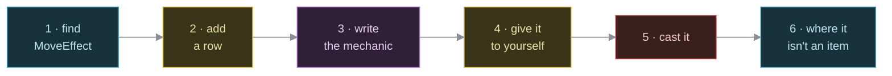

Tutorial: add your first move
==============================

    Audience       Anyone who wants to add content to roog. You have
                   done `add-your-first-item.md`, or you are
                   comfortable enough to skip it.
    Prerequisites  A checkout, and a working `cargo`. That is all.
    Time           About ten minutes.
    You will       Give the player a second active move, aim it,
                   feel it cost Magic, then see where the pattern
                   stops looking like an item.

This is a lesson, not a recipe. When you want the short version, read `../how-to/add-a-move.md`.

What you are about to learn
----------------------------

Roog has exactly one active move today: Fireball, the dragon's own breath weapon on loan to the player so the system had something to prove itself on. A move is coded the way a potion or a wand is -- one identity enum, one catalog row, one mechanic keyed off it -- because it is exactly as *active* as either of those.

It is also, on purpose, not an item. It has no `Position`, no `Item` marker, no pack slot. It cannot be dropped, thrown, or found on a floor. It lives permanently in whoever's `Moveset` it's in, and it spends Magic instead of a battery.

By the end you will have added Frost Nova, and you will know exactly which parts of "add an item" still apply and which ones stopped applying the moment you left `Position` off the struct.

Step 1: find the enum and the table
-------------------------------------

A move's identity is `MoveEffect`, in:

    models/src/components.rs

Search for it:

    pub enum MoveEffect {
        DragonBreath,
    }

One variant. Next to it, in `models/src/catalog.rs`, is the table that gives that variant a name, a cost and a reach:

    pub const MOVES: &[MoveDef] = &[
        MoveDef { effect: MoveEffect::DragonBreath, name: "Fireball", cost: 2, range: 8 },
    ];

Read the row:

    MoveDef { effect: MoveEffect::DragonBreath, name: "Fireball", cost: 2, range: 8 }
                              |                          |          |       |
                        the identity                its label   Magic    reticle
                                                                  spent   reach

`cost` is Magic points, spent by `move_system` the instant the move actually fires. `range` feeds the aiming reticle exactly the way a wand's `Ranged.range` does -- you will aim Frost Nova the same way you'd zap a wand of cold.

Step 2: add a row
-------------------

Frost Nova is Fireball's cold twin. Append a variant:

    pub enum MoveEffect {
        DragonBreath,
        FrostNova,
    }

And a row after Fireball's:

    MoveDef { effect: MoveEffect::FrostNova, name: "Frost Nova", cost: 2, range: 6 },

Build:

    cargo build

It will not compile. That is the point of the next step -- unlike a weapon or a suit of armour, a move's row is not the whole of it.

Step 3: write the mechanic
-----------------------------

The error names a missing match arm in `models/src/items/moves.rs`:

    fn apply_move_effect(world: &mut World, user: Entity, target: Position, effect: MoveEffect) {
        match effect {
            MoveEffect::DragonBreath => breathe_fire(world, user, target),
        }
    }

The match has no catch-all, on purpose -- the same discipline `apply_wand_effect` holds over `WandEffect`. A variant that compiled without an arm would be a move that silently did nothing, and roog does not ship those.

Add the arm, and the function it calls:

    MoveEffect::DragonBreath => breathe_fire(world, user, target),
    MoveEffect::FrostNova => frost_nova(world, user, target),

    fn frost_nova(world: &mut World, user: Entity, target: Position) {
        let (power, power_bonus) = {
            let fighter = world.get::<Fighter>(user);
            let loadout = loadout(world, user);
            (
                fighter.map_or(0, |f| f.power) + loadout.power_die,
                fighter.map_or(0, |f| f.power_bonus) + loadout.power_bonus,
            )
        };
        let damage =
            (world.resource_mut::<GameRng>().0.gen_range(1..=power.max(1)) + power_bonus).max(0);
        world
            .resource_mut::<GameLog>()
            .add("A wave of killing frost radiates outward!".to_string());
        elemental_blast(
            world,
            Some(user),
            target,
            BLAST_RADIUS,
            damage,
            Some(Element::Cold),
            BlastPalette::Frost,
        );
    }

Look closely and you'll notice you wrote almost nothing. `elemental_blast` is the same function a zapped wand of cold calls -- the disc, the line-of-sight check, the animation, the chain reaction into any trap or coin caught in it, all of it borrowed. The only thing `frost_nova` supplies is *how much damage*, computed from the caster's own claws rather than a wand's dice. That computation is copied verbatim from `breathe_fire` right above it; a move that inflicts a status instead of damage would instead borrow from `crate::conditions`, the way a wand's utility effects do.

Build again:

    cargo build

It compiles.

Step 4: give it to yourself
------------------------------

There is no `ROOG_SPAWN` for a move -- there is no entity to spawn. The only way to hold one is to already have it, so put it in the player's starting `Moveset`, in `initialize_world` (`models/src/map/levels.rs`):

    Moveset {
        slots: vec![MoveEffect::DragonBreath, MoveEffect::FrostNova],
    },

Build and run:

    cargo build
    cargo run -p engine

Step 5: cast it
------------------

Press `Z`. You should see a small box listing both moves, each with its Magic cost. Press `2` (or navigate down and confirm) to pick Frost Nova, and the aiming reticle opens exactly as it would for a wand.

Faster, once you know the slot: `Alt`+`W` opens the same reticle directly, no menu in between. `Alt`+`Q`/`W`/`E`/`R` reach slots one through four in that order. While the reticle is up, `Tab` snaps it to the next monster or item in view instead of nudging it one tile at a time.

Confirm the shot at something, and watch your Magic drop by two. Try it again with an empty pool: the reticle never even opens, and the log says why.

Step 6: where it stops being an item
----------------------------------------

Try the things that work on a potion, a wand, a dagger:

  * **Open the pack (`i`) and look for Frost Nova.** It isn't there. A move never enters a `Backpack`; the player's copy of it lives only in `Moveset`.
  * **Try to throw it (`t`).** There is nothing to select -- the throw menu only ever lists `Backpack` contents, and a move was never in one.
  * **Save and reload.** Your Magic total survives. Your `Moveset` does not -- `models/src/saveload.rs` has no entry for it yet, so a reload hands you back whatever `initialize_world` (or a loaded save's own player data) puts there. That's a real gap, not a lesson; if you're keeping Frost Nova, fill it in before you trust a save.
  * **Give a monster the same trick.** You can't, not generically. `MoveEffect` is a shared *mechanic* -- `frost_nova` doesn't care who `user` is -- but nothing routes a bestiary row into anybody's `Moveset`, and no Magic pool exists to spend for a monster anyway. The dragon's own fireball proves the trick can be reused (it calls the very same `elemental_blast` your move does, in `crate::items::dragon_breath`), but it is wired straight into `crate::ai` by hand, outside the whole move system, for free. Making that automatic is future work, not something this tutorial's row buys you.

None of that is a bug in what you built. It's the shape of the thing: a move is a mechanic on loan to whoever's `Moveset` names it, not a possession with a life of its own on the floor.

Step 7: keep it or drop it
------------------------------

If you like Frost Nova, leave it. If this was a dry run:

    git checkout models/src/components.rs models/src/catalog.rs \
                 models/src/items/moves.rs models/src/map/levels.rs

What you actually learned
----------------------------

  * A move is identified the same way a potion or a wand is: one enum variant, one catalog row, one arm of an exhaustive match that will not let a variant ship silent.

  * Almost all of a move's behaviour is borrowed from whatever already does the thing -- `elemental_blast` for a blast, `crate::conditions` for a status -- the same reuse a wand's own mechanic leans on.

  * A move is *not* an item, deliberately: no `Position`, no `Item`, no pack slot, no `ROOG_SPAWN`, nothing to throw or drop. It lives in a `Moveset`, and it costs Magic instead of running out of charges.

  * A `MoveEffect`'s mechanic is shared and reusable — a monster can do the same trick, as the dragon does — but *triggering* it is not generic yet. Wiring a species to use one, and giving `Moveset` a life past a save, are both still open ground.

Where to go next
-------------------

  ../how-to/add-a-move.md                 the short version, as a recipe
  add-your-first-item.md                  the same lesson, for items
  ../how-to/add-an-item.md                the pattern this one borrows
  ../reference/input-and-turn-loop.md     where `move_system` sits in the schedule
