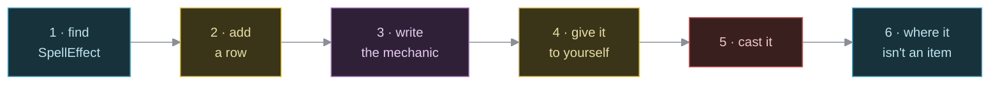

Tutorial: add your first spell
==============================

    Audience       Anyone who wants to add content to nihilurk. You have
                   done `add-your-first-item.md`, or you are
                   comfortable enough to skip it.
    Prerequisites  A checkout, and a working `cargo`. That is all.
    Time           About ten minutes.
    You will       Give the player a second active spell, aim it,
                   feel it cost Magic, then see where the pattern
                   stops looking like an item.

This is a lesson, not a recipe. When you want the short version, read `../how-to/add-a-spell.md`.

What you are about to learn
----------------------------

nihilurk has sixteen active spells today, taught to the player at random by a hero coin (an uncommon coin-table pickup) rather than started with any. A spell is coded the way a potion or a wand is -- one identity enum, one catalog row, one mechanic keyed off it -- because it is exactly as *active* as either of those. This tutorial adds a seventeenth, by hand, the way every one of the sixteen was first tried.

It is also, on purpose, not an item. It has no `Position`, no `Item` marker, no pack slot. It cannot be dropped, thrown, or found on a floor. It lives permanently in whoever's `Spellset` it's in, and it spends Magic instead of a battery.

By the end you will have added Ice Bolt, and you will know exactly which parts of "add an item" still apply and which ones stopped applying the moment you left `Position` off the struct.

Step 1: find the enum and the table
-------------------------------------

A spell's identity is `SpellEffect`, in:

    models/src/components.rs

Search for it:

    pub enum SpellEffect {
        DragonBreath,
        Sting,
        Thunderbolt,
        // ... thirteen more ...
    }

Sixteen variants today. Next to it, in `models/src/catalog.rs`, is the table that gives each variant a name, a cost, a reach and a kind:

    pub const SPELLS: &[SpellDef] = &[
        SpellDef { effect: SpellEffect::DragonBreath, name: "Fireball", cost: 2, range: 8, kind: SpellKind::Attack },
        // ... fifteen more ...
    ];

Read Fireball's row:

    SpellDef { effect: SpellEffect::DragonBreath, name: "Fireball", cost: 2, range: 8, kind: SpellKind::Attack }
                              |                          |          |       |                |
                        the identity                its label   Magic    reticle      Attack or Skill --
                                                                  spent    reach       doubled by a staff
                                                                                        when it's Attack

`cost` is Magic points, spent by `spell_system` the instant the spell actually fires (doubled by a wielded staff's `TurboMagic`, but only for an `Attack`). `range` feeds the aiming reticle exactly the way a wand's `Ranged.range` does -- you will aim Ice Bolt the same way you'd zap a wand of cold. `kind` is read once, by `spell_cost` and by whatever mechanic you write in step 3.

Step 2: add a row
-------------------

Ice Bolt is Fireball's cold twin. Append a variant at the very end of the enum -- never in the middle, since a save encodes a `SpellEffect` as its position:

    pub enum SpellEffect {
        DragonBreath,
        // ... the other fourteen ...
        HasteSelf,
        IceBolt,
    }

And a row anywhere in `SPELLS` (the table's order doesn't matter, only the enum's does):

    SpellDef { effect: SpellEffect::IceBolt, name: "Ice Bolt", cost: 2, range: 6, kind: SpellKind::Attack },

Build:

    cargo build

It will not compile. That is the point of the next step -- unlike a weapon or a suit of armour, a spell's row is not the whole of it.

Step 3: write the mechanic
-----------------------------

The error names a missing match arm in `models/src/items/spells.rs`:

    fn apply_spell_effect(
        world: &mut World,
        user: Entity,
        target: Position,
        effect: SpellEffect,
        power_mult: i32,
    ) {
        match effect {
            SpellEffect::DragonBreath => breathe_fire(world, user, target, power_mult),
            // ... fourteen more arms ...
        }
    }

The match has no catch-all, on purpose -- the same discipline `apply_wand_effect` holds over `WandEffect`. A variant that compiled without an arm would be a spell that silently did nothing, and nihilurk does not ship those. `power_mult` is `2` when a staff doubled an `Attack`'s cost, `1` otherwise -- fold it into your damage the way every existing `Attack` arm does.

Add the arm, and the function it calls:

    SpellEffect::DragonBreath => breathe_fire(world, user, target, power_mult),
    SpellEffect::IceBolt => ice_bolt(world, user, target, power_mult),

    fn ice_bolt(world: &mut World, user: Entity, target: Position, power_mult: i32) {
        let (power, power_bonus) = {
            let fighter = world.get::<Fighter>(user);
            let loadout = loadout(world, user);
            (
                fighter.map_or(0, |f| f.power) + loadout.power_die,
                fighter.map_or(0, |f| f.power_bonus) + loadout.power_bonus,
            )
        };
        let damage = ((world.resource_mut::<GameRng>().0.gen_range(1..=power.max(1)) + power_bonus)
            .max(0))
            * power_mult;
        world
            .resource_mut::<GameLog>()
            .add("A wave of killing frost radiates outward!".to_string());
        elemental_blast(
            world,
            Some(user),
            target,
            BLAST_RADIUS,
            damage,
            Some(Element::Cold),
            BlastPalette::Frost,
        );
    }

Look closely and you'll notice you wrote almost nothing. `elemental_blast` is the same function a zapped wand of cold calls -- the disc, the line-of-sight check, the animation, the chain reaction into any trap or coin caught in it, all of it borrowed. The only thing `ice_bolt` supplies is *how much damage*, computed from the caster's own claws rather than a wand's dice. That computation is copied verbatim from `breathe_fire` right above it; a spell that inflicts a status instead of damage would instead borrow from `crate::conditions`, the way a wand's utility effects do.

Build again:

    cargo build

It compiles.

Step 4: give it to yourself
------------------------------

There is no `NIHILURK_SPAWN` for a spell -- there is no entity to spawn. In play, the only way to learn one is a hero coin (an uncommon coin-table pickup that teaches a random not-yet-known spell); to try Ice Bolt without hunting for a coin, put it straight into the player's starting `Spellset`, in `initialize_world` (`models/src/map/levels.rs`):

    Spellset {
        slots: vec![SpellEffect::IceBolt],
    },

Build and run:

    cargo build
    cargo run -p engine

Step 5: cast it
------------------

Press `Z`. You should see a small box listing both spells, each with its Magic cost. Press `b` (or navigate down and confirm) to pick Ice Bolt, and the aiming reticle opens exactly as it would for a wand.

Rows are lettered `a` to `d`, the way the pack's are, and the menu is the only way to a spell -- no key fires a slot directly. While the reticle is up, `Tab` snaps it to the next monster or item in view instead of nudging it one tile at a time.

Confirm the shot at something, and watch your Magic drop by two. Try it again with an empty pool: the reticle never even opens, and the log says why.

Step 6: where it stops being an item
----------------------------------------

Try the things that work on a potion, a wand, a dagger:

  * **Open the pack (`i`) and look for Ice Bolt.** It isn't there. A spell never enters a `Backpack`; the player's copy of it lives only in `Spellset`.
  * **Try to throw it (`t`).** There is nothing to select -- the throw menu only ever lists `Backpack` contents, and a spell was never in one.
  * **Save and reload.** Your Magic total survives, and so does your `Spellset` -- `models/src/saveload.rs` round-trips it like every other piece of the player. If Ice Bolt ever left a marker of its own lying around on you (the way the spell Magic Ward or Bide does), that would need its own line in `EntitySave` too -- see `../how-to/add-a-spell.md` for the two that already have one.
  * **Give a monster the same trick.** You can't, not generically. `SpellEffect` is a shared *mechanic* -- `ice_bolt` doesn't care who `user` is -- but nothing routes a bestiary row into anybody's `Spellset`, and no Magic pool exists to spend for a monster anyway. The dragon's own fireball proves the trick can be reused (it calls the very same `elemental_blast` your spell does, in `crate::items::dragon_breath`), but it is wired straight into `crate::ai` by hand, outside the whole spell system, for free. Making that automatic is future work, not something this tutorial's row buys you.

None of that is a bug in what you built. It's the shape of the thing: a spell is a mechanic on loan to whoever's `Spellset` names it, not a possession with a life of its own on the floor.

Step 7: keep it or drop it
------------------------------

If you like Ice Bolt, leave it. If this was a dry run:

    git checkout models/src/components.rs models/src/catalog.rs \
                 models/src/items/spells.rs models/src/map/levels.rs

What you actually learned
----------------------------

  * A spell is identified the same way a potion or a wand is: one enum variant, one catalog row, one arm of an exhaustive match that will not let a variant ship silent.

  * Almost all of a spell's behaviour is borrowed from whatever already does the thing -- `elemental_blast` for a blast, `crate::conditions` for a status -- the same reuse a wand's own mechanic leans on.

  * A spell is *not* an item, deliberately: no `Position`, no `Item`, no pack slot, no `NIHILURK_SPAWN`, nothing to throw or drop. It lives in a `Spellset`, and it costs Magic instead of running out of charges.

  * A `SpellEffect`'s mechanic is shared and reusable — a monster can do the same trick, as the dragon does — but *triggering* it is not generic yet. Wiring a species to use one under its own AI, at no Magic cost, is still bespoke work in `crate::ai`.

Where to go next
-------------------

  ../how-to/add-a-spell.md                 the short version, as a recipe
  add-your-first-item.md                  the same lesson, for items
  ../how-to/add-an-item.md                the pattern this one borrows
  ../reference/input-and-turn-loop.md     where `spell_system` sits in the schedule
