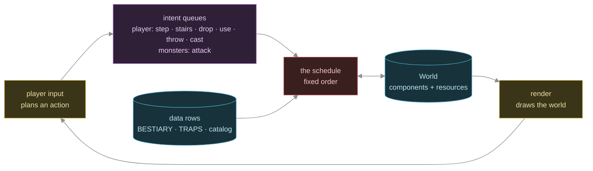
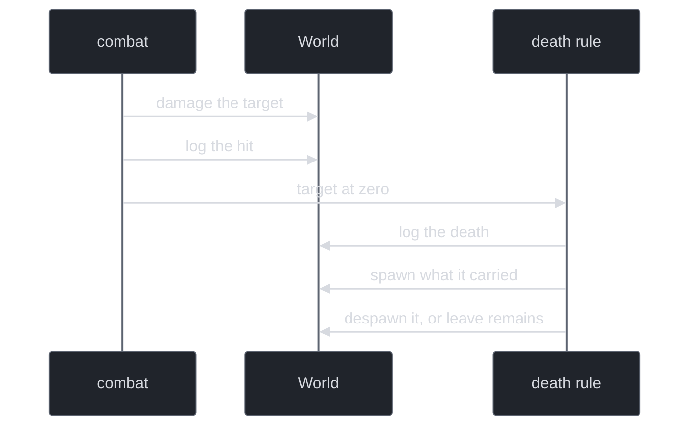
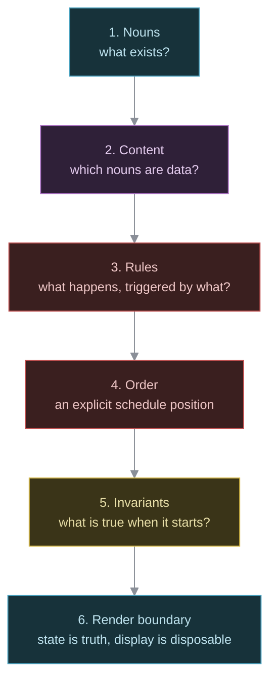

# SCS: The Simulationist Component System

SCS is nihilurk's architecture in one sentence: a simulation-first world of components, driven by systems that run in a fixed turn order, where state changes directly wherever the game needs it to.

It is not a generic ECS framework, and it does not chase purity. It is a roguelike architecture built to keep causality, speed and game meaning. It would fit any turn-based tactical, card or board game. Only the rows change.

---

## 1. Definition

Five questions, one answer each:

| Modeling... | Use a... | In nihilurk |
|---|---|---|
| a fact about one entity | **component** | `Poisoned`, `FireImmune`, `Position` |
| a fact about the whole run | **resource** | `Map`, `GameRng`, `GameLog`, the intent queues |
| a rule that runs every turn | **system** | `combat_system`, `ai`, `reaper_system` |
| "this before/after that" | **the schedule** | one `Schedule`, run once a turn |
| a thing that exists | **a data row** | `BESTIARY`, `TRAPS`, the item tables in `catalog.rs` |

Everything below defends these five rows, or records where a project drifted from them.

**Good fit:** roguelikes, tactics, card and board games, sim-heavy prototypes. Anywhere "what happened, in what order, because of what" is the game.
**Poor fit:** real-time action, where frame-coherent query batching beats turn causality.

---

## 2. The schedule is law; direct mutation is correct

*Order changes outcomes.* A trap springs before combat, and damage lands before death is checked. A framework built for mount, update and unmount has no notion of this. Skip the explicit schedule and the ordering does not vanish. It hides in call order, which nobody wrote down.

SCS adds two opinions to plain ECS:

1. **The schedule is part of the rules.** Every edge is written, and every edge is load-bearing.
2. **A system may mutate the world directly.** It takes the whole world, not a declared query.

The shape of a turn:

Each box is one or more systems. nihilurk's exact edges are in `docs/reference/input-and-turn-loop.md`.

The usual objection to direct mutation is that a system should declare its reads and writes so a scheduler can parallelise it. That assumes the set is known in advance. One hit often is not:

Which of those fire depends on runtime state. A query shape cannot say so. Forced into pure queries, the logic does not go away. It scatters across narrow systems glued by flags, and gets harder to read. Mutation was never the failure. Mutation nobody wrote down was.

Rust's borrow friction stays. SCS absorbs it into written convention, in phases and in content tables, instead of fighting it again at every call site.

---

## 3. Strong, weak, ugly

### Strong

- **One grammar.** Five questions, one answer each. A reader never has to ask where a thing lives.
- **Order is data, and it is checked.** The schedule is one flat list with every dependency written, and a test compares the real graph to the intended edges. No two steps are left unordered, so the executor has no order to choose. A reordering is a visible diff and a failing test.
- **Everything is a queued intent.** The player's actions and the monsters' attacks both enter as intent, and the schedule resolves them in its fixed order. The player acts first in the turn, so what they do resolves before the others move.
- **Invariants are checked on a running game.** A seeded bot plays the real schedule and, after every turn, the world must hold what each step assumed of the one before: queues drained, no stale markers, no fighter left at zero, no pack pointing at nothing.
- **Properties, not kinds.** Rules ask whether something has a component, never what kind of thing it is. A fire-resist ring and a fire-immune monster answer the same question, so rules compose without knowing each other.
- **Data where the verb already exists.** A new instance of a known verb is a row. Nothing else has to hear about it.
- **Small runtime.** No scheduler machinery, no plugin layer, no parallelism to reason about. nihilurk ships as a roughly 3 MB binary and idles in single-digit megabytes.

### Weak

- **Data-driven stops at the verb.** A new kind of effect costs code in three places: a variant, a row, and a handler. "Add content" is a row only while the vocabulary is enough. Moving the handler onto the row saves one line and gives up the compiler's missing-handler error, so the question is open, not solved.
- **Assumptions are checked late.** Each step's preconditions are prose beside its definition. The soak checks their consequences at the end of a turn, and a single `debug_assert!` checks one at the step. A step that stops assuming something fails a turn later, in a different place.
- **Direct mutation gives up conflict detection.** No scheduler checks that two systems fight over the same data. A total order and the soak carry that.
- **Prose drifts.** The step count and the queue count in the docs are tested against the code. Every other number or diagram in a document is a second copy of the code, and nothing compares them.

### Ugly

- **The key still touches the world.** Choosing what to do is separate from doing it, with one exception: preparing a throw splits a stack at the key, before the intent is queued. Menus, targeting and looking also change state at the key, but none of them spends a turn.
- **Two descriptions of one decision.** Each queued action is planned at the key and applied by the schedule, so the planner and the applier both name the same cases. They must agree, and only tests make them.
- **Spawn and despawn authority is everywhere.** Any system may create or destroy an entity. The discipline is that each does so at the rule that decided it. The soak catches the damage a bad despawn leaves (a dangling reference). Nothing catches a despawn at the wrong rule.
- **A stated invariant is only a sentence, unless something runs it.** Where the soak covers it, it is guarded. Where it does not, it is prose.

---

## 4. Hidden magic, and where it stands

The target was never direct mutation. It was conventions nobody wrote down or checked.

| Concern | Stance | Cost |
|---|---|---|
| Rows that encode behavior (a row grants a component) | **kept** | The point of the design. Behavior is reached through a grant, not a branch. |
| Effects spread across tables and systems | **kept** | One vocabulary, read by systems that never learn where an effect came from. |
| Row legality | **tested** | Impossible rows fail the suite before a system sees them. |
| Schedule order | **tested** | The graph is compared to the intended edges, and no pair of steps is left unordered. |
| System preconditions | **soaked, mostly** | Prose at each system, with their consequences checked after every turn of a seeded run. One is asserted. |
| Mutation sites | **soaked for damage** | The soak finds dangling references. Nothing checks that a spawn or despawn sits at its deciding rule. |
| Command and effect queues | **intent queued, log synchronous** | The player and the monsters queue intent. The message log is read back within the turn, so queueing it would break it. |
| Relationship indexes | **declined, with a trigger** | A world-wide scan is cheap at small scale. Add an index when the world holds thousands. |
| Docs at the seam | **hook plus tests** | A hook forces a docs page into any commit that changes the schedule or a queue, and a test checks the two counts the pages state. Other prose is unchecked. |
| Item verbs | **open** | See the first Weak point. |

---

## 5. Why this helps a human and an LLM

Fact on an entity: component. Global for the run: resource. Rule: system. Phase boundary: schedule. Content: row. The answer never varies, so debugging does not wade through a lifecycle abstraction, and refactors keep the schedule fixed while the rest moves.

An LLM gains the same thing as less guessing. Nouns are always components. Verbs are always systems. Content is always a row, never inline logic. A narrow target means fewer edits in the wrong layer and less invented framework. "Add a monster" is one row, which is the edit a new teammate or a model gets right the first time.

---

## 6. Designing with SCS

The pieces are a struct, a function and a `for` loop. SCS adds the order in which you reach for them:

Step 5 gets skipped most, and it causes the bugs nobody can reproduce.

**Worked example 1: the pink dragon.** `README.md` walks it. Fire-immune is `FireImmune`, which already exists. Its stats are one `BESTIARY` row. It needed no new rule, order or invariant, so `cargo build` and it is real.

**Worked example 2: the ice cube** (`models/src/ice.rs`). Cold kills a creature and leaves a cube. A cube is a `Mob` with no `Fighter`, so the player's step, a monster's path and a missile's line already treat it as a wall. Nothing can hurt it. Walking into it sends it at the nearest weak foe. The existing rules answered every question, so none were added.

**Smells:**

- A `&mut World` system whose reach you cannot state in one sentence.
- A new Rust type where a row would do.
- Turn order known only from call order.
- Game state that lives only in the renderer.
- One feature touching three unrelated systems. A step above was skipped, so the feature was patched in sideways. SCS still fits.

---

## 7. Thesis

A roguelike world is a live, ordered, stateful simulation. Components describe facts, systems enact rules, and the turn schedule is one of the rules. A dungeon is a causal machine, and the architecture is defined by handling that complexity with discipline, not by avoiding it.

It keeps the speed and range of imperative mutation, and writes down the boundary between simulation logic and convention. It is feral where it needs to be, disciplined where it matters. That is why nihilurk is nihilurk.

---

## Manifesto

We do not build the world as a framework. We build it as a simulation.

We do not ask the game to be polite about mutation. We ask it to be honest about consequences.

We do not worship generic abstraction. We worship causal clarity.

We do not treat the turn schedule as a convenience. We treat it as law.

We do not hide complexity behind a prettier shell. We make it legible, keep it fast, and let the mechanics tell the truth.

That is SCS.
